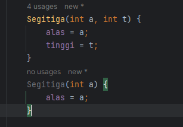

# LAPORAN PRATIKUM 3
NIM   : 2241720030\
Nama  : Muhammad Fakhruddin Arif\
Kelas : TI-1D

## Latihan
### 3.2 Membuat Array dari Object, mengisi dan Menampilkan
Kode Program:

BangunRuang:

``` java
package BangunRuang;
public class BangunRuang {
    public int panjang;
    public int lebar;
}
```
ArrayObejcts:
``` java
package BangunRuang;
public class MainPP {
    public static void main(String[] args) {
        BangunRuang[] ppArray = new BangunRuang[3];

        ppArray[0] = new BangunRuang();
        ppArray[0].panjang = 110;
        ppArray[0].lebar = 30;

        ppArray[1] = new BangunRuang();
        ppArray[1].panjang = 80;
        ppArray[1].lebar = 40;

        ppArray[2] = new BangunRuang();
        ppArray[2].panjang = 100;
        ppArray[2].lebar = 20;

        System.out.println("Persegi Panjang ke-0, Panjang: " + ppArray[0].panjang + " ,Lebar: " + ppArray[0].lebar);
        System.out.println("Persegi Panjang ke-1, Panjang: " + ppArray[1].panjang + " ,Lebar: " + ppArray[1].lebar);
        System.out.println("Persegi Panjang ke-2, Panjang: " + ppArray[2].panjang + " ,Lebar: " + ppArray[2].lebar);
    }
}

```

Output:

``` java
Persegi Panjang ke-0, Panjang: 110 ,Lebar: 30
Persegi Panjang ke-1, Panjang: 80 ,Lebar: 40
Persegi Panjang ke-2, Panjang: 100 ,Lebar: 20

Process finished with exit code 0
```

Pertanyaan:
1. Berdasarkan uji coba 3.2, apakah class yang akan dibuat array of object harus selalu memiliki atribut dan sekaligus method?Jelaskan!
- Tidak, Karena bisa dengan menggunakan atribut saja
2. Apakah class PersegiPanjang memiliki konstruktor?
- Tidak, Namun kontraktor akan slalu dipanggil pada proses instansiasi objek
3. Apa yang dimaksud dengan kode berikut ini: 
- Instansiasi array yang akan menampung 3 object
4. Apa yang dimaksud dengan kode berikut ini: 
- Membuat objek yang akan menempati index ke-1 dengan memasukkan nilai panjang dan lebar pada index tersebut
5. Mengapa class main dan juga class BangunRuang dipisahkan pada uji coba 3.2?
- Dikarenakan agar lebih rapi, mudah dibaca, dan dapat memanggil class yang lain.

### 3.3 Menerima Input Isian Array Menggunakan Looping
Kode Program:
``` java
package BangunRuang;
import java.util.Scanner;
public class MainPP {
    public static void main(String[] args) {
        BangunRuang[] ppArray = new BangunRuang[3];

        Scanner sc = new Scanner(System.in);
        for (int i = 0; i < 3; i++) {
            ppArray[i] = new BangunRuang();
            System.out.println("Persegi panjang ke-" + i);
            System.out.print("Masukkan Panjang: ");
            ppArray[i].panjang = sc.nextInt();
            System.out.print("Masukkan Lebar: ");
            ppArray[i].lebar = sc.nextInt();
        }
        for (int i = 0; i < 3; i++) {
            System.out.println("Persegi Panjang ke-" + i);
            System.out.println("Panjang: " + ppArray[i].panjang + ", Lebar: " + ppArray[i].lebar);
        }
    }
}
```
Output:
``` java 
Persegi panjang ke-0
Masukkan Panjang: 5
Masukkan Lebar: 6
Persegi panjang ke-1
Masukkan Panjang: 5
Masukkan Lebar: 3
Persegi panjang ke-2
Masukkan Panjang: 4
Masukkan Lebar: 8
Persegi Panjang ke-0
Panjang: 5, Lebar: 6
Persegi Panjang ke-1
Panjang: 5, Lebar: 3
Persegi Panjang ke-2
Panjang: 4, Lebar: 8

Process finished with exit code 0
```
Pertanyaan:
1. Apakah array of object dapat diimplementasikan pada array 2 Dimensi? 
- Iya
2. Jika jawaban soal no satu iya, berikan contohnya! Jika tidak, jelaskan!

``` java
PersegiPanjang[][] ppArray = new PersegiPanjang[2][3];
```

3. Jika diketahui terdapat class Persegi yang memiliki atribut sisi bertipe integer, maka kode dibawah ini akan memunculkan error saat dijalankan. Mengapa? 
- Dikarenakan belum instansiasi objek
4. Modifikasi kode program pada praktikum 3.3 agar length array menjadi inputan dengan Scanner!
``` java
package BangunRuang;
import java.util.Scanner;
public class ArrayObjects {
    public static void main(String[] args) {
        Scanner sc = new Scanner(System.in);
        System.out.print("Masukkan Jumlah Persegi Panjang");
        int data = sc.nextInt();
        PersegiPanjang[] ppArray = new PersegiPanjang[data];
        for (int i = 0; i < ppArray.length; i++) {
            ppArray[i] = new PersegiPanjang();
            System.out.println("Persegi panjang ke-" + i);
            System.out.print("Masukkan Panjang: ");
            ppArray[i].panjang = sc.nextInt();
            System.out.print("Masukkan Lebar: ");
            ppArray[i].lebar = sc.nextInt();
        }
        for (int i = 0; i < ppArray.length; i++) {
            System.out.println("Persegi Panjang ke-" + i);
            System.out.println("Panjang: " + ppArray[i].panjang + ", Lebar: " + ppArray[i].lebar);
        }
    }
}
```
5. Apakah boleh Jika terjadi duplikasi instansiasi array of objek, misalkan saja instansiasi dilakukan pada ppArray[i] sekaligus ppArray[0]?Jelaskan ! 
- Boleh saja, tetapi disarankan tidak menduplikasi instansiasi dikarenakan akan menimpa data atau instansiasi sebelumnya

### 3.4 Operasi Matematika Atribut Object Array
Kode program:

Balok:
``` java
package ArrayBalok;

public class Balok {
    public int panjang;
    public int lebar;
    public int tinggi;
    public Balok(int p, int l, int t) {
        panjang = p;
        lebar = l;
        tinggi = t;
    }
    public int hitungVolume() {
        return panjang * lebar * tinggi;
    }
}
```

ArrayBalok:
``` java
package ArrayBalok;

public class ArrayBalok {
    public static void main(String[] args) {
        Balok[] blArray = new Balok[3];
        blArray[0] = new Balok(100, 30, 12);
        blArray[1] = new Balok(120, 40, 15);
        blArray[2] = new Balok(210, 50, 25);

        for (int i = 0; i < 3; i++) {
            System.out.println("Volume Balok Ke- " + i + ": " + blArray[i].hitungVolume());
        }
    }
}
```

Output:
``` java
Volume Balok Ke- 0: 36000
Volume Balok Ke- 1: 72000
Volume Balok Ke- 2: 262500

Process finished with exit code 0
```

Pertanyaan:
1. Dapatkah konstruktor berjumlah lebih dalam satu kelas? Jelaskan dengan contoh! 



Bisa, Tetapi harus berbeda parameter pada kontruktor

2. Tambahkan konstruktor pada class Segitiga tersebut yang berisi parameter int a, int t yang masing-masing digunakan untuk mengisikan atribut alas dan tinggi. 
``` java
package ArrayBalok;

public class Segitiga {
    public int alas;
    public int tinggi;
    
    Segitiga(int a, int t) {
        a = alas;
        t = tinggi;
    }
}
```
3. Tambahkan method hitungLuas() dan hitungKeliling() pada class Segitiga tersebut. Asumsi segitiga adalah segitiga siku-siku. (Hint: Anda dapat menggunakan bantuan library Math pada Java untuk mengkalkulasi sisi miring) 
``` java
double hitungLuas() {
   return alas  * tinggi / 2;
}

double hitungKeliling() {
    double sisiMiring = Math.sqrt(Math.pow(alas, 2) + Math.pow(tinggi, 2));
    return sisiMiring + alas + tinggi;
}
```
4. Pada fungsi main, buat array Segitiga sgArray yang berisi 4 elemen, isikan masing-masing atributnya sebagai berikut: \
sgArray ke-0 alas: 10, tinggi: 4 \
sgArray ke-1 alas: 20, tinggi: 10 \
sgArray ke-2 alas: 15, tinggi: 6 \
sgArray ke-3 alas: 25, tinggi: 10 
``` java
package ArraySegitiga;

public class sgArray {
    public static void main(String[] args) {
        Segitiga[] sg = new Segitiga[4];
        sg[0] = new Segitiga(10, 4);
        sg[1] = new Segitiga(20, 10);
        sg[2] = new Segitiga(15, 6);
        sg[3] = new Segitiga(25, 10);
    }
}

```
5. Kemudian menggunakan looping, cetak luas dan keliling dengan cara memanggil method hitungLuas() dan hitungKeliling(). 
``` java
package ArraySegitiga;

public class sgArray {
    public static void main(String[] args) {
        Segitiga[] sg = new Segitiga[4];
        sg[0] = new Segitiga(10, 4);
        sg[1] = new Segitiga(20, 10);
        sg[2] = new Segitiga(15, 6);
        sg[3] = new Segitiga(25, 10);

        for (int i = 0; i < sg.length; i++) {
            System.out.println("Luas Segitiga Ke-" + i + ": " + sg[i].hitungLuas());
            System.out.println("Keliling Segitiga Ke-" + i + ": " + sg[i].hitungKeliling());
            System.out.println();
        }
    }
}
```

### Latihan Pratikum
1. Buatlah program yang dapat menghitung luas permukaan dan volume bangun ruang kerucut, limas segi empat sama sisi, dan bola. \

Kode Program :
1. Limas
``` java
package BangunRuangTugas;

public class Limas {
    double alas, tinggi;

    Limas(double a, double t) {
        alas = a;
        tinggi = t;
    }
    double hitungLuas() {
        return (alas * alas) + (4 * (alas * tinggi / 2));
    }
    double hitungVolume() {
        return alas * tinggi / 3;
    }
}
```
2. Kerucut
``` java
package BangunRuangTugas;

public class Kerucut {
    double jariJari;
    double sisiMiring;

    public Kerucut(double jr, double sisi) {
        jariJari = jr;
        sisiMiring = sisi;
    }

    public double hitungLuas() {
        double lp = 3.14 * jariJari * (jariJari + sisiMiring);
        return lp;
    }

    public double hitungVolume() {
        double tinggi = Math.sqrt(Math.pow(sisiMiring, 2) - Math.pow(jariJari, 2));
        double vol = (3.14 * jariJari * jariJari * tinggi) / 3;
        return vol;
    }
}
```
3. Bola
``` java
package BangunRuangTugas;

import java.math.*;

public class Bola {
    double jariJari;
    Bola(double jj) {
        jariJari = jj;
    }

    double hitungLuasPermukaan() {
        double lp = Math.pow(jariJari, 2) * 4 * 3.14;
        return lp;
    }
    double hitungVolume() {
        double vol = Math.pow(jariJari, 3) * 3.14 * 4 / 3;
        return vol;
    }
}
```
4. MainBR
``` java
package BangunRuangTugas;
import java.util.Scanner;

public class MainBR {
    public static void main(String[] args) {
        Scanner sc = new Scanner(System.in);

        Kerucut[] kerucut = new Kerucut[2];
        Limas[] limas = new Limas[2];
        Bola[] bola = new Bola[2];

        for (int i = 0; i < kerucut.length; i++) {
            System.out.print("Masukkan Jari-Jari Kerucut: ");
            double jjKr = sc.nextDouble();
            System.out.print("Masukkan Sisi Miring: ");
            double smKr = sc.nextDouble();
            kerucut[i] = new Kerucut(jjKr, smKr);
            System.out.println("Luas Permukaan Pada Kerucut Ke-" + i + ": " + kerucut[i].hitungLuas());
            System.out.println("Volume Permukaan Pada Kerucut Ke-" + i + ": " + kerucut[i].hitungVolume());
            System.out.println();


            System.out.print("Masukkan panjang Sisi Alas Limas: ");
            double psaLm = sc.nextDouble();
            System.out.print("Masukkan Tinggi Limas: ");
            double tLm = sc.nextDouble();
            limas[i] = new Limas(psaLm, tLm);
            System.out.println("Luas Permukaan Pada Limas Ke-" + i + ": " + limas[i].hitungLuas());
            System.out.println("Volume Permukaan Pada Limas Ke-" + i + ": " + limas[i].hitungVolume());
            System.out.println();

            System.out.print("Masukkan jari-jari Bola: ");
            double jjB = sc.nextDouble();
            bola[i] = new Bola(jjB);
            System.out.println("Luas Permukaan Pada Bola Ke-" + i + ": " + bola[i].hitungLuasPermukaan());
            System.out.println("Volume Permukaan Pada Bola Ke-" + i + ": " + bola[i].hitungVolume());
            System.out.println();
        }
    }
}
```

2. Sebuah kampus membutuhkan program untuk menampilkan informasi mahasiswa berupa nama, nim, jenis kelamin dan juga IPK mahasiswa.

Kode Program:
1. DataMahasiswa
``` java
package DataMahasiswa;

import java.util.Scanner;
public class DataMahasiswa {
    String nama, nim, jenisKelamin;
    double ipk;
}
```
2. MainDM
``` java
package DataMahasiswa;

import java.util.Scanner;

public class MainDM {
    public static void main(String[] args) {
        Scanner scd = new Scanner(System.in);
        Scanner scs = new Scanner(System.in);
        DataMahasiswa[] dm = new DataMahasiswa[3];

        for (int i = 0; i < dm.length; i++) {
            int a = i + 1;
            dm[i] = new DataMahasiswa();
            System.out.println("Masukkan Data Mahasiswa Ke-" + a);
            System.out.print("Masukkan Nama         : ");
            dm[i].nama = scs.nextLine();
            System.out.print("Masukkan NIM          : ");
            dm[i].nim = scs.nextLine();
            System.out.print("Masukkan Jenis Kelamin: ");
            dm[i].jenisKelamin = scs.nextLine();
            System.out.print("Masukkan IPK          : ");
            dm[i].ipk = scd.nextDouble();
            System.out.println();
        }
        System.out.println();
        for (int i = 0; i < dm.length; i++) {
            int a = i + 1;
            System.out.println("Data Mahasiswa Ke-" + a);
            System.out.println("Nama         : " + dm[i].nama);
            System.out.println("NIM          : " + dm[i].nim);
            System.out.println("Jenis Kelamin: " + dm[i].jenisKelamin);
            System.out.println("Nilai IPK    : " + dm[i].ipk);
            System.out.println();
        }
    }
}
```

Output:
``` java
Masukkan Data Mahasiswa Ke-1
Masukkan Nama         : Muhammad Fakhruddin Arif
Masukkan NIM          : 2241720030
Masukkan Jenis Kelamin: L
Masukkan IPK          : 3.81

Masukkan Data Mahasiswa Ke-2
Masukkan Nama         : Nadila Amalia Pribadi
Masukkan NIM          : 2241720130
Masukkan Jenis Kelamin: P
Masukkan IPK          : 3.89

Masukkan Data Mahasiswa Ke-3
Masukkan Nama         : Doni Wahyu Kurniawan
Masukkan NIM          : 2241720102
Masukkan Jenis Kelamin: L
Masukkan IPK          : 3.94


Data Mahasiswa Ke-1
Nama         : Muhammad Fakhruddin Arif
NIM          : 2241720030
Jenis Kelamin: L
Nilai IPK    : 3.81

Data Mahasiswa Ke-2
Nama         : Nadila Amalia Pribadi
NIM          : 2241720130
Jenis Kelamin: P
Nilai IPK    : 3.89

Data Mahasiswa Ke-3
Nama         : Doni Wahyu Kurniawan
NIM          : 2241720102
Jenis Kelamin: L
Nilai IPK    : 3.94


Process finished with exit code 0
```