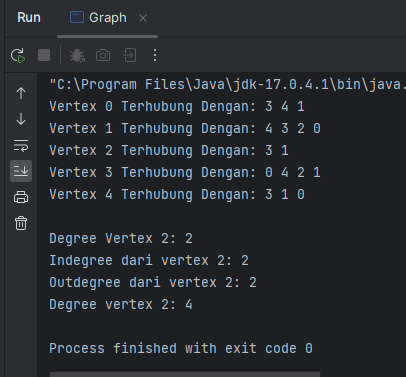
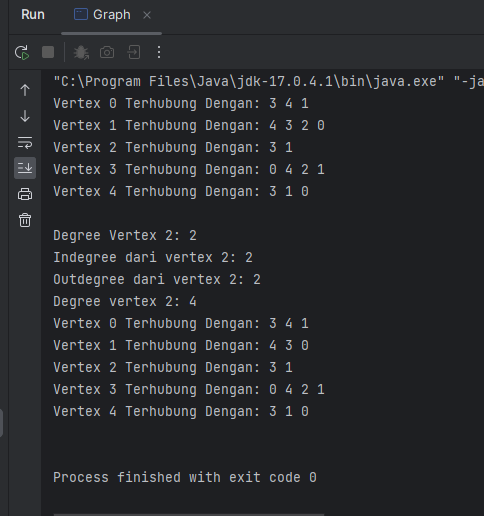
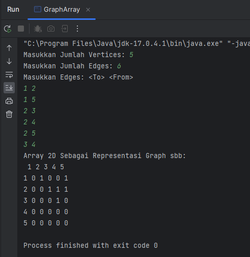
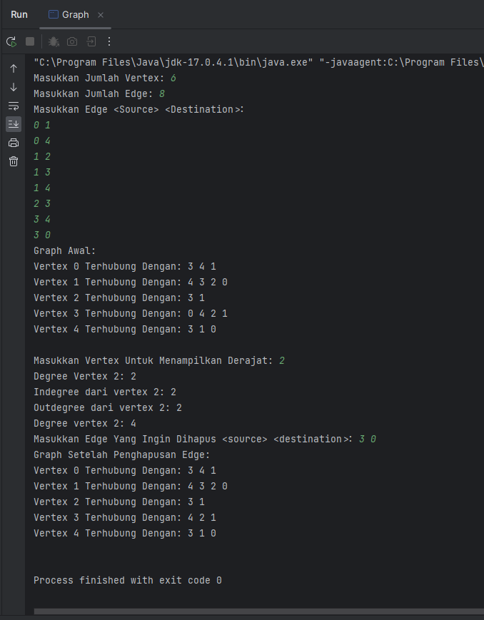
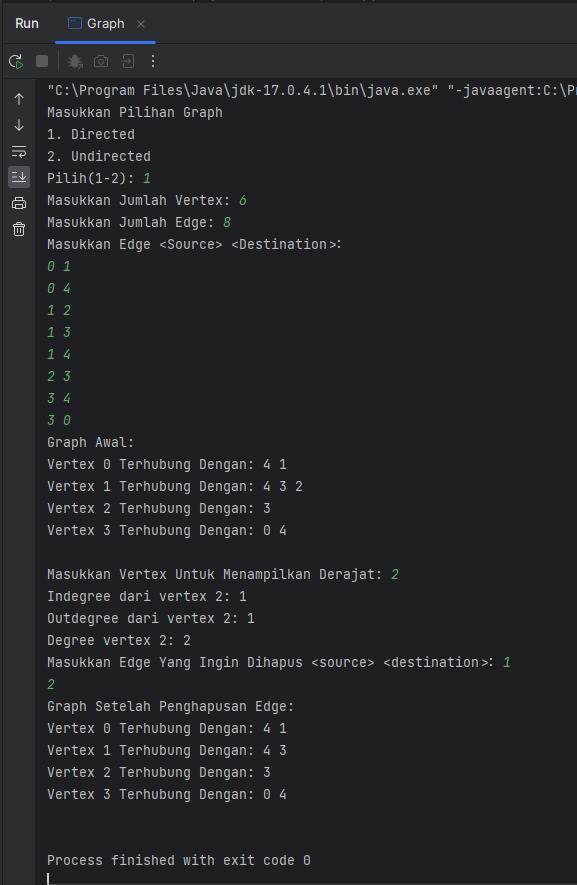
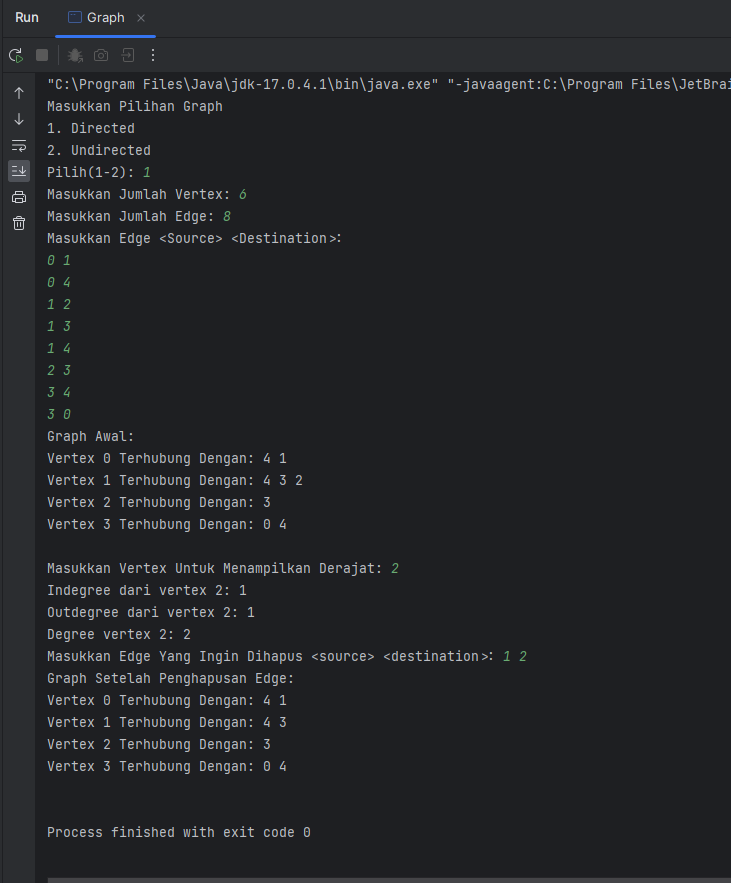
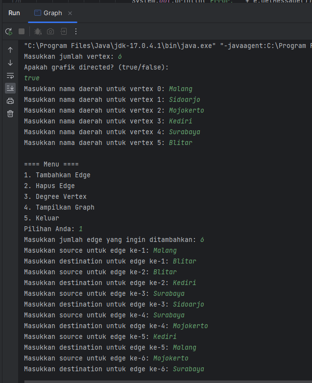
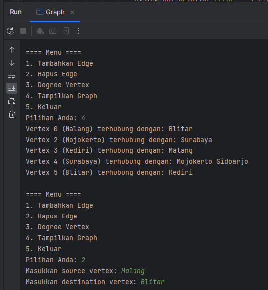
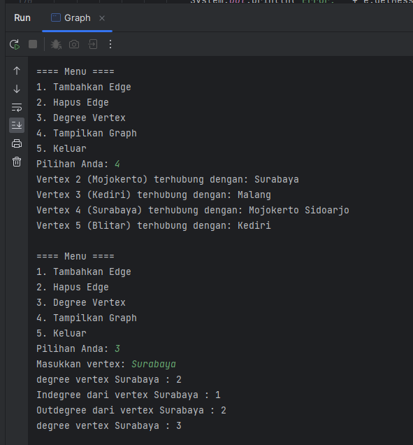
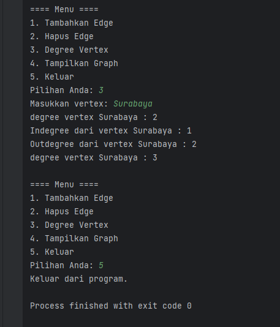

# LAPORAN JOBSHEET 12
NIM   : 2241720030

Nama  : Muhammad Fakhruddin Arif

Kelas : TI-1D

## Latihan
### Implementasi Graph menggunakan Linked List
Code:
``` java
package GraphLinkedList;

public class Graph {
    int vertex;
    LinkedList list[];

    Graph(int vertex) {
        this.vertex = vertex;
        list = new LinkedList[vertex];
        for (int i = 0; i < vertex; i++) {
            list[i] = new LinkedList();
        }
    }

    void addEdge(int source, int destination) {
//        Add Edge
        list[source].addFirst(destination);

//        Add Back Edge (for undirected)
        list[destination].addFirst(source);
    }

    void degree(int source) {
        System.out.println("Degree Vertex " + source + ": " + list[source].size());

        int k, totalIn = 0, totalOut = 0;
        for (int i = 0; i < vertex; i++) {
            for (int j = 0; j < list[i].size(); j++) {
                if (list[i].get(j) == source) ++totalIn;
            }
            for (k = 0; k < list[source].size(); k++) {
                list[source].get(k);
            }
            totalOut = k;
        }
        System.out.println("Indegree dari vertex " + source + ": " + totalIn);
        System.out.println("Outdegree dari vertex " + source + ": " + totalOut);
        System.out.println("Degree vertex " + source + ": " + (totalIn + totalOut));
    }

    void removeEdge(int source, int destination) {
        for (int i = 0; i < vertex; i++) {
            if (i == destination) {
                list[source].remove(destination);
            }
        }
    }

    void removeAllEdges() {
        for (int i = 0; i < vertex; i++) {
            list[i].clear();
        }
        System.out.println("Graph Berhasil Dikosongkan");
    }

    void printGraph() {
        for (int i = 0; i < vertex; i++) {
            if (list[i].size() > 0) {
                System.out.print("Vertex " + i + " Terhubung Dengan: ");
                for (int j = 0; j < list[i].size(); j++) {
                    System.out.print(list[i].get(j) + " ");
                }
                System.out.println();
            }
        }
        System.out.println();
    }

    public static void main(String[] args) {
        Graph graph = new Graph(6);
        graph.addEdge(0, 1);
        graph.addEdge(0, 4);
        graph.addEdge(1, 2);
        graph.addEdge(1, 3);
        graph.addEdge(1, 4);
        graph.addEdge(2, 3);
        graph.addEdge(3, 4);
        graph.addEdge(3, 0);
        graph.printGraph();
        graph.degree(2);

        graph.removeEdge(1, 2);
        graph.printGraph();
    }
}
```
Output:

Hasil Running Langkah Ke-11



Hasil Running Langkah Ke-13



Pertanyaan
1. Sebutkan beberapa jenis (minimal 3) algoritma yang menggunakan dasar Graph, dan apakah kegunaan algoritma-algoritma tersebut?
- Depth-First Search yaitu algoritma yang digunakan untuk menjelajahi atau mencari informasi dalam sebuah graf dengan melakukan pencarian secara mendalam.Dan dapat digunakan untuk menemukan semua simpul yang dapat dicapai dari simpul awal, menemukan jalur tertentu antara dua simpul, atau menentukan apakah graf terhubung atau tidak.
- Breadth-First Search yaitu algoritma yang digunakan untuk menjelajahi atau mencari informasi dalam sebuah graf dengan melakukan pencarian secara melebar.Dan dapat digunakan untuk mencari jalur terpendek antara dua simpul, menemukan semua simpul dalam graf yang terhubung ke simpul awal, atau menemukan pola atau struktur tertentu dalam graf.
- Minimum Spanning Tree yaitu digunakan untuk mencari pohon lintasan terpendek yang menghubungkan semua simpul dalam graf dengan bobot minimum.Dan digunakan dalam masalah jaringan, perencanaan rute, atau optimisasi lintasan di mana penting untuk memilih jalur dengan bobot minimum.
2. Pada class Graph terdapat array bertipe LinkedList, yaitu LinkedList list[]. Apakah tujuan pembuatan variabel tersebut ?  
- Untuk menyimpan representasi adjacency list dari graf
3. Apakah alasan pemanggilan method addFirst() untuk menambahkan data, bukan method add jenis lain pada linked list ketika digunakan pada method addEdge pada class Graph? 
- Karena pemanggilan addFirst() lebih efisien dibanding dengan method add yang lain
4. Bagaimana cara mendeteksi prev pointer pada saat akan melakukan penghapusan suatu edge pada graph ? 
- Untuk menemukan node membutuhkan iterasi pada node untuk dihapus. Setelah node ditemukan, lalu memperbarui nilai penunjuk sehingga ujungnya dapat dihapus dengan menghubungkan node sebelum dan sesudah
5. Kenapa pada praktikum 2.1.1 langkah ke-12 untuk menghapus path yang bukan merupakan lintasan pertama kali menghasilkan output yang salah ? Bagaimana solusinya ? 
``` java
graph.remove(1, 3);
graph.printGraph();
```
- Langkah ke-12 tidak menghasilkan hasil yang diharapkan karena menghapus node index ke-3 dari node ke-1, dan tidak menghilangkan elemen 0 dari sumber node ke-3.Ini harus dilakukan untuk representasi graph tidak berarah, Untuk sepenuhnya menghapus non-jalur, kedua graph harus dihapus

### Implementasi Graph menggunakan Matriks 
Code
``` java
package GraphMatrix;

import java.util.Scanner;

public class GraphArray {
    int vertices;
    int[][] twoD_array;

    GraphArray(int v) {
        vertices = v;
        twoD_array = new int[vertices + 1][vertices + 1];
    }

    void makeEdge(int to, int from, int edge) {
        try {
            twoD_array[to][from] = edge;
        }
        catch (ArrayIndexOutOfBoundsException index) {
            System.out.println("Vertex Tidak Ada");
        }
    }

    int getEdge(int to, int from) {
        try {
            return twoD_array[to][from];
        }
        catch (ArrayIndexOutOfBoundsException index) {
            System.out.println("Vertex Tidak Ada");
        }
        return -1;
    }

    public static void main(String[] args) {
        int v, e, count = 1, to = 0, from = 0;
        Scanner sc = new Scanner(System.in);
        GraphArray graph;
        try {
            System.out.print("Masukkan Jumlah Vertices: ");
            v = sc.nextInt();
            System.out.print("Masukkan Jumlah Edges: ");
            e = sc.nextInt();

            graph = new GraphArray(v);
            System.out.println("Masukkan Edges: <To> <From>");
            while (count <= e) {
                to = sc.nextInt();
                from = sc.nextInt();

                graph.makeEdge(to, from, 1);
                count++;
            }
            System.out.println("Array 2D Sebagai Representasi Graph sbb: ");
            System.out.print(" ");
            for (int i = 1; i <= v; i++) {
                System.out.print(i + " ");
            }
            System.out.println();

            for (int i = 1; i <= v; i++) {
                System.out.print(i + " ");
                for (int j = 1; j <= v; j++) {
                    System.out.print(graph.getEdge(i, j) + " ");
                }
                System.out.println();
            }
        } catch (Exception E) {
            System.out.println("Error. Silahkan Cek Kembali\n" + E.getMessage());
        }
        sc.close();
    }
}
```
Output



Pertanyaan
1. Apakah perbedaan degree/derajat pada directed dan undirected graph? 
- Directed Graph tidak memiliki degree yang sama dan tidak selalu berelasi, tetapi undirected graph memiliki degree yang sama dan harus berelasi kembali
2. Pada implementasi graph menggunakan adjacency matriks. Kenapa jumlah vertices harus ditambahkan dengan 1 pada indeks array berikut? 
- Karena array dimulai dari 0 dan masing-masing membutuhkan 7 baris dan 7 kolom untuk dicetak. 0 dari kiri ke atas lalu 6 + 1 menjadi 7
3. Apakah kegunaan method getEdge() ? 
- Untuk melakukan pencarian dan mengembalikan deskripsi apakah tepi yang dicari ada didalam graph
4. Termasuk jenis graph apakah uji coba pada praktikum 2.2? 
- Jenis Directed Graph
5. Mengapa pada method main harus menggunakan try-catch Exception ? 
- Agar ketika terjadi error pada program tersebut tidak memberhentikan program secara paksa

## Tugas
1. Ubahlah lintasan pada praktikum 2.1 menjadi inputan! 

Code:
``` java
package Tugas;

import java.util.Scanner;

public class Graph {
    int vertex;
    LinkedList list[];

    Graph(int vertex) {
        this.vertex = vertex;
        list = new LinkedList[vertex];
        for (int i = 0; i < vertex; i++) {
            list[i] = new LinkedList();
        }
    }

    void addEdge(int source, int destination) {
//        Add Edge
        list[source].addFirst(destination);

//        Add Back Edge (for undirected)
        list[destination].addFirst(source);
    }

    void degree(int source) {
        System.out.println("Degree Vertex " + source + ": " + list[source].size());

        int k, totalIn = 0, totalOut = 0;
        for (int i = 0; i < vertex; i++) {
            for (int j = 0; j < list[i].size(); j++) {
                if (list[i].get(j) == source) ++totalIn;
            }
            for (k = 0; k < list[source].size(); k++) {
                list[source].get(k);
            }
            totalOut = k;
        }
        System.out.println("Indegree dari vertex " + source + ": " + totalIn);
        System.out.println("Outdegree dari vertex " + source + ": " + totalOut);
        System.out.println("Degree vertex " + source + ": " + (totalIn + totalOut));
    }

    void removeEdge(int source, int destination) {
        for (int i = 0; i < vertex; i++) {
            if (i == destination) {
                list[source].remove(destination);
            }
        }
    }

    void removeAllEdges() {
        for (int i = 0; i < vertex; i++) {
            list[i].clear();
        }
        System.out.println("Graph Berhasil Dikosongkan");
    }

    void printGraph() {
        for (int i = 0; i < vertex; i++) {
            if (list[i].size() > 0) {
                System.out.print("Vertex " + i + " Terhubung Dengan: ");
                for (int j = 0; j < list[i].size(); j++) {
                    System.out.print(list[i].get(j) + " ");
                }
                System.out.println();
            }
        }
        System.out.println();
    }

    public static void main(String[] args) {
        Scanner sc = new Scanner(System.in);

        System.out.print("Masukkan Jumlah Vertex: ");
        int amountVertex = sc.nextInt();
        Graph graph = new Graph(amountVertex);
        System.out.print("Masukkan Jumlah Edge: ");
        int amountEdge = sc.nextInt();

        System.out.println("Masukkan Edge <Source> <Destination>: ");
        for (int i = 0; i < amountEdge; i++) {
            int source = sc.nextInt();
            int destination = sc.nextInt();
            graph.addEdge(source, destination);
        }

        System.out.println("Graph Awal:");
        graph.printGraph();

        System.out.print("Masukkan Vertex Untuk Menampilkan Derajat: ");
        int source = sc.nextInt();
        graph.degree(source);

        System.out.print("Masukkan Edge Yang Ingin Dihapus <source> <destination>: ");
        int removeSource = sc.nextInt();
        int removeDestination = sc.nextInt();
        graph.removeEdge(removeSource, removeDestination);

        System.out.println("Graph Setelah Penghapusan Edge: ");
        graph.printGraph();
    }
}
```
Output:



2. Tambahkan method graphType dengan tipe boolean yang akan membedakan graph termasuk directed atau undirected graph. Kemudian update seluruh method yang berelasi dengan method graphType tersebut (hanya menjalankan statement sesuai dengan jenis graph) pada praktikum 2.1 

Code:
``` java
package Tugas;

import java.util.Scanner;

public class Graph {
    int vertex;
    LinkedList list[];

    int isDirected;

    Graph(int vertex, int isDirected) {
        this.vertex = vertex;
        this.isDirected = isDirected;
        list = new LinkedList[vertex];
        for (int i = 0; i < vertex; i++) {
            list[i] = new LinkedList();
        }
    }

    void addEdge(int source, int destination) {
        if (graphType()) {
            //        Add Edge
            list[source].addFirst(destination);
        }
        else {
//        Add Edge
            list[source].addFirst(destination);

//        Add Back Edge (for undirected)
            list[destination].addFirst(source);
        }
    }

    void degree(int source) {
        if (graphType()) {
            int k, totalIn = 0, totalOut = 0;
            for (int i = 0; i < vertex; i++) {
                for (int j = 0; j < list[i].size(); j++) {
                    if (list[i].get(j) == source) ++totalIn;
                }
                for (k = 0; k < list[source].size(); k++) {
                    list[source].get(k);
                }
                totalOut = k;
            }
            System.out.println("Indegree dari vertex " + source + ": " + totalIn);
            System.out.println("Outdegree dari vertex " + source + ": " + totalOut);
            System.out.println("Degree vertex " + source + ": " + (totalIn + totalOut));
        }
        else {
            System.out.println("Degree Vertex " + source + ": " + list[source].size());
        }
    }

    void removeEdge(int source, int destination) {
        if (graphType()) {
            for (int i = 0; i < vertex; i++) {
                if (i == destination) {
                    list[source].remove(destination);
                }
            }
        }
        else {
            for (int i = 0; i < vertex; i++) {
                if (i==destination) {
                    list[source].remove(destination);
                    list[destination].remove(source);
                }
            }
        }
    }

    void removeAllEdges() {
        for (int i = 0; i < vertex; i++) {
            list[i].clear();
        }
        System.out.println("Graph Berhasil Dikosongkan");
    }

    void printGraph() {
        for (int i = 0; i < vertex; i++) {
            if (list[i].size() > 0) {
                System.out.print("Vertex " + i + " Terhubung Dengan: ");
                for (int j = 0; j < list[i].size(); j++) {
                    System.out.print(list[i].get(j) + " ");
                }
                System.out.println();
            }
        }
        System.out.println();
    }

    boolean graphType() {
        return isDirected == 1;
    }

    public static void main(String[] args) {
        Scanner sc = new Scanner(System.in);

        System.out.println("Masukkan Pilihan Graph");
        System.out.println("1. Directed");
        System.out.println("2. Undirected");
        System.out.print("Pilih(1-2): ");
        int isDirected = sc.nextInt();

        System.out.print("Masukkan Jumlah Vertex: ");
        int amountVertex = sc.nextInt();
        Graph graph = new Graph(amountVertex, isDirected);
        System.out.print("Masukkan Jumlah Edge: ");
        int amountEdge = sc.nextInt();

        System.out.println("Masukkan Edge <Source> <Destination>: ");
        for (int i = 0; i < amountEdge; i++) {
            int source = sc.nextInt();
            int destination = sc.nextInt();
            graph.addEdge(source, destination);
        }

        System.out.println("Graph Awal:");
        graph.printGraph();

        System.out.print("Masukkan Vertex Untuk Menampilkan Derajat: ");
        int source = sc.nextInt();
        graph.degree(source);

        System.out.print("Masukkan Edge Yang Ingin Dihapus <source> <destination>: ");
        int removeSource = sc.nextInt();
        int removeDestination = sc.nextInt();
        graph.removeEdge(removeSource, removeDestination);

        System.out.println("Graph Setelah Penghapusan Edge: ");
        graph.printGraph();
    }
}
```
Output:



3. Modifikasi method removeEdge() pada praktikum 2.1 agar tidak menghasilkan output yang salah untuk path selain path pertama kali! 

Code:
``` java
    void removeEdge(int source, int destination) {
        if (graphType()) {
            for (int i = 0; i < list[source].size(); i++) {
                if (destination == list[source].get(i)) {
                    list[source].remove(i);
                }
            }
        }
        else {
            for (int i = 0; i < list[source].size(); i++) {
                if (destination == list[source].get(i)) {
                    list[source].remove(i);
                }
            }
            for (int i = 0; i < list[destination].size(); i++) {
                if (source == list[destination].get(i)) {
                    list[destination].remove(i);
                }
            }
        }
    }
```
Output:



4. Ubahlah tipe data vertex pada seluruh graph pada praktikum 2.1 dan 2.2 dari Integer menjadi tipe generic agar dapat menerima semua tipe data dasar Java! Misalnya setiap vertex yang awalnya berupa angka 0,1,2,3, dst. selanjutnya ubah menjadi suatu nama daerah seperti Gresik, Bandung, Yogya, Malang, dst. 

Code:

Node
``` java
package TugasGeneric;

public class Node<T> {
    T data;
    Node<T> prev, next;

    Node(Node<T> prev, T data, Node<T> next) {
        this.prev = prev;
        this.next = next;
        this.data = data;
    }
}
```
LinkedList
``` java
package TugasGeneric;

public class LinkedList<T> {
    private Node<Integer> head, tail;
    private int size;

    public LinkedList() {
        size = 0;
        head = null;
        tail = null;
    }

    public void addFirst(Integer data) {
        Node<Integer> temp = new Node<>(null, data, head);
        if (head != null) {
            head.prev = temp;
        }
        if (tail == null) {
            tail = temp;
        }
        head = temp;
        size++;
    }

    public void remove(int index) throws Exception {
        if (isEmpty()) {
            throw new Exception("List kosong");
        }

        if (index < 0 || index >= size) {
            throw new Exception("Indeks di luar batas");
        }

        if (index == 0) {
            removeFirst();
        } else if (index == size - 1) {
            removeLast();
        } else {
            Node<Integer> temp = head;
            for (int i = 0; i < index; i++) {
                temp = temp.next;
            }
            temp.prev.next = temp.next;
            temp.next.prev = temp.prev;
            size--;
        }
    }

    public void removeFirst() throws Exception {
        if (isEmpty()) {
            throw new Exception("List kosong");
        }

        if (size == 1) {
            head = null;
            tail = null;
        } else {
            head = head.next;
            head.prev = null;
        }
        size--;
    }

    public void removeLast() throws Exception {
        if (isEmpty()) {
            throw new Exception("List kosong");
        }

        if (size == 1) {
            head = null;
            tail = null;
        } else {
            tail = tail.prev;
            tail.next = null;
        }
        size--;
    }

    public int size() {
        return size;
    }

    public T get(int index) throws Exception {
        if (isEmpty()) {
            throw new Exception("List kosong");
        }

        if (index < 0 || index >= size) {
            throw new Exception("Indeks di luar batas");
        }

        Node<Integer> temp = head;
        for (int i = 0; i < index; i++) {
            temp = temp.next;
        }
        return (T) temp.data;
    }

    public boolean isEmpty() {
        return size == 0;
    }

    public void clear() {
        head = null;
        tail = null;
        size = 0;
    }
}
```
Graph
``` java
package TugasGeneric;

import java.util.Scanner;

public class Graph<T> {
    int vertex;
    LinkedList<T>[] list;
    boolean directed;
    String[] cityNames;

    public Graph(int vertex, boolean directed) {
        this.vertex = vertex;
        this.directed = directed;
        cityNames = new String[vertex];
        list = new LinkedList[vertex];
        for (int i = 0; i < vertex; i++) {
            list[i] = new LinkedList<>();
        }
    }

    public void addCityName(int vertex, String cityName) {
        cityNames[vertex] = cityName;
    }

    public boolean graphType() {
        return directed;
    }

    public void addEdge(String source, String destination) {
        int sourceIndex = getIndexByCityName(source);
        int destinationIndex = getIndexByCityName(destination);
        list[sourceIndex].addFirst(destinationIndex);
        if (!directed) {
            list[destinationIndex].addFirst(sourceIndex);
        }
    }

    public void degree(String source) throws Exception {
        int sourceIndex = getIndexByCityName(source);
        System.out.println("degree vertex " + source + " : " + list[sourceIndex].size());

        if (directed) {
            int totalIn = 0, totalOut = 0;
            for (int i = 0; i < vertex; i++) {
                for (int j = 0; j < list[i].size(); j++) {
                    if (list[i].get(j).equals(sourceIndex)) {
                        totalIn++;
                    }
                }
            }

            totalOut = list[sourceIndex].size();
            System.out.println("Indegree dari vertex " + source + " : " + totalIn);
            System.out.println("Outdegree dari vertex " + source + " : " + totalOut);
            System.out.println("degree vertex " + source + " : " + (totalIn + totalOut));
        } else {
            int totalDegree = list[sourceIndex].size();
            System.out.println("Degree dari vertex " + source + " : " + totalDegree);
        }
    }

    public void removeEdge(String source, String destination) throws Exception {
        int sourceIndex = getIndexByCityName(source);
        int destinationIndex = getIndexByCityName(destination);

        if (sourceIndex == -1 || destinationIndex == -1) {
            throw new Exception("Nama daerah tidak ditemukan");
        }

        int index = -1;
        for (int i = 0; i < list[sourceIndex].size(); i++) {
            if (list[sourceIndex].get(i).equals(destinationIndex)) {
                index = i;
                break;
            }
        }

        if (index != -1) {
            list[sourceIndex].remove(index);
            if (!directed) {
                for (int i = 0; i < list[destinationIndex].size(); i++) {
                    if (list[destinationIndex].get(i).equals(sourceIndex)) {
                        list[destinationIndex].remove(i);
                        break;
                    }
                }
            }
        } else {
            throw new Exception("Edge tidak ada");
        }
    }

    public void removeAllEdge() {
        for (int i = 0; i < vertex; i++) {
            list[i].clear();
        }
        System.out.println("Semua edges berhasil dihapus");
    }

    private int getIndexByCityName(String cityName) {
        for (int i = 0; i < vertex; i++) {
            if (cityNames[i].equalsIgnoreCase(cityName)) {
                return i;
            }
        }
        return -1;
    }

    public void printGraph() throws Exception {
        for (int i = 0; i < vertex; i++) {
            if (list[i].size() > 0) {
                System.out.print("Vertex " + i + " (" + cityNames[i] + ") terhubung dengan: ");
                for (int j = 0; j < list[i].size(); j++) {
                    int connectedVertex = (int) list[i].get(j);
                    String connectedCityName = cityNames[connectedVertex];
                    System.out.print(connectedCityName + " ");
                }
                System.out.println();
            }
        }
    }

    public static void main(String[] args) throws Exception {
        Scanner sc = new Scanner(System.in);
        System.out.print("Masukkan jumlah vertex: ");
        int numVertices = sc.nextInt();

        System.out.println("Apakah grafik directed? (true/false): ");
        boolean isDirected = sc.nextBoolean();

        Graph<String> graph = new Graph<>(numVertices, isDirected);

        for (int i = 0; i < numVertices; i++) {
            System.out.print("Masukkan nama daerah untuk vertex " + i + ": ");
            String cityName = sc.next();
            graph.addCityName(i, cityName);
        }

        int choice = 0;
        while (choice != 5) {
            System.out.println("\n==== Menu ====");
            System.out.println("1. Tambahkan Edge");
            System.out.println("2. Hapus Edge");
            System.out.println("3. Degree Vertex");
            System.out.println("4. Tampilkan Graph");
            System.out.println("5. Keluar");
            System.out.print("Pilihan Anda: ");
            choice = sc.nextInt();

            switch (choice) {
                case 1:
                    System.out.print("Masukkan jumlah edge yang ingin ditambahkan: ");
                    int numEdges = sc.nextInt();
                    for (int i = 0; i < numEdges; i++) {
                        System.out.print("Masukkan source untuk edge ke-" + (i + 1) + ": ");
                        String source = sc.next();
                        System.out.print("Masukkan destination untuk edge ke-" + (i + 1) + ": ");
                        String destination = sc.next();
                        graph.addEdge(source, destination);
                    }
                    break;
                case 2:
                    System.out.print("Masukkan source vertex: ");
                    String sourceRemove = sc.next();
                    System.out.print("Masukkan destination vertex: ");
                    String destinationRemove = sc.next();
                    try {
                        graph.removeEdge(sourceRemove, destinationRemove);
                    } catch (Exception e) {
                        System.out.println("Error: " + e.getMessage());
                    }
                    break;
                case 3:
                    System.out.print("Masukkan vertex: ");
                    String vertex = sc.next();
                    try {
                        graph.degree(vertex);
                    } catch (Exception e) {
                        System.out.println("Error: " + e.getMessage());
                    }
                    break;
                case 4:
                    try {
                        graph.printGraph();
                    } catch (Exception e) {
                        System.out.println("Error: " + e.getMessage());
                    }
                    break;
                case 5:
                    System.out.println("Keluar dari program.");
                    break;
                default:
                    System.out.println("Pilihan tidak valid.");
                    break;
            }
        }
    }
}
```
Output:








