# LAPORAN PRATIKUM 7
NIM   : 2241720030

Nama  : Muhammad Fakhruddin Arif

Kelas : TI-1D

## Latihan

### Praktikum 1
Code:

Queue
``` java
package Praktikum1;

public class Queue {
    int max, size, front, rear;
    int Q[];

    Queue(int n) {
        max = n;
        Create();
    }

    void Create() {
        Q = new int[max];
        size = 0;
        front = rear = -1;
    }

    boolean IsEmpty() {
        if (size == 0) {
            return true;
        }
        else {
            return false;
        }
    }
    boolean IsFull() {
        if (size == max) {
            return true;
        }
        else {
            return false;
        }
    }

    void peek() {
        if (!IsEmpty()) {
            System.out.println("Elemen Terdepan: " + Q[front]);
        }
        else {
            System.out.println("Queue Masih Kosong");
        }
    }

    void print() {
        if (IsEmpty()) {
            System.out.println("Queue Masih Kosong");
        }
        else {
            int i = front;
            while (i != rear) {
                System.out.print(Q[i] + " ");
                i = (i + 1) % max;
            }
            System.out.println(Q[i] + " ");
            System.out.println("Jumlah Elemen = " + size);
        }
    }

    void clear() {
        if (!IsEmpty()) {
            front = rear = -1;
            size = 0;
            System.out.println("Queue Berhasil Dikosongkan");
        }
        else {
            System.out.println("Queue Masih Kosong");
        }
    }

    void Enqueue(int data) {
        if (IsFull()) {
            System.out.println("Queue Sudah Penuh");
        }
        else {
            if (IsEmpty()) {
                front = rear = 0;
            }
            else {
                if (rear == max - 1) {
                    rear = 0;
                }
                else {
                    rear++;
                }
            }
            Q[rear] = data;
            size++;
        }
    }

    int Dequeue() {
        int data = 0;
        if (IsEmpty()) {
            System.out.println("Queue Masih Kosong");
        }
        else {
            data = Q[front];
            size--;
            if (IsEmpty()) {
                front = rear = -1;
            }
            else {
                if (front == max - 1) {
                    front = 0;
                }
                else {
                    front++;
                }
            }
        }
        return data;
    }
}
```
QueueMain
``` java
package Praktikum1;

import java.util.Scanner;

public class QueueMain {
    public static void main(String[] args) {
        Scanner sc = new Scanner(System.in);
        System.out.print("Masukkan Kapasitas Queue: ");
        int n = sc.nextInt();
        Queue Q = new Queue(n);
        int pilih;
        do {
            menu();
            pilih = sc.nextInt();
            switch (pilih) {
                case 1:
                    System.out.print("Masukkan Data Baru: ");
                    int dataMasuk = sc.nextInt();
                    Q.Enqueue(dataMasuk);
                    break;
                case 2:
                    int dataKeluar = Q.Dequeue();
                    if (dataKeluar != 0) {
                        System.out.println("Data Yang Dikeluarkan: " + dataKeluar);
                    }
                    break;
                case 3:
                    Q.print();
                    break;
                case 4:
                    Q.peek();
                    break;
                case 5:
                    Q.clear();
                    break;
            }
        } while (pilih > 0 && pilih < 6);
    }

    static void menu() {
        System.out.println("Masukkan Operasi Yang Diinginkan: ");
        System.out.println("1. Enqueue");
        System.out.println("2. Dequeue");
        System.out.println("3. Print");
        System.out.println("4. Peek");
        System.out.println("5. Clear");
        System.out.println("----------------------------------");
    }
}
```
Output

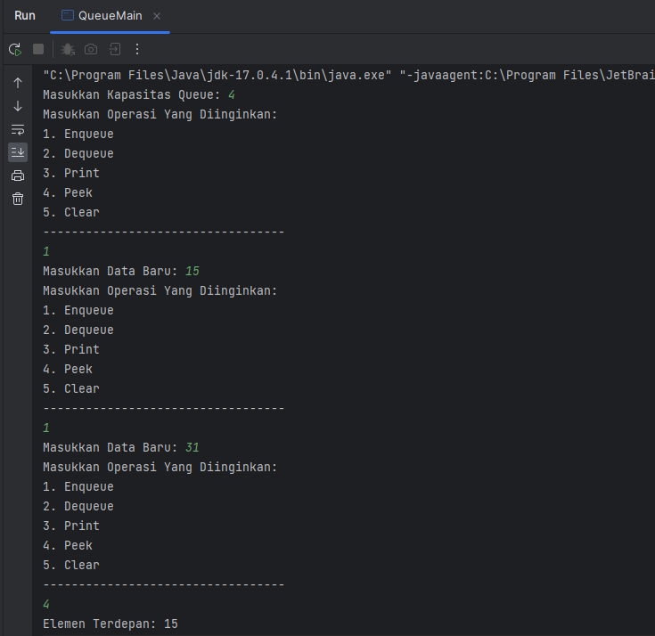

Pertanyaan
1. Pada method Create, mengapa atribut front dan rear diinisialisasi dengan nilai -1, tidak 0?
- Dikarenakan array dimulai dari 0, maka -1 menandakan bahwa array belum ada atau masih kosong.
2. Pada method Enqueue, jelaskan maksud dan kegunaan dari potongan kode berikut!
``` java
if (rear == max - 1) {
    rear = 0;
}
```
- Memastikan bahwa data yang ingin dimasukkan ke dalam queue tetap dapat dimasukkan meskipun posisi belakang dari queue sudah penuh. Jadi, ketika posisi rear sudah mencapai posisi terakhir dari max, maka posisi rear akan diatur ulang menjadi 0, sehingga data baru dapat dimasukkan ke dalam queue pada posisi awal lagi.
3. Perhatikan kembali method Enqueue, baris kode program manakah yang menunjukkan bahwa data baru disimpan pada posisi terakhir di dalam queue?

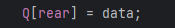

4. Perhatikan kembali method Dequeue, baris kode program manakah yang menunjukkan bahwa data yang dikeluarkan adalah data pada posisi paling depan di dalam queue?

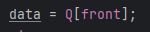

5. Pada method Dequeue, jelaskan maksud dan kegunaan dari potongan kode berikut!
``` java
if (front == max - 1) {
    front = 0;
}
```
- Untuk memastikan bahwa data yang dikeluarkan dari queue selalu dimulai dari posisi depan. Jadi, ketika posisi front sudah mencapai posisi terakhir dari antrian, maka posisi front akan diatur ulang menjadi 0, sehingga data selanjutnya dapat dikeluarkan dari queue dengan dimulai dari posisi awal lagi.
6. Pada method print, mengapa pada proses perulangan variabel i tidak dimulai dari 0 (int i=0), melainkan int i=front?
- Dikarenakan posisi depan tidak selalu dimulai dari 0, maka nilai variabel i harus menyamakan dengan variabel front 
7. Perhatikan kembali method print, jelaskan maksud dari potongan kode berikut!
``` java
i = (i + 1) % max;
```
- Kode program tersebut digunakan untuk mengiterasi indeks elemen-elemen pada array Q. Ketika i mencapai nilai maksimum (yaitu max - 1), maka nilai i+1 akan kembali ke 0 karena penggunaan operasi modulus atau %.

### Praktikum 2

Code

Penumpang
``` java
package Praktikum2;

public class Penumpang {
    String nama, kotaAsal, kotaTujuan;
    int jumlahTiket, harga;

    Penumpang(String nama, String kotaAsal, String kotaTujuan, int jumlahTiket, int harga) {
        this.nama = nama;
        this.kotaAsal = kotaAsal;
        this.kotaTujuan = kotaTujuan;
        this.jumlahTiket = jumlahTiket;
        this.harga = harga;
    }
}
```
Queue
``` java
package Praktikum2;

public class Queue {
    int max, size, front, rear;
    Penumpang Q[];

    Queue(int n) {
        max = n;
        Create();
    }

    void Create() {
        Q = new Penumpang[max];
        size = 0;
        front = rear = -1;
    }

    boolean IsEmpty() {
        if (size == 0) {
            return true;
        }
        else {
            return false;
        }
    }
    boolean IsFull() {
        if (size == max) {
            return true;
        }
        else {
            return false;
        }
    }

    void peek() {
        if (!IsEmpty()) {
            System.out.println("Elemen Terdepan: " + Q[front].nama + "|" + Q[front].kotaAsal + "|" + Q[front].kotaTujuan + "|" + Q[front].jumlahTiket + "|" + Q[front].harga);
        }
        else {
            System.out.println("Queue Masih Kosong");
        }
    }

    void print() {
        if (IsEmpty()) {
            System.out.println("Queue Masih Kosong");
        }
        else {
            int i = front;
            while (i != rear) {
                System.out.print(Q[i].nama + "|" + Q[i].kotaAsal + "|" + Q[i].kotaTujuan + "|" + Q[i].jumlahTiket + "|" + Q[i].harga);
                i = (i + 1) % max;
            }
            System.out.println(Q[i] + " ");
            System.out.println("Jumlah Elemen = " + size);
        }
    }

    void clear() {
        if (!IsEmpty()) {
            front = rear = -1;
            size = 0;
            System.out.println("Queue Berhasil Dikosongkan");
        }
        else {
            System.out.println("Queue Masih Kosong");
        }
    }

    void Enqueue(Penumpang data) {
        if (IsFull()) {
            System.out.println("Queue Sudah Penuh");
        }
        else {
            if (IsEmpty()) {
                front = rear = 0;
            }
            else {
                if (rear == max - 1) {
                    rear = 0;
                }
                else {
                    rear++;
                }
            }
            Q[rear] = data;
            size++;
        }
    }

    Penumpang Dequeue() {
        Penumpang data = new Penumpang("", "", "", 0, 0);
        if (IsEmpty()) {
            System.out.println("Queue Masih Kosong");
        }
        else {
            data = Q[front];
            size--;
            if (IsEmpty()) {
                front = rear = -1;
            }
            else {
                if (front == max - 1) {
                    front = 0;
                }
                else {
                    front++;
                }
            }
        }
        return data;
    }
}
```
QueueMain
``` java
package Praktikum2;

import java.util.Scanner;

public class QueueMain {
    public static void main(String[] args) {
        Scanner sc = new Scanner(System.in);
        System.out.print("Masukkan Kapasitas Queue: ");
        int jumlah = sc.nextInt();
        Queue antri = new Queue(jumlah);
        int pilih;
        do {
            menu();
            pilih = sc.nextInt();
            sc.nextLine();
            switch (pilih) {
                case 1:
                    System.out.print("Nama: ");
                    String nama = sc.nextLine();
                    System.out.print("Kota Asal: ");
                    String asal = sc.nextLine();
                    System.out.print("Kota Tujuan: ");
                    String tujuan = sc.nextLine();
                    System.out.print("Jumlah Tiket: ");
                    int jml = sc.nextInt();
                    System.out.print("Harga: ");
                    int harga = sc.nextInt();
                    Penumpang penumpang = new Penumpang(nama, asal, tujuan, jml, harga);
                    sc.nextLine();
                    antri.Enqueue(penumpang);
                    break;
                case 2:
                    Penumpang data = antri.Dequeue();
                    if (!"".equals(data.nama) && !"".equals(data.kotaAsal) && !"".equals(data.kotaTujuan) && data.jumlahTiket != 0 && data.harga != 0) {
                    System.out.println("Antrian Yang Keluar: " + data.nama + "|" + data.kotaAsal + "|" + data.kotaTujuan + "|" + data.jumlahTiket + "|" + data.harga);
                    }
                    break;
                case 3:
                    antri.peek();
                    break;
                case 4:
                    antri.print();
                    break;
            }
        } while (pilih > 0 && pilih < 5);
    }
    static void menu() {
        System.out.println("Pilih Menu: ");
        System.out.println("1. Antrian Baru");
        System.out.println("2. Antrian Keluar");
        System.out.println("3. Cek Antrian Terdepan");
        System.out.println("4. Cek Semua Antrian");
        System.out.println("----------------------------");
    }
}
```
Output

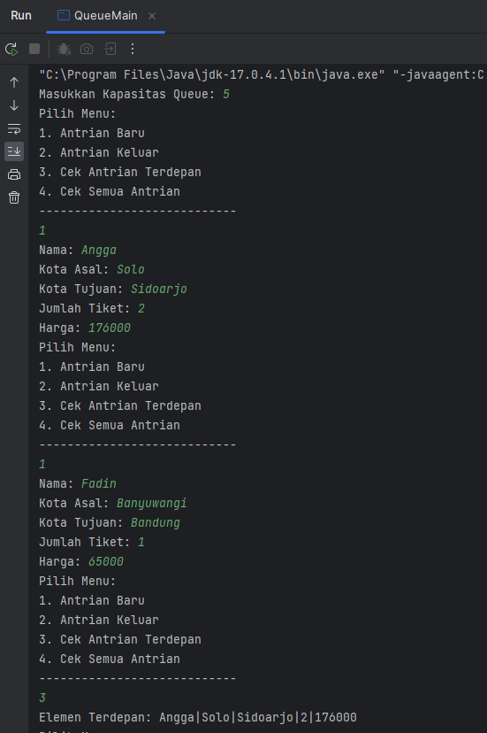

Pertanyaan
1. Perhatikan class Queue, apa fungsi kode program berikut pada method Dequeue?
``` java
Penumpang data = new Penumpang("", "", "", 0, 0);
```
- Fungsi kode program tersebut untuk membuat object penumpang
2. Pada soal nomor 1, apabila kode program tersebut diganti dengan kode berikut:
   Penumpang data = new Penumpang()
   Apakah yang terjadi? Mengapa demikian?
- Kode program terjadi error, dikarenakan pada konstruktor diharuskan memasukkan parameter yang telah ditentukan
3. Tunjukkan kode program yang digunakan untuk menampilkan data yang dikeluarkan dari queue!

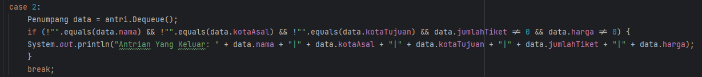

4. Lakukan modifikasi program dengan menambahkan method baru bernama peekRear pada class Queue yang digunakan untuk mengecek antrian yang berada di posisi belakang! Tambahkan pula daftar menu 5. Cek Antrian paling belakang pada class QueueMain sehingga method peekRear dapat dipanggil!
``` java 
   void peekRear() {
        if (!IsEmpty()) {
            System.out.println("Elemen Belakang: " + Q[rear].nama + "|" + Q[rear].kotaAsal + "|" + Q[rear].kotaTujuan + "|" + Q[rear].jumlahTiket + "|" + Q[rear].harga);
        }
        else {
            System.out.println("Queue Masih Kosong");
        }
    }
```
Main
``` java
package Praktikum2;

import java.util.Scanner;

public class QueueMain {
    public static void main(String[] args) {
        Scanner sc = new Scanner(System.in);
        System.out.print("Masukkan Kapasitas Queue: ");
        int jumlah = sc.nextInt();
        Queue antri = new Queue(jumlah);
        int pilih;
        do {
            menu();
            pilih = sc.nextInt();
            sc.nextLine();
            switch (pilih) {
                case 1:
                    System.out.print("Nama: ");
                    String nama = sc.nextLine();
                    System.out.print("Kota Asal: ");
                    String asal = sc.nextLine();
                    System.out.print("Kota Tujuan: ");
                    String tujuan = sc.nextLine();
                    System.out.print("Jumlah Tiket: ");
                    int jml = sc.nextInt();
                    System.out.print("Harga: ");
                    int harga = sc.nextInt();
                    Penumpang penumpang = new Penumpang(nama, asal, tujuan, jml, harga);
                    sc.nextLine();
                    antri.Enqueue(penumpang);
                    break;
                case 2:
                    Penumpang data = antri.Dequeue();
                    if (!"".equals(data.nama) && !"".equals(data.kotaAsal) && !"".equals(data.kotaTujuan) && data.jumlahTiket != 0 && data.harga != 0) {
                    System.out.println("Antrian Yang Keluar: " + data.nama + "|" + data.kotaAsal + "|" + data.kotaTujuan + "|" + data.jumlahTiket + "|" + data.harga);
                    }
                    break;
                case 3:
                    antri.peek();
                    break;
                case 4:
                    antri.print();
                    break;
                case 5:
                    antri.peekRear();
                    break;
            }
        } while (pilih > 0 && pilih < 6);
    }
    static void menu() {
        System.out.println("Pilih Menu: ");
        System.out.println("1. Antrian Baru");
        System.out.println("2. Antrian Keluar");
        System.out.println("3. Cek Antrian Terdepan");
        System.out.println("4. Cek Semua Antrian");
        System.out.println("5. Cek Antrian Paling Belakang");
        System.out.println("----------------------------");
    }
}
```

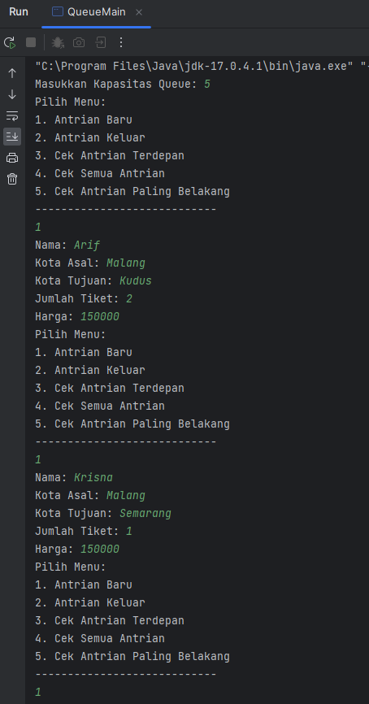\

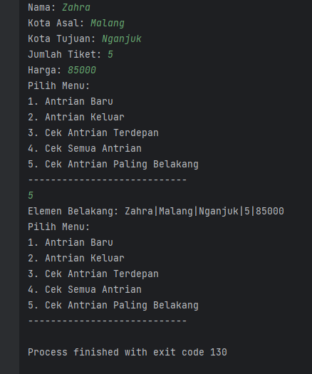

## Tugas
1. Tambahkan dua method berikut ke dalam class Queue pada Praktikum1:
   
    a. Method peekPosition(data: int) : void
   Untuk menampilkan posisi dari sebuah data di dalam queue, misalnya dengan mengirimkan data tertentu, akan diketahui posisi (indeks) data tersebut berada di urutan keberapa
   
    b. Method peekAt(position: int) : void
   Untuk menampilkan data yang berada pada posisi (indeks) tertentu
   
    Sesuaikan daftar menu yang terdapat pada class QueueMain sehingga kedua method tersebut dapat dipanggil!

a. peekPosition(int data)
``` java
     void peekPosition(int data){
        for (int i = 0; i < size; i++) {
            if (data == Q[i]) {
                System.out.println("Data " + data + " ditemukan di indeks ke: " + i);
            }
        }
    }
```
b.peekAt(int position)
``` java
   void peekAt(int position){
        System.out.println("Data di indeks ke-" + position + " adalah: " + Q[position] );
    }
```

2. Buatlah program antrian untuk mengilustasikan mahasiswa yang sedang meminta tanda tangan KRS pada dosen DPA di kampus. Ketika seorang mahasiswa akan mengantri, maka dia harus menuliskan terlebih dulu NIM, nama, absen, dan IPK seperti yang digambarkan pada Class diagram berikut:

Code:

Mahasiswa
``` java
package Tugas;

public class Mahasiswa {
    String nim, nama;
    int absen;
    double ipk;

    Mahasiswa(String nim, String nama, int absen, double ipk) {
        this.nim = nim;
        this.nama = nama;
        this.absen = absen;
        this.ipk = ipk;
    }
}
```
Queue
``` java
package Tugas;

public class Queue {
    int max, size, front, rear;
    Mahasiswa antrian[];

    Queue(int n) {
        max = n;
        Create();
    }

    void Create() {
        antrian = new Mahasiswa[max];
        size = 0;
        front = rear = -1;
    }

    boolean IsEmpty() {
        if (size == 0) {
            return true;
        }
        else {
            return false;
        }
    }
    boolean IsFull() {
        if (size == max) {
            return true;
        }
        else {
            return false;
        }
    }

    void peek() {
        if (!IsEmpty()) {
            System.out.println("Elemen Terdepan: " + antrian[front].nim + " | " + antrian[front].nama + " | " + antrian[front].absen + " | " + antrian[front].ipk);
        }
        else {
            System.out.println("Queue Masih Kosong");
        }
    }

    void print() {
        if (IsEmpty()) {
            System.out.println("Queue Masih Kosong");
        }
        else {
            int i = front;
            while (i != rear) {
                System.out.print(antrian[i].nim + " | " + antrian[i].nama + " | " + antrian[i].absen + " | " + antrian[i].ipk);
                i = (i + 1) % max;
            }
            System.out.println(antrian[i] + " ");
            System.out.println("Jumlah Elemen = " + size);
        }
    }

    void clear() {
        if (!IsEmpty()) {
            front = rear = -1;
            size = 0;
            System.out.println("Queue Berhasil Dikosongkan");
        }
        else {
            System.out.println("Queue Masih Kosong");
        }
    }

    void Enqueue(Mahasiswa data) {
        if (IsFull()) {
            System.out.println("Queue Sudah Penuh");
        }
        else {
            if (IsEmpty()) {
                front = rear = 0;
            }
            else {
                if (rear == max - 1) {
                    rear = 0;
                }
                else {
                    rear++;
                }
            }
            antrian[rear] = data;
            size++;
        }
    }

    Mahasiswa Dequeue() {
        Mahasiswa data = new Mahasiswa("", "",0, 0);
        if (IsEmpty()) {
            System.out.println("Queue Masih Kosong");
        }
        else {
            data = antrian[front];
            size--;
            if (IsEmpty()) {
                front = rear = -1;
            }
            else {
                if (front == max - 1) {
                    front = 0;
                }
                else {
                    front++;
                }
            }
        }
        return data;
    }

    void peekRear() {
        if (!IsEmpty()) {
            System.out.println("Elemen Belakang: " + antrian[rear].nim + " | " + antrian[rear].nama + " | " + antrian[rear].absen + " | " + antrian[rear].ipk);
        }
        else {
            System.out.println("Queue Masih Kosong");
        }
    }
    void peekPosition(String nim) {
        int posisi = -1;
        for (int i = 0; i < antrian.length; i++) {
            if (nim.equalsIgnoreCase(antrian[i].nim)) {
                posisi = i;
                break;
            }
        }
        if (posisi < 0) {
            System.out.println("Data Tidak Ditemukan");
        }
        else {
            System.out.println("Mahasiswa Dengan NIM " + nim + " Berada Pada Antrian Posisi Ke-" + (posisi + 1));
        }
    }
    void printMahasiswa(int posisi) {
        for (int i = 0; i < antrian.length; i++) {
            if (posisi < antrian.length && posisi >= 0) {
                if (posisi == i) {
                    System.out.println("NIM     : " + antrian[i].nim);
                    System.out.println("Nama    : " + antrian[i].nama);
                    System.out.println("Absen   : " + antrian[i].absen);
                    System.out.println("IPK     : " + antrian[i].ipk);
                }
            }
            else {
                System.out.println("Posisi Yang Anda Masukkan Tidak Sesuai");
                break;
            }
        }
    }
}
```
MahasiswaMain
``` java
package Tugas;

import java.util.Scanner;

public class MahasiswaMain {
    public static void main(String[] args) {
        Scanner sc = new Scanner(System.in);
        System.out.print("Masukkan Kapasitas Queue: ");
        int capasity = sc.nextInt();
        Queue antrian = new Queue(capasity);

        int pilih;
        do {
            menu();
            System.out.print("Pilih Menu: ");
            pilih = sc.nextInt();
            sc.nextLine();
            switch (pilih) {
                case 1:
                    System.out.print("NIM: ");
                    String nim = sc.nextLine();
                    System.out.print("Nama: ");
                    String nama = sc.nextLine();
                    System.out.print("Absen: ");
                    int absen = sc.nextInt();
                    System.out.print("IPK: ");
                    double ipk = sc.nextDouble();
                    Mahasiswa mhs = new Mahasiswa(nim, nama, absen, ipk);
                    sc.nextLine();
                    antrian.Enqueue(mhs);
                    break;
                case 2:
                    Mahasiswa data = antrian.Dequeue();
                    if (!"".equals(data.nama) && !"".equals(data.nim) && data.absen != 0 && data.ipk != 0) {
                        System.out.println("Antrian Mahasiswa Keluar: ");
                        System.out.println("NIM     : " + data.nim);
                        System.out.println("Nama    : " + data.nama);
                        System.out.println("Absen   : " + data.absen);
                        System.out.println("IPK     : " + data.ipk);
                    }
                    break;
                case 3:
                    antrian.peek();
                    break;
                case 4:
                    antrian.peekRear();
                    break;
                case 5:
                    System.out.print("Masukkan NIM: ");
                    String inputnim = sc.nextLine();
                    antrian.peekPosition(inputnim);
                    break;
                case 6:
                    System.out.print("Masukkan Posisi: ");
                    int inputPosisi = sc.nextInt();
                    antrian.printMahasiswa(inputPosisi);
                    sc.nextLine();
                case 7:
                    antrian.print();
                    break;
            }
        } while (pilih > 0 && pilih < 8);
    }
    static void menu() {
        System.out.println("1. Antrian Baru");
        System.out.println("2. Antrian Keluar");
        System.out.println("3. Cek Antrian Terdepan");
        System.out.println("4. Cek Antrian Belakang");
        System.out.println("5. Cari Antrian Berdasakan NIM");
        System.out.println("6. Menampilkan Data Berdasarkan Posisi");
        System.out.println("7. Tampil Semua Antrian");
        System.out.println("------------------------------------------------");
    }
}
```
Output

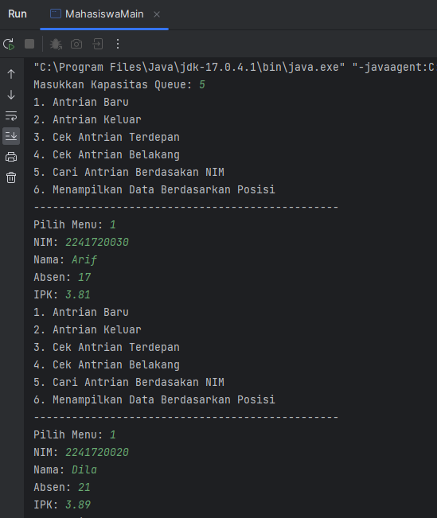

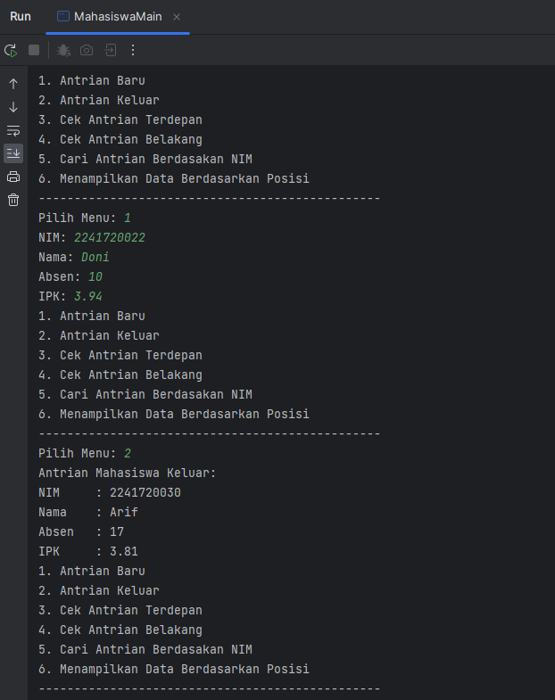

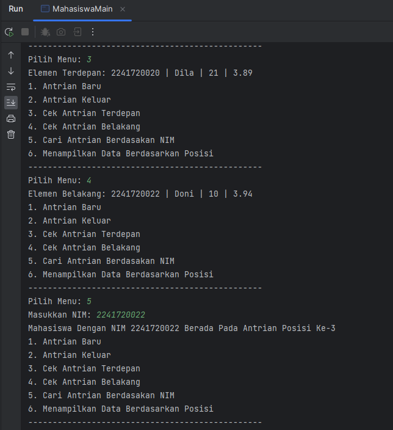

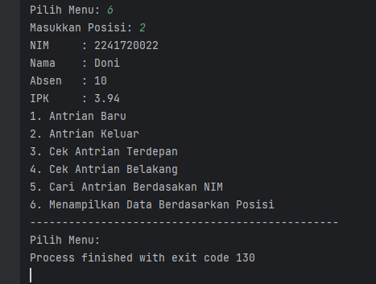