# LAPORAN PRATIKUM 9
NIM   : 2241720030

Nama  : Muhammad Fakhruddin Arif

Kelas : TI-1D

## Latihan

### Pembuatan Single Linked List

Code:

Node
``` java
package minggu11;

public class Node {
    int data;
    Node next;

    Node(int nilai, Node berikutnya) {
        this.data = nilai;
        this.next = berikutnya;
    }
}
```
SingleLinkedList
``` java
package minggu11;

public class SingleLinkedList {
    Node head; // Posisi Awal Linked List
    Node tail; // Posisi Akhir Linked List

    boolean isEmpty() {
        return head == null;
    }

    void print() {
        if (!isEmpty()) {
            Node tmp = head;
            System.out.print("Isi Linked List:\t");
            while (tmp != null) {
                System.out.print(tmp.data + "\t");
                tmp = tmp.next;
            }
            System.out.println();
        }
        else {
            System.out.println("Linked List Kosong");
        }
    }

    void addFirst(int input) {
        Node ndInput = new Node(input, null);
        if (isEmpty()) {
            // Head dan Tail sama dengan Node Input
            head = ndInput;
            tail = ndInput;
        }
        else {
            ndInput.next = head;
            head = ndInput;
        }
    }

    void addLast(int input) {
        Node ndInput = new Node(input, null);
        if (isEmpty()) {
            // Head dan Tail sama dengan Node Input
            head = ndInput;
            tail = ndInput;
        }
        else {
            tail.next = ndInput;
            tail = ndInput;
        }
    }

    void insertAfter(int key, int input) {
        Node ndInput = new Node(input, null);
        Node temp = head;
        do {
            if (temp.data == key) {
                ndInput.next = temp.next;
                temp.next = ndInput;
                if (ndInput.next == null) tail = ndInput;
                break;
            }
            temp = temp.next;
        } while (temp != null);
    }

    void insertAt(int index, int input) {
        if (index < 0) {
            System.out.println("Index Salah");
        }
        else if (index == 0) {
            addFirst(input);
        }
        else {
            Node temp = head;
            for (int i = 0; i < index - 1; i++) {
                temp = temp.next;
            }
            temp.next = new Node(input, temp.next);
            if (temp.next.next == null) tail = temp.next;
        }
    }
}
```
SLLMain
``` java
package minggu11;

public class SLLMain {
    public static void main(String[] args) {
        SingleLinkedList singleLinkedList = new SingleLinkedList();

        singleLinkedList.print();
        singleLinkedList.addFirst(890);
        singleLinkedList.print();
        singleLinkedList.addLast(760);
        singleLinkedList.print();
        singleLinkedList.addFirst(700);
        singleLinkedList.print();
        singleLinkedList.insertAfter(700, 999);
        singleLinkedList.print();
        singleLinkedList.insertAt(3, 833);
        singleLinkedList.print();
    }
}
```
Output

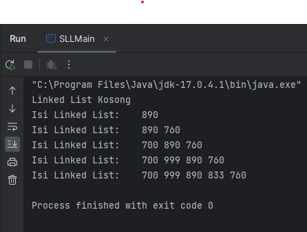

Pertanyaan
1. Mengapa hasil compile kode program di baris pertama menghasilkan “Linked List Kosong”?
- Dikarenakan pada compile tersebut variabel head belum mempunyai nilai atau null, dan pada proses pemilihan terdapat method isEmpty() yang akan bernilai true jika head == null jadi jika head == null akan menghasilkan "Linked List Kosong".
2. Pada step 10, jelaskan kegunaan kode berikut
``` java
ndInput.next = temp.next;
temp.next = ndInput;
```
- Saat akan menambahkan data setelah data tertentu maka data setelah key akan menjadi data selanjutnya dari data yang diinputkan, dan data yang diinputkan akan menempati setelah data key
3. Perhatikan class SingleLinkedList, pada method insertAt Jelaskan kegunaan kode berikut
``` java
if (temp.next.next == null) tail = temp.next;
```
- Misalkan akan terdapat 3 data lalu akan menginputkan diposisi index ke 3 maka data yang baru akan menempati posisi data terakhir dan akan menjadi tail.

### Modifikasi Elemen Pada Single Linked List
Code:
SingleLinkedList
``` java
package minggu11;

public class SingleLinkedList {
    Node head; // Posisi Awal Linked List
    Node tail; // Posisi Akhir Linked List

    boolean isEmpty() {
        return head == null;
    }

    void print() {
        if (!isEmpty()) {
            Node tmp = head;
            System.out.print("Isi Linked List:\t");
            while (tmp != null) {
                System.out.print(tmp.data + "\t");
                tmp = tmp.next;
            }
            System.out.println();
        }
        else {
            System.out.println("Linked List Kosong");
        }
    }

    void addFirst(int input) {
        Node ndInput = new Node(input, null);
        if (isEmpty()) {
            // Head dan Tail sama dengan Node Input
            head = ndInput;
            tail = ndInput;
        }
        else {
            ndInput.next = head;
            head = ndInput;
        }
    }

    void addLast(int input) {
        Node ndInput = new Node(input, null);
        if (isEmpty()) {
            // Head dan Tail sama dengan Node Input
            head = ndInput;
            tail = ndInput;
        }
        else {
            tail.next = ndInput;
            tail = ndInput;
        }
    }

    void insertAfter(int key, int input) {
        Node ndInput = new Node(input, null);
        Node temp = head;
        do {
            if (temp.data == key) {
                ndInput.next = temp.next;
                temp.next = ndInput;
                if (ndInput.next == null) tail = ndInput;
                break;
            }
            temp = temp.next;
        } while (temp != null);
    }

    void insertAt(int index, int input) {
        if (index < 0) {
            System.out.println("Index Salah");
        }
        else if (index == 0) {
            addFirst(input);
        }
        else {
            Node temp = head;
            for (int i = 0; i < index - 1; i++) {
                temp = temp.next;
            }
            temp.next = new Node(input, temp.next);
            if (temp.next.next == null) tail = temp.next;
        }
    }
    
    int getData(int index) {
        Node tmp = head;
        for (int i = 0; i < index; i++) {
            tmp = tmp.next;
        }
        return tmp.data;
    }

    int indexOf(int key) {
        Node tmp = head;
        int index = 0;
        while (tmp != null && tmp.data != key) {
            tmp = tmp.next;
            index++;
        }
        if (tmp == null) {
            return -1;
        }
        else {
            return index;
        }
    }

    void removeFisrt() {
        if (isEmpty()) {
            System.out.println("Linked List Masih Kosong, Tidak Dapat Dihapus");
        }
        else if (head == tail) {
            head = tail = null;
        }
        else {
            head = head.next;
        }
    }

    void removeLast() {
        if (isEmpty()) {
            System.out.println("Linked List Masih Kosong, Tidak Dapat Dihapus");
        }
        else if (head == tail) {
            head = tail = null;
        }
        else {
            Node temp = head;
            while (temp.next != tail) {
                temp = temp.next;
            }
            temp.next = null;
            tail = temp;
        }
    }

    void remove(int key) {
        if (isEmpty()) {
            System.out.println("Linked List Maasih Kosong, Tidak Dapat Dihapus");
        }
        else {
            Node temp = head;
            while (temp != null) {
                if (temp.data == key && temp == head) {
                    this.removeFisrt();
                    break;
                }
                else if (temp.next.data == key) {
                    temp.next = temp.next.next;
                    if (temp.next == null) {
                        tail = temp;
                    }
                    break;
                }
                temp = temp.next;
            }
        }
    }

    void removeAt(int index) {
        if (index == 0) {
            removeFisrt();
        }
        else {
            Node temp = head;
            for (int i = 0; i < index - 1; i++) {
                temp = temp.next;
            }
            temp.next = temp.next.next;
            if (temp.next == null) {
                tail = temp;
            }
        }
    }
}
```
SLLMain
``` java
package minggu11;

public class SLLMain {
    public static void main(String[] args) {
        SingleLinkedList singleLinkedList = new SingleLinkedList();

        singleLinkedList.print();
        singleLinkedList.addFirst(890);
        singleLinkedList.print();
        singleLinkedList.addLast(760);
        singleLinkedList.print();
        singleLinkedList.addFirst(700);
        singleLinkedList.print();
        singleLinkedList.insertAfter(700, 999);
        singleLinkedList.print();
        singleLinkedList.insertAt(3, 833);
        singleLinkedList.print();

        System.out.println("Data Pada Index Ke-1 = " + singleLinkedList.getData(1));
        System.out.println("Data 3 Berada Pada Index Ke-" + singleLinkedList.indexOf(760));
        singleLinkedList.remove(999);
        singleLinkedList.print();
        singleLinkedList.removeAt(0);
        singleLinkedList.print();
        singleLinkedList.removeFisrt();
        singleLinkedList.print();
        singleLinkedList.removeLast();
        singleLinkedList.print();
    }
}
```
Output

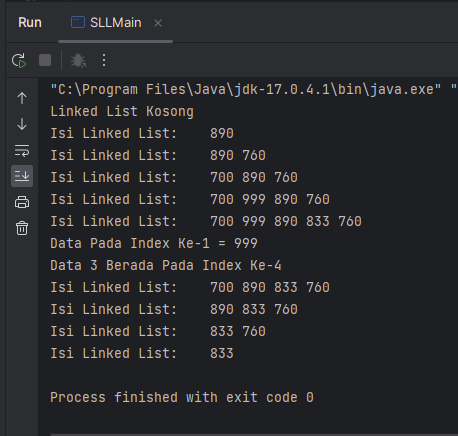

Pertanyaan
1. Mengapa digunakan keyword break pada fungsi remove? Jelaskan!
- Break digunakan untuk menghentikan perulangan tersebut jika data yang akan dihapus telah ditemukan
2. Jelaskan kegunaan kode dibawah pada method remove
``` java
else if (temp.next.data == key) {
    temp.next = temp.next.next;
}
```
- Yang akan dibandingkan dengan key adalah data setelah temp. Jika sudah sesuai maka posisi setelah temp akan ditempati data setelah key yang akan dihapus.
3. Apa saja nilai kembalian yang dapat dikembalikan pada method indexOf? Jelaskan maksud
   masing-masing kembalian tersebut!
- Method indexOf akan me-return -1 apabila data yang dicari tidak ditemukan. Jika data ditemukan maka akan me-return index dari data yang dicari

## TugasFilm
1. Buat method insertBefore untuk menambahkan node sebelum keyword yang diinginkan
``` java
   void insertBefore(int key, int input) {
        Node ndInput = new Node(input, null);
        Node temp = head;
        Node previous = null;

        while (temp != null && temp.data != key) {
            previous = temp;
            temp = temp.next;
        }
        if (temp == null) {
            System.out.println("Kata Kunci Tidak Ditemukan");
        }
        ndInput.next = temp;
        if (previous == null) {
            head = ndInput;
        }
        else {
            previous.next = ndInput;
        }
    }
```
SLLMain
``` java
package minggu11;

public class SLLMain {
    public static void main(String[] args) {
//        Create Object
        SingleLinkedList sll = new SingleLinkedList();
        sll.addFirst(20);
        sll.print();
        sll.addLast(10);
        sll.print();
        sll.insertAfter(20, 1);
        sll.print();
        sll.insertBefore(1, 30);
        sll.print();
    }
}
```

Output

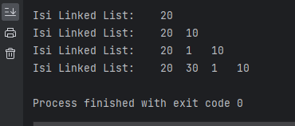

2. Implementasikan ilustrasi Linked List Berikut. Gunakan 4 macam penambahan data yang telah
   dipelajari sebelumnya untuk menginputkan data.

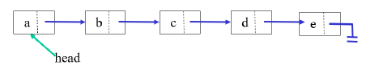

Node
``` java
package TugasNomor2;

public class Node {
    String data;
    Node next;

    Node(String nilai, Node berikutnya) {
        this.data = nilai;
        this.next = berikutnya;
    }
}
```
SingleLinkedList
``` java
package TugasNomor2;

public class SingleLinkedList {
    Node head; // Posisi Awal Linked List
    Node tail; // Posisi Akhir Linked List

    boolean isEmpty() {
        return head == null;
    }

    void print() {
        if (!isEmpty()) {
            Node tmp = head;
            System.out.print("Isi Linked List:\t");
            while (tmp != null) {
                System.out.print(tmp.data + "\t");
                tmp = tmp.next;
            }
            System.out.println();
        }
        else {
            System.out.println("Linked List Kosong");
        }
    }

    void addFirst(String input) {
        Node ndInput = new Node(input, null);
        if (isEmpty()) {
            // Head dan Tail sama dengan Node Input
            head = ndInput;
            tail = ndInput;
        }
        else {
            ndInput.next = head;
            head = ndInput;
        }
    }

    void addLast(String input) {
        Node ndInput = new Node(input, null);
        if (isEmpty()) {
            // Head dan Tail sama dengan Node Input
            head = ndInput;
            tail = ndInput;
        }
        else {
            tail.next = ndInput;
            tail = ndInput;
        }
    }

    void insertAfter(String key, String input) {
        Node ndInput = new Node(input, null);
        Node temp = head;
        do {
            if (temp.data == key) {
                ndInput.next = temp.next;
                temp.next = ndInput;
                if (ndInput.next == null) tail = ndInput;
                break;
            }
            temp = temp.next;
        } while (temp != null);
    }

    void insertAt(int index, String input) {
        if (index < 0) {
            System.out.println("Index Salah");
        }
        else if (index == 0) {
            addFirst(input);
        }
        else {
            Node temp = head;
            for (int i = 0; i < index - 1; i++) {
                temp = temp.next;
            }
            temp.next = new Node(input, temp.next);
            if (temp.next.next == null) tail = temp.next;
        }
    }
}
```
``` java
package TugasNomor2;

public class Main {
    public static void main(String[] args) {
        SingleLinkedList ssl = new SingleLinkedList();

        ssl.addFirst("A");
        ssl.print();
        ssl.addLast("E");
        ssl.print();
        ssl.insertAfter("A", "B");
        ssl.print();
        ssl.insertAt(2, "C");
        ssl.print();
        ssl.insertAfter("C", "D");
        ssl.print();

    }
}
```
Output

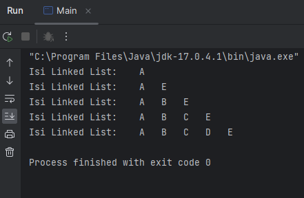

3. Buatlah Implementasi Stack berikut menggunakan Single Linked List

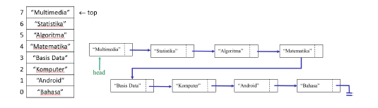

Matakuliah
``` java
package TugasNomor3;

public class MataKuliah {
    String namaMatkul;

    MataKuliah(String namaMatkul) {
        this.namaMatkul = namaMatkul;
    }
}
```
Node
``` java
package TugasNomor3;

public class Node {
    MataKuliah data;
    Node next;

    Node(MataKuliah data, Node next) {
        this.data = data;
        this.next = next;
    }
}
```
Stack
``` java
package TugasNomor3;

public class Stack {
    Node top;
    int size;

    Stack() {
        this.top = null;
        this.size = 0;
    }

    boolean isEmpty() {
        return top == null;
    }
    void push(MataKuliah data) {
        Node ndInput = new Node(data, null);
        if (isEmpty()) {
            top = ndInput;
        }
        else {
            ndInput.next = top;
            top = ndInput;
        }
        size++;
    }

    void pop() {
        if (isEmpty()) {
            System.out.println("Data Masih Kosong");
            return;
        }
        top = top.next;
        size--;
    }

    void peek() {
        if (isEmpty()) {
            System.out.println("Data Masih Kosong");
            return;
        }
        System.out.println("Mata Kuliah: " + top.data);
    }

    void print() {
        if (!isEmpty()) {
            Node tmp = top;
            System.out.print("Isi Linked List:\t");
            while (tmp != null) {
                System.out.print(tmp.data.namaMatkul + "\t");
                tmp = tmp.next;
            }
            System.out.println();
        }
        else {
            System.out.println("Linked List Kosong");
        }
    }
}
```
Main
``` java
package TugasNomor3;

import java.util.Scanner;

public class Main {
    public static void main(String[] args) {
        Stack stk = new Stack();
        Scanner scd = new Scanner(System.in);
        Scanner scs = new Scanner(System.in);

        char pilih;
        do {
            System.out.println("1. Push");
            System.out.println("2. Pop");
            System.out.println("3. Peek");
            System.out.print("Pilih Operasi Stack (1 - 3): ");
            int inputStack = scd.nextInt();
            if (inputStack == 1) {
                System.out.print("Nama Mata Kuliah: ");
                String nama = scs.nextLine();

                MataKuliah mataKuliah = new MataKuliah(nama);
                stk.push(mataKuliah);
            }
            else if (inputStack == 2) {
                stk.pop();
            }
            else if (inputStack == 3) {
                stk.peek();
            }
            else {
                System.out.println("Inputan Yang Anda Masukkan Tidak Sesuai");
            }

            stk.print();

            System.out.print("Apakah Anda Akan Mengolah Data Ke Stack (y/n)? ");
            pilih = scs.next().charAt(0);
            scs.nextLine();
        } while (pilih == 'y');
    }
}
```

Output

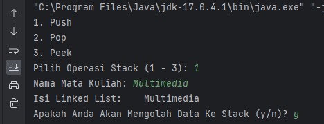

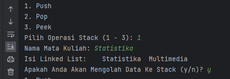

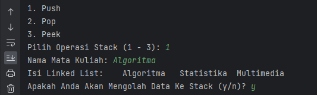

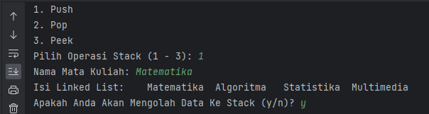

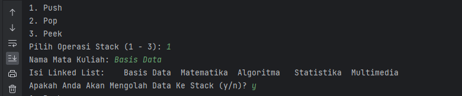

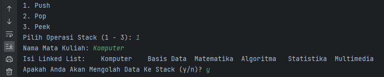

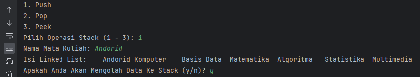

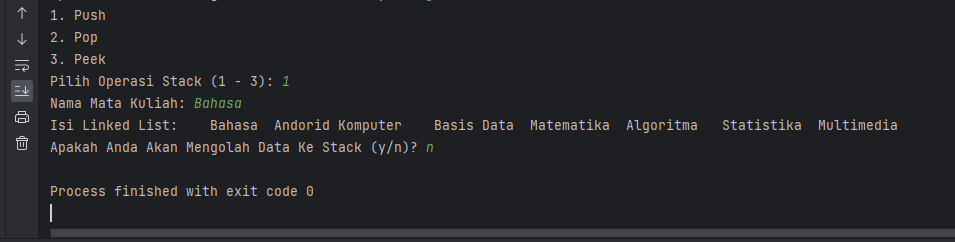


