# LAPORAN PRATIKUM 7
NIM   : 2241720030

Nama  : Muhammad Fakhruddin Arif

Kelas : TI-1D

## Latihan
### 7.2 Praktikum 1 
Code:

Pakaian
``` java
package Pratikum1;

public class Pakaian {
    String jenis, warna, merk, ukuran;
    double harga;

    Pakaian(String jenis, String warna, String merk, String ukuran, double harga) {
        this.jenis = jenis;
        this.warna = warna;
        this.merk = merk;
        this.ukuran = ukuran;
        this.harga = harga;
    }
}
```
Stack
``` java
package Pratikum1;

public class Stack {
    int size;
    int top;
    Pakaian data[];

    Stack(int size) {
        this.size = size;
        data = new Pakaian[size];
        top = -1;
    }

    boolean IsEmpty() {
        if (top == -1) {
            return true;
        }
        else {
            return false;
        }
    }
    boolean IsFull() {
        if (top == size - 1) {
            return true;
        }
        else {
            return false;
        }
    }

    void push(Pakaian pakaian) {
        if (!IsFull()) {
            top++;
            data[top] = pakaian;
        }
        else {
            System.out.println("Isi Stack Penuh");
        }
    }
    void pop() {
        if (!IsEmpty()) {
            Pakaian x = data[top];
            top--;
            System.out.println("Mahasiswa Yang Keluar: " + x.jenis + " " + x.warna + " " + x.merk + " " + x.ukuran + " " + x.harga);
        }
        else {
            System.out.println("Stack Masih Kosong");
        }
    }
    void peek() {
        System.out.println("Elemen Teratas: " + data[top].jenis + " " + data[top].warna + " " + data[top].merk + " " + data[top].ukuran + " " + data[top].harga);
    }
    void print() {
        System.out.println("Isi Stack:");
        for (int i = top; i >= 0; i--) {
            System.out.println(data[i].jenis + " " + data[i].warna + " " + data[i].merk + " " + data[i].ukuran + " " + data[i].harga);
        }
        System.out.println();
    }
    void clear() {
        if (!IsEmpty()) {
            for (int i = top; i >= 0; i--) {
                top--;
            }
            System.out.println("Stack Sudah Dikosongkan");
        }
        else {
            System.out.println("Stack Masih Kosong");
        }
    }
}
```
StackMain
``` java
package Pratikum1;

import java.util.Scanner;

public class StackMain {
    public static void main(String[] args) {
        Stack stk = new Stack(5);
        Scanner sc = new Scanner(System.in);

        char pilih;
        do {
            System.out.print("Jenis: ");
            String jenis = sc.nextLine();
            System.out.print("Warna: ");
            String warna = sc.nextLine();
            System.out.print("Merk: ");
            String merk = sc.nextLine();
            System.out.print("Ukuran: ");
            String ukuran = sc.nextLine();
            System.out.print("Harga: ");
            double harga = sc.nextDouble();

            Pakaian pakaian = new Pakaian(jenis, warna, merk, ukuran, harga);
            System.out.print("Apakah Anda Akan Menambahkan Mahasiswa Baru Ke Stack (y/n)? ");
            pilih = sc.next().charAt(0);
            sc.nextLine();
            stk.push(pakaian);
        } while (pilih == 'y');

        stk.print();
        stk.pop();
        stk.peek();
        stk.print();
    }
}
```
Output:

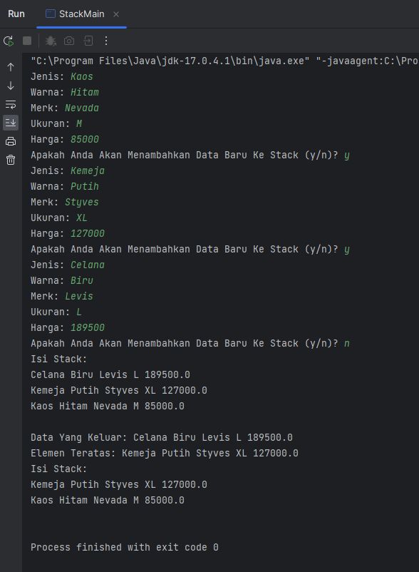

Pertanyaan
1. Berapa banyak data pakaian yang dapat ditampung di dalam stack? Tunjukkan potongan kode program untuk mendukung jawaban Anda tersebut! 
    - Yang dapat ditampung didalam stack sebanyak 5

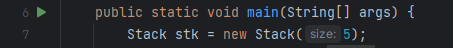

2. Perhatikan class StackMain, pada saat memanggil fungsi push, parameter yang dikirimkan adalah p. Mahasiswa apa yang tersimpan pada variabel p tersebut? 
``` java
stk.push(pakaian);
```
   - Mahasiswa yang tersimpan pada variabel tersebut yaitu jenis, warna, merk, ukuran, dan harga pada sebuah pakaian.
3. Apakah fungsi penggunaan do-while yang terdapat pada class StackMain? 
   - Untuk mengulangi atau melooping kode program yang terdapat didalam do dan akan tetap melooping hingga kondisi pada while bersifat false
4. Modifikasi kode program pada class StackMain sehingga pengguna dapat memilih operasi-operasi pada stack (push, pop, peek, atau print) melalui pilihan menu program dengan memanfaatkan kondisi IF-ELSE atau SWITCH-CASE! 

Code
``` java
package Pratikum1;

import java.util.Scanner;

public class StackMain {
    public static void main(String[] args) {
        Stack stk = new Stack(5);
        Scanner scd = new Scanner(System.in);
        Scanner scs = new Scanner(System.in);

        char pilih;
        do {
            System.out.println("1. Push");
            System.out.println("2. Pop");
            System.out.println("3. Peek");
            System.out.println("4. Print");
            System.out.print("Pilih Operasi Stack (1 - 4): ");
            int inputStack = scd.nextInt();
            if (inputStack == 1) {
                System.out.print("Jenis: ");
                String jenis = scs.nextLine();
                System.out.print("Warna: ");
                String warna = scs.nextLine();
                System.out.print("Merk: ");
                String merk = scs.nextLine();
                System.out.print("Ukuran: ");
                String ukuran = scs.nextLine();
                System.out.print("Harga: ");
                double harga = scd.nextDouble();

                Pakaian pakaian = new Pakaian(jenis, warna, merk, ukuran, harga);
                scd.nextLine();
                stk.push(pakaian);
            }
            else if (inputStack == 2) {
                stk.pop();
            }
            else if (inputStack == 3) {
                stk.peek();
            }
            else if (inputStack == 4) {
                stk.print();
            }
            else {
                System.out.println("Inputan Yang Anda Masukkan Tidak Sesuai");
            }
            System.out.print("Apakah Anda Akan Mengolah Mahasiswa Ke Stack (y/n)? ");
            pilih = scs.next().charAt(0);
        } while (pilih == 'y');
    }
}
```
Output

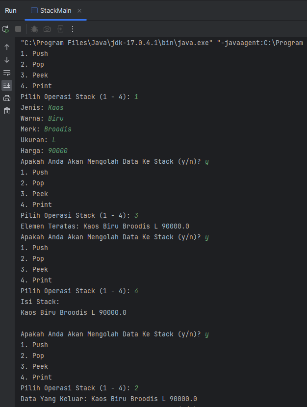

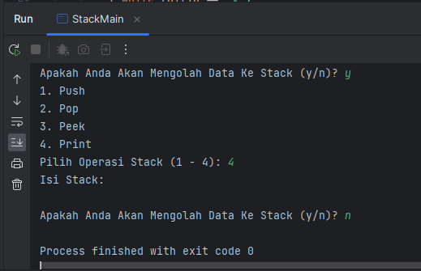

### 7.3 Praktikum 2 
Code:

Postfix
``` java
package Pratikum2;

public class Postfix {
    int n, top;
    char stack[];

    Postfix(int total) {
        n = total;
        top = -1;
        stack = new char[n];
        push('(');
    }

    void push(char c) {
        top++;
        stack[top] = c;
    }
    char pop() {
        char item = stack[top];
        top--;
        return item;
    }
    boolean IsOperand(char c) {
        if ((c >= 'A' && c <= 'Z') || (c >= 'a' && c <= 'z') || (c >= '0' && c <= '9') || c == ' ' || c == '.') {
            return true;
        }
        else {
            return false;
        }
    }
    boolean IsOperator(char c) {
        if (c == '^' || c == '%' || c == '/' || c == '*' || c == '-' || c == '+') {
            return true;
        }
        else {
            return false;
        }
    }
    int derajat(char c) {
        switch (c) {
            case '^':
                return 3;
            case '%':
                return 2;
            case '/':
                return 2;
            case '*':
                return 2;
            case '-':
                return 1;
            case '+':
                return 1;
            default:
                return 0;
        }
    }
    String konversi(String Q) {
        String P = "";
        char c;
        for (int i = 0; i < n; i++) {
            c = Q.charAt(i);
            if (IsOperand(c)) {
                P = P + c;
            }
            if (c == '(') {
                push(c);
            }
            if (c == ')') {
                while (stack[top] != '(') {
                    P = P + pop();
                }
                pop();
            }
            if (IsOperator(c)) {
                while (derajat(stack[top]) >= derajat(c)) {
                    P = P + pop();
                }
                push(c);
            }
        }
        return P;
    }
}
```
PostfixMain
``` java
package Pratikum2;

import java.util.Scanner;

public class PostfixMain {
    public static void main(String[] args) {
        Scanner sc = new Scanner(System.in);
        String P, Q;
        System.out.print("Masukkan Ekspresi Matematika (Infix): ");
        Q = sc.nextLine();
        Q = Q.trim();
        Q = Q + ")";

        int total = Q.length();

        Postfix post = new Postfix(total);
        P = post.konversi(Q);
        System.out.println("Postfix: " + P);
    }
}
```
Output:

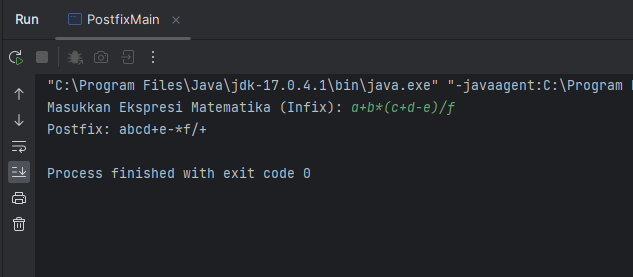

Pertanyaan
1. Perhatikan class Postfix, jelaskan alur kerja method derajat!
   - Alur kerja method derajat yaitu untuk mengecek suatu bilangan operasi yang mempunyai tingkatan tertentu yang nanti-Nya akan digunakan untuk perbandingan antara stack[top] dan nilai dari sebuah inputan.
2. Apa fungsi kode program berikut? 
``` java
c = Q.charAt(i);
```
   - Fungsi dari kode berikut yaitu untuk membaca karakter setiap i dari nilai varibel Q
3. Jalankan kembali program tersebut, masukkan ekspresi 3*5^(8-6)%3. Tampilkan hasilnya! 

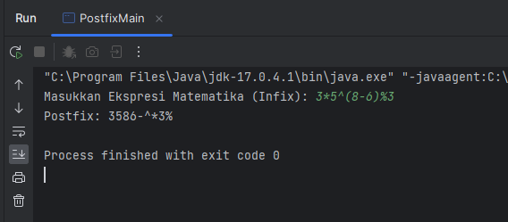

4. Pada soal nomor 3, mengapa tanda kurung tidak ditampilkan pada hasil konversi? Jelaskan! 
   - Dikarenakan pada saat c == ')' terjadi perulangan pop() dengan memindahkan data ke variabel P hingga variabel c == '(' setelah itu terjadi pop() kembali tetapi data tidak dimasukkan ke variabel P

## TugasFilm
1. Perhatikan dan gunakan kembali kode program pada Praktikum 1. Tambahkan method getMin pada class Stack yang digunakan untuk mencari dan menampilkan data pakaian dengan harga terendah dari semua data pakaian yang tersimpan di dalam stack!

Code:

Stack
``` java
void getMin() {
        int minPrice = top;
        for (int i = top - 1; i >= 0; i--) {
            if (data[i].harga < data[minPrice].harga) {
                minPrice = i;
            }
        }
        System.out.println("Harga Pakaian Terendah Yaitu: Rp. " + data[minPrice].harga);
        System.out.println("Jenis: " + data[minPrice].jenis);
        System.out.println("Warna: " + data[minPrice].warna);
        System.out.println("Merk: " + data[minPrice].merk);
        System.out.println("Ukuran: " + data[minPrice].ukuran);
    }
```
StackMain
``` java 
package Pratikum1;

import java.util.Scanner;

public class StackMain {
    public static void main(String[] args) {
        Stack stk = new Stack(5);
        Scanner scd = new Scanner(System.in);
        Scanner scs = new Scanner(System.in);

        char pilih;
        do {
            System.out.println("1. Push");
            System.out.println("2. Pop");
            System.out.println("3. Peek");
            System.out.println("4. Print");
            System.out.println("5. GetMin");
            System.out.print("Pilih Operasi Stack (1 - 5): ");
            int inputStack = scd.nextInt();
            if (inputStack == 1) {
                System.out.print("Jenis: ");
                String jenis = scs.nextLine();
                System.out.print("Warna: ");
                String warna = scs.nextLine();
                System.out.print("Merk: ");
                String merk = scs.nextLine();
                System.out.print("Ukuran: ");
                String ukuran = scs.nextLine();
                System.out.print("Harga: ");
                double harga = scd.nextDouble();

                Pakaian pakaian = new Pakaian(jenis, warna, merk, ukuran, harga);
                stk.push(pakaian);
            }
            else if (inputStack == 2) {
                stk.pop();
            }
            else if (inputStack == 3) {
                stk.peek();
            }
            else if (inputStack == 4) {
                stk.print();
            }
            else if (inputStack == 5) {
                stk.getMin();
            }
            else {
                System.out.println("Inputan Yang Anda Masukkan Tidak Sesuai");
            }
            System.out.print("Apakah Anda Akan Mengolah Mahasiswa Ke Stack (y/n)? ");
            pilih = scs.next().charAt(0);
            scs.nextLine();
        } while (pilih == 'y');
    }
}
```

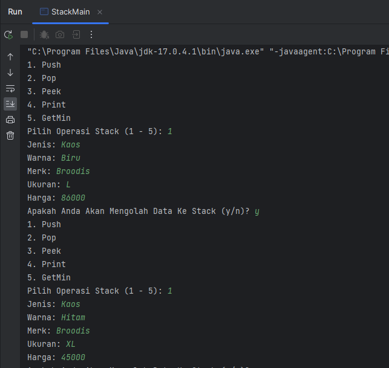

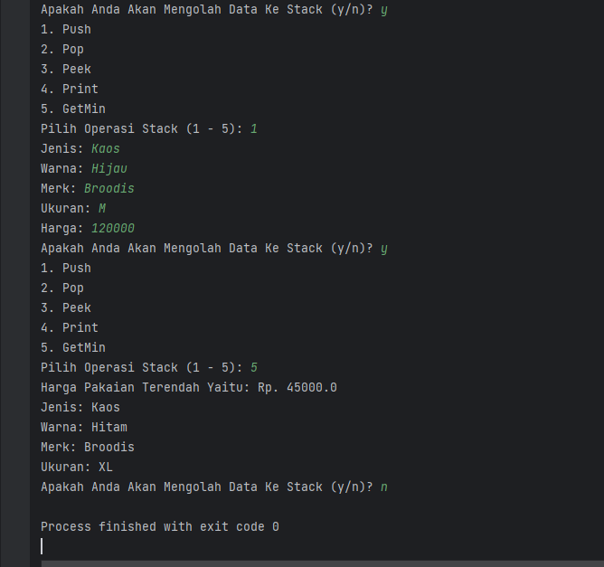

2. Setiap hari Minggu, Dewi pergi berbelanja ke salah satu supermarket yang berada di area rumahnya. Setiap kali selesai berbelanja, Dewi menyimpan struk belanjaannya di dalam laci. Setelah dua bulan, ternyata Dewi sudah mempunyai delapan struk belanja. Dewi berencana mengambil lima struk belanja untuk ditukarkan dengan voucher belanja. Buat sebuah program stack untuk menyimpan data struk belanja Dewi, kemudian lakukan juga proses pengambilan data struk belanja sesuai dengan jumlah struk yang akan ditukarkan dengan voucher. Informasi yang tersimpan pada struk belanja terdiri dari: • Nomor transaksi • Tanggal pembelian • Jumlah barang yang dibeli • Total harga bayar Tampilkan informasi struk belanja yang masih tersimpan di dalam stack! 

Code:

Struk
``` java
package TugasFilm;

public class Struk {
    int noTransaksi;
    String tanggalBeli;
    int jumlahBarang;
    double hargaBayar;

    Struk(int noTransaksi, String tanggalBeli, int jumlahBarang, double hargaBayar) {
        this.noTransaksi = noTransaksi;
        this.tanggalBeli = tanggalBeli;
        this.jumlahBarang = jumlahBarang;
        this.hargaBayar = hargaBayar;
    }

    void display() {
        System.out.println("Nomor Transaksi    : " + noTransaksi);
        System.out.println("Tanggal Transaksi  : " + tanggalBeli);
        System.out.println("Jumlah Barang      : " + jumlahBarang);
        System.out.println("Total Pembayaran   : " + hargaBayar);
    }
}
```
List
``` java
package TugasFilm;

import Pratikum1.Pakaian;

public class List {
    int size;
    int top;
    Struk struk[];

    List(int size) {
        this.size = size;
        struk = new Struk[size];
        top = -1;
    }

    boolean IsEmpty() {
        if (top == -1) {
            return true;
        }
        else {
            return false;
        }
    }
    boolean IsFull() {
        if (top == size - 1) {
            return true;
        }
        else {
            return false;
        }
    }

    void push(Struk stk) {
        if (!IsFull()) {
            top++;
            struk[top] = stk;
        }
        else {
            System.out.println("Isi Stack Penuh");
        }
    }

    void pop() {
        if (!IsEmpty() && top > 3) {
            for (int i = top; i > top - 5; i--) {
                struk[i].display();
                System.out.println();
            }
            top -= 5;
        }
        else {
            System.out.println("Maaf Struk Anda Tidak Dapat Ditukar");
        }
    }

    void print() {
        System.out.println("Struk Yang Tersisa: ");
        for (int i = top; i >= 0; i--) {
            struk[i].display();
            System.out.println();
        }
    }
}
```
Main
``` java
package TugasFilm;

import java.util.Scanner;

public class Main {
    public static void main(String[] args) {
        Scanner scd = new Scanner(System.in);
        Scanner scs = new Scanner(System.in);

        boolean run = true;
        boolean runMenu = true;

        while (run) {
            System.out.print("Masukkan Size Stack: ");
            int sizeStack = scd.nextInt();
            List list = new List(sizeStack);

            do {
                System.out.print("Masukkan Nomor Transaksi   : ");
                int noTransaksi = scd.nextInt();
                System.out.print("Masukkan Tanggal Transaksi : ");
                String tanggal = scs.nextLine();
                System.out.print("Masukkan Jumlah Barang     : ");
                int jumlahBarang = scd.nextInt();
                System.out.print("Masukkan Total Bayar       : ");
                double hargaBayar = scd.nextDouble();
                Struk struk = new Struk(noTransaksi, tanggal, jumlahBarang, hargaBayar);
                list.push(struk);
                System.out.println();
            } while (!list.IsFull());

            while (runMenu) {
                System.out.println("Pilihan Menu Mahasiswa Struk");
                System.out.println("1. Lihat Mahasiswa Semua Struk");
                System.out.println("2. Tukar Struk");
                System.out.print("Pilih Menu: ");
                int selectMenu = scd.nextInt();
                if (selectMenu == 1) {
                    list.print();
                } else if (selectMenu == 2) {
                    list.pop();
                } else {
                    System.out.println("Maaf Menu Yang Anda Masukkan Salah");
                }
                System.out.print("Apakah Anda Ingin Mengulangi Inputan Menu (y/n)?: ");
                String ulangTukar = scs.nextLine();
                if (ulangTukar.charAt(0) == 'n' || ulangTukar.charAt(0) == 'N') {
                    runMenu = false;
                }
            }
            System.out.print("Apakah Anda Ingin Mengulangi Inputan Size Stack (y/n)?: ");
            String ulangSetting = scs.nextLine();
            if (ulangSetting.charAt(0) == 'n' || ulangSetting.charAt(0) == 'N') {
                run = false;
            }
        }
    }
}
```
Output

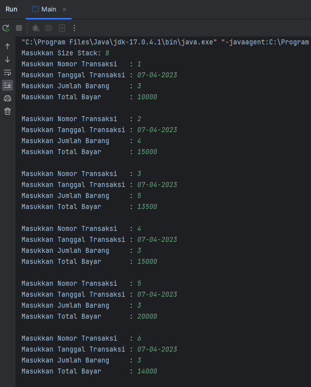

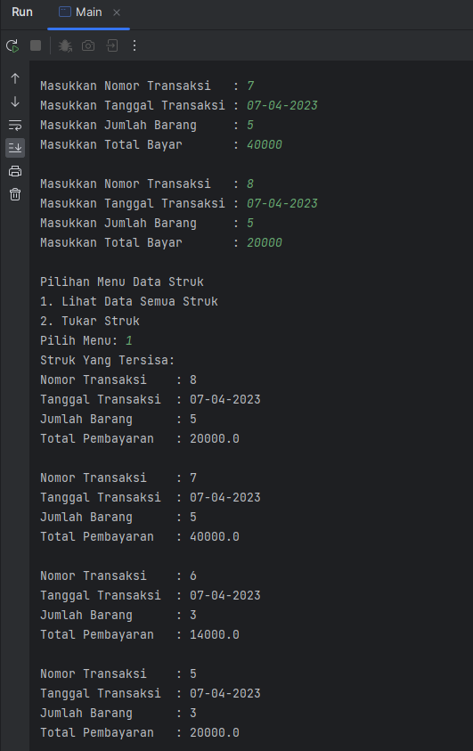

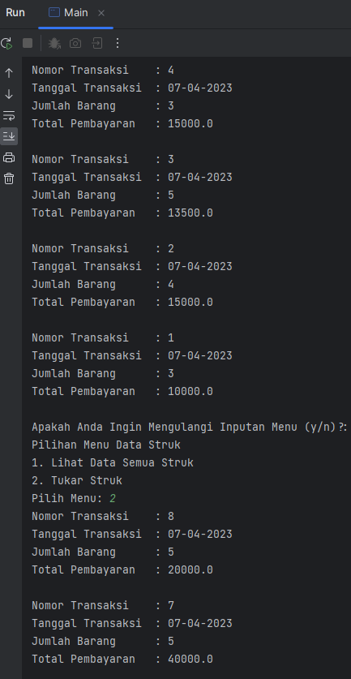

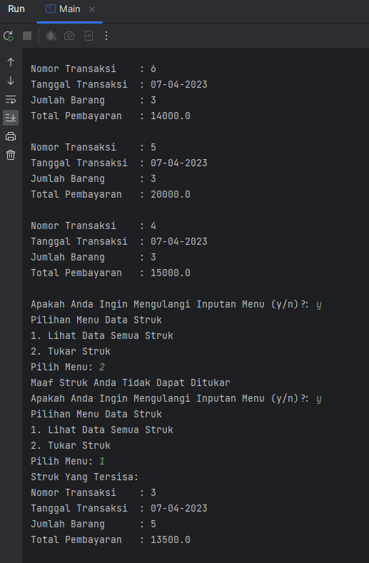

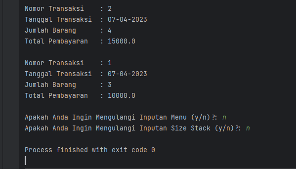