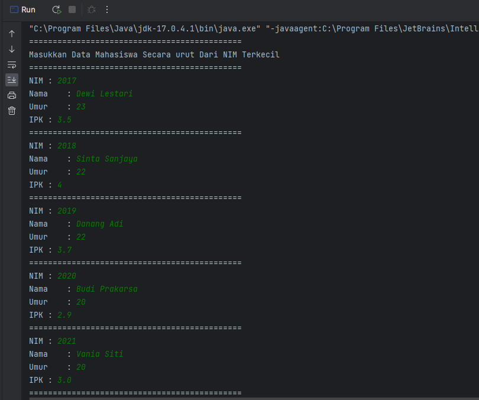
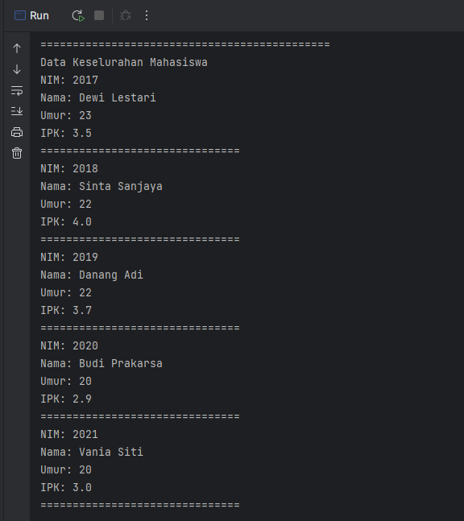

# LAPORAN PRATIKUM 6
NIM   : 2241720030

Nama  : Muhammad Fakhruddin Arif

Kelas : TI-1D

## Latihan
### 6.2.Searching / Pencarian Menggunakan Agoritma Sequential Search

Code:

Mahasiswa
``` java
package minggu7;

public class Mahasiswa {
    int nim, umur;
    String nama;
    double ipk;

    Mahasiswa(int nim, String nama, int umur, double ipk) {
        this.nim = nim;
        this.nama = nama;
        this.umur = umur;
        this.ipk = ipk;
    }

    void tampil() {
        System.out.println("NIM: " + nim);
        System.out.println("Nama: " + nama);
        System.out.println("Umur: " + umur);
        System.out.println("IPK: " + ipk);
    }
}
```

PencarianMhs
``` java
package minggu7;

public class PencarianMhs {
    Mahasiswa listMhs[] = new Mahasiswa[5];
    int index;

    void tambah(Mahasiswa mhs) {
        if (index < listMhs.length) {
            listMhs[index] = mhs;
            index++;
        }
        else {
            System.out.println("Data Sudah Penuh");
        }
    }
    void tampil() {
        for (Mahasiswa mhs : listMhs) {
            mhs.tampil();
            System.out.println("===============================");
        }
    }

    int FindSeqSearch(int cari) {
        int posisi = -1;
        for (int j = 0; j < listMhs.length; j++) {
            if (listMhs[j].nim == cari) {
                posisi = j;
                break;
            }
        }
        return posisi;
    }

    void TampilPosisi(int x, int pos) {
        if (pos != -1) {
            System.out.println("Data: " + x + " Ditemukan Pada Indeks-" + pos);
        }
        else {
            System.out.println("Data " + x + " Tidak Ditemukan");
        }
    }

    void TampilData(int x, int pos) {
        if (pos != -1) {
            System.out.println("NIM\t: " + x);
            System.out.println("Nama\t: " + listMhs[pos].nama);
            System.out.println("Umur\t: " + listMhs[pos].umur);
            System.out.println("IPK\t: " + listMhs[pos].ipk);
        }
        else {
            System.out.println("Data " + x + " Tidak Ditemukan");
        }
    }
}
```

MahasiswaMain
``` java
package minggu7;

import java.util.Scanner;

public class MahasiswaMain {
    public static void main(String[] args) {
        Scanner scd = new Scanner(System.in);
        Scanner scs = new Scanner(System.in);

        PencarianMhs data = new PencarianMhs();
        int jumlah = 5;
        System.out.println("=============================================");
        System.out.println("Masukkan Data Mahasiswa Secara urut Dari NIM Terkecil");
        for (int i = 0; i < jumlah; i++) {
            System.out.println("=============================================");
            System.out.print("NIM\t: ");
            int nim = scd.nextInt();
            System.out.print("Nama\t: ");
            String nama = scs.nextLine();
            System.out.print("Umur\t: ");
            int umur = scd.nextInt();
            System.out.print("IPK\t: ");
            double ipk = scd.nextDouble();

            Mahasiswa mhs = new Mahasiswa(nim, nama, umur, ipk);
            data.tambah(mhs);
        }
        System.out.println("=============================================");
        System.out.println("Data Keselurahan Mahasiswa");
        data.tampil();

        System.out.println("_____________________________________________");
        System.out.println("_____________________________________________");
        System.out.println("Pencarian Data:");
        System.out.println("Masukkan NIM Mahasiswa Yang Dicari");
        System.out.print("NIM: ");
        int search = scd.nextInt();
        System.out.println("Menggunakan Sequential Search");
        int posisi = data.FindSeqSearch(search);

        data.TampilPosisi(search, posisi);
        data.TampilData(search, posisi);
    }
}
```
Output






Pertanyaan
1. Jelaskan perbedaan metod TampilData dan Tampilposisi pada class PencarianMhs
    - Method TampilPosisi() untuk menampilkan index pada sebuah data, Jika method TampilData() untuk menampilkan semua data pada index yang telah ditemukan
2. Jelaskan fungsi break pada kode program
    - Fungsi break yaitu untuk memberhentikan paksa sebuah looping dan pemilihan yang dilakukan
3. Jika Data Nim yang dimasukkan tidak terurut dari kecil ke besar. Apakah program masih dapat berjalan? Apakah hasil yang dikeluarkan benar? Mengapa demikian!
    - Masih dapat berjalan dan hasil yang dikeluarkan benar dikarenakan kode program yang dilakukan yaitu mengecek semua data hingga bertemu dengan data yang sesuai dengan inputan

### 6.3.Searching / Pencarian Menggunakan Binary Search


### 6.4.Percobaan Pengayaan Divide and Conquer
## Latihan Pratikum