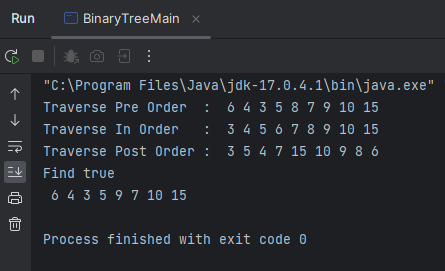
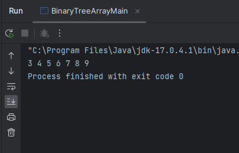
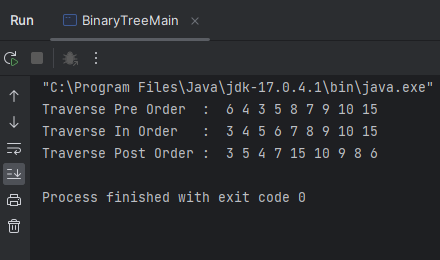
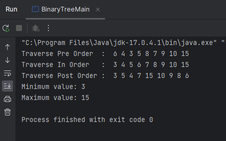
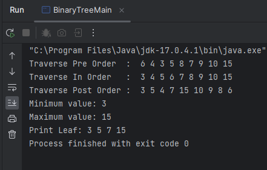
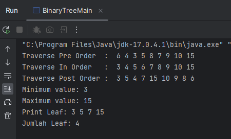
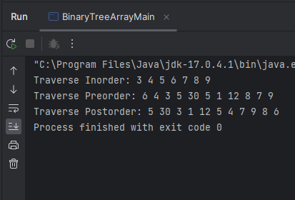

# LAPORAN PRATIKUM 13
NIM   : 2241720030

Nama  : Muhammad Fakhruddin Arif

Kelas : TI-1D

## Latihan
### Praktikum 1
Code:

Node
``` java
package Praktikum1;

public class Node {
   int data;
   Node left, right;

   public Node() {

   }

   public Node(int data) {
      this.left = null;
      this.data = data;
      this.right = null;
   }
}
```
BinaryTree
``` java
package Praktikum1;

public class BinaryTree {
   Node root;

   public BinaryTree(){
      root = null;
   }
   boolean isEmpty(){
      return root == null;
   }
   void add(int data) {
      if (isEmpty()) {//tree is empty
         root = new Node(data);
      }else {
         Node current = root;
         while(true){
            if(data < current.data) {
               if(current.left != null) {
                  current = current.left;
               }else {
                  current.left = new Node(data);
                  break;
               }
            }else if (data > current.data) {
               if (current.right != null) {
                  current = current.right;
               }else {
                  current.right = new Node(data);
                  break;
               }
            }else {//data is already exist
               break;
            }
         }
      }
   }
   boolean find(int data){
      boolean hasil = false;
      Node current = root;
      while (current!=null){
         if (current.data==data){
            hasil = true;
            break;
         } else if (data < current.data) {
            current = current.left;
         }else {
            current = current.right;
         }
      }
      return hasil;
   }
   void traversePreOrder(Node node){
      if (node != null){
         System.out.print(" "+node.data);
         traversePreOrder(node.left);
         traversePreOrder(node.right);
      }
   }
   void traversePostOrder(Node node){
      if (node != null){
         traversePostOrder(node.left);
         traversePostOrder(node.right);
         System.out.print(" "+node.data);
      }
   }
   void traverseInOrder(Node node){
      if (node != null){
         traverseInOrder(node.left);
         System.out.print(" "+node.data);
         traverseInOrder(node.right);
      }
   }
   Node getSuccessor(Node del){
      Node successor = del.right;
      Node successorParent = del;
      while (successor.left!=null){
         successorParent = successor;
         successor = successor.left;
      }
      if (successor!=del.right){
         successorParent.left = successor.right;
         successor.right = del.right;
      }
      return successor;
   }
   void delete(int data){
      if(isEmpty()){
         System.out.println("Tree is empty");
         return;
      }
      //Find node
      Node parent = root;
      Node current = root;
      boolean isLeftChild = false;
      while (current!=null){
         if (current.data==data){
            break;
         } else if (data<current.data) {
            parent = current;
            current = current.left;
            isLeftChild = true;
         } else if (data> current.data) {
            parent = current;
            current = current.right;
            isLeftChild = false;
         }
      }
      //deletion
      if(current==null){
         System.out.println("Couldn't find data!");
         return;
      }else {
         //Jika tidak punya anak, langsung dihapus
         if (current.left==null&&current.right==null){
            if (current==root){
               root = null;
            }else {
               if (isLeftChild){
                  parent.left = null;
               }else {
                  parent.right = null;
               }
            }
         } else if (current.left==null) { //if there is 1 child (right)
            if (current==root){
               root = current.right;
            }else {
               if (isLeftChild){
                  parent.left = current.right;
               }else{
                  parent.right = current.right;
               }
            }
         }else if(current.left==null){ //if there is 1 child (left)
            if (current==root){
               root = current.left;
            }else {
               if (isLeftChild){
                  parent.left = current.left;
               }else{
                  parent.right = current.left;
               }
            }
         }else { //if there is 2 childs
            Node successor = getSuccessor(current);
            if(current==root){
               root = successor;
            }else {
               if (isLeftChild){
                  parent.left = successor;
               }else {
                  parent.right = successor;
               }
               successor.left = current.left;
            }
         }
      }
   }
}
```

BinaryTreeMain
``` java
package Praktikum1;

public class BinaryTreeMain {
   public static void main(String[] args) {
      BinaryTree bt = new BinaryTree();

      bt.add(6);
      bt.add(4);
      bt.add(8);
      bt.add(3);
      bt.add(5);
      bt.add(7);
      bt.add(9);
      bt.add(10);
      bt.add(15);

      System.out.print("Traverse Pre Order\t: ");
      bt.traversePreOrder(bt.root);
      System.out.println();
      System.out.print("Traverse In Order\t: ");
      bt.traverseInOrder(bt.root);
      System.out.println();
      System.out.print("Traverse Post Order\t: ");
      bt.traversePostOrder(bt.root);
      System.out.println();

      System.out.println("Find " + bt.find(5));
      bt.delete(8);
      bt.traversePreOrder(bt.root);
      System.out.println();
   }
}
```

Output



Pertanyaan
1. Mengapa dalam binary search tree proses pencarian data bisa lebih efektif dilakukan dibanding binary tree biasa?
- Karena pencarian dilakukan dengan lebih baik dan efisien, dan Binary Search Tree juga dapat mengurangi area pencarian informasi yang akan dicari, sehingga lebih sedikit informasi yang diperiksa.
2. Untuk apakah di class Node, kegunaan dari atribut left dan right?
- Kiri digunakan untuk mengakses node yang nilainya lebih kecil dari parent-Nya dan untuk kanan digunakan untuk mengakses node dengan nilai yang lebih besar dari parent-Nya
3. a. Untuk apakah kegunaan dari atribut root di dalam class BinaryTree?
   
    b. Ketika objek tree pertama kali dibuat, apakah nilai dari root?
- a.  Untuk menentukan akar atau pusat dari tree
- b. nilai dari root yaitu null
4. Ketika tree masih kosong, dan akan ditambahkan sebuah node baru, proses apa yang akan terjadi?
- Pertama diperiksa apa tree masih kosong, jika kosong maka data diletakkan di root.Jika tidak maka dilakukan perulangan dan pengecekan jika data lebih kecil dari node current maka dilakukan pengecekan kembali apa child dari node current kosong atau tidak.Jika kosong, current akan berpindah ke node tersebut dan dilakukan pengecekan lagi sampai node child bagian kiri dari current kosong kemudian data akan ditambahkan.
  Jika data lebih besar dari node saat ini, maka akan dicek kembali apakah node child dari node saat ini kosong atau tidak. Jika tidak kosong,  maka current ke node tersebut dan terus menerus diperiksa hingga node child. Node kanan kosong, sehingga data ditambahkan.
5. Perhatikan method add(), di dalamnya terdapat baris program seperti di bawah ini. Jelaskan secara detil untuk apa baris program tersebut?
``` java
if(data<current.data) {
    if(current.left!=null){
    current = current.left;
    }
    else{
        current.left = new Node(data);
        break;
    }
}
```
- Pengecekan dilakukan, yaitu jika data yang diinputkan kurang dari node current, maka akan dicek kembali apakah child node saat ini kosong atau tidak. Jika tidak kosong, current berpindah ke node tersebut dan terus menerus diperiksa hingga child node berada di sisi kiri current, sehingga data ditambahkan.

### Praktikum 2
Code:

BinaryTreeArray
``` java
package Praktikum2;

public class BinaryTreeArray {
   int[] data;
   int idxLast;

   public BinaryTreeArray() {
      data = new int[10];
   }

   void populateData(int data[], int idxLast) {
      this.data = data;
      this.idxLast = idxLast;
   }

   void traverseInOrder(int idxStart) {
      if (idxStart <= idxLast) {
         traverseInOrder(2 * idxStart + 1);
         System.out.print(data[idxStart] + " ");
         traverseInOrder(2 * idxStart + 2);
      }
   }
}
```

BinaryTreeArrayMain
``` java
package Praktikum2;

public class BinaryTreeArrayMain {
   public static void main(String[] args) {
      BinaryTreeArray bta = new BinaryTreeArray();
      int[] data = {6, 4, 8, 3, 5, 7, 9, 0, 0, 0, 0};
      int idLast = 6;
      bta.populateData(data, idLast);
      bta.traverseInOrder(0);
   }
}
```

Output



Pertanyaan
1. Apakah kegunaan dari atribut data dan idxLast yang ada di class BinaryTreeArray?
- data : Menerima data yang dikirim dalam bentuk array
- idxLast : Menentukan index yang terakhir digunakan dalam array data untuk menyimpan elemen binary tree.Ketika sebuah elemen ditambahkan ke tree, idxLast bertambah satu dan elemen baru disimpan di index idxLast. Sebaliknya, saat menggunakan tree atau melakukan operasi pada tree, idxLast digunakan untuk membatasi iterasi hanya pada index terakhir yang berisi elemen valid dalam array data
2. Apakah kegunaan dari method populateData()?
- Untuk mengisi data dalam array dan mengatur nilai idxLast dengan data yang diberikan user
3. Apakah kegunaan dari method traverseInOrder()?
- Untuk menampilkan isi dari binary tree dimulai dari elemen paling kiri lalu elemen parent kemudian elemen child dan seterusnya
4. Jika suatu node binary tree disimpan dalam array indeks 2, maka di indeks berapakah posisi left child dan rigth child masin-masing?
- Jika suatu node dalam binary tree disimpan dalam array pada index ke-2, maka left child akan berada pada index 2 * 2 + 1 = 5, dan right berada pada index 2 * 2 + 2 = 6.
Jika suatu node disimpan didalam binary tree pada index i dalam array, maka left child akan berada pada index 2 * i  + 1, dan right child berada pada index 2 * i + 2
5. Apa kegunaan statement int idxLast = 6 pada praktikum 2 percobaan nomor 4?
- Untuk menginisialisasi variabel idxLast dengan nilai 6, sehingga elemen terakhir dari data array berada di index ke-6

## Tugas
1. Buat method di dalam class BinaryTree yang akan menambahkan node
   dengan cara rekursif.

Code:

BinaryTree
``` java
   Node addRec(Node current, int data) {
      if (current == null) {
         return new Node(data);
      }

      if (data < current.data) {
         current.left = addRec(current.left, data);
      } else if (data > current.data) {
         current.right = addRec(current.right, data);
      }

      return current;
   }
```
BinaryTreeMain
``` java
      bt.root = bt.addRec(bt.root, 6);
      bt.root = bt.addRec(bt.root, 4);
      bt.root = bt.addRec(bt.root, 8);
      bt.root = bt.addRec(bt.root, 3);
      bt.root = bt.addRec(bt.root, 5);
      bt.root = bt.addRec(bt.root, 7);
      bt.root = bt.addRec(bt.root, 9);
      bt.root = bt.addRec(bt.root, 10);
      bt.root = bt.addRec(bt.root, 15);

      System.out.print("Traverse Pre Order\t: ");
      bt.traversePreOrder(bt.root);
      System.out.println();
      System.out.print("Traverse In Order\t: ");
      bt.traverseInOrder(bt.root);
      System.out.println();
      System.out.print("Traverse Post Order\t: ");
      bt.traversePostOrder(bt.root);
      System.out.println();
```
Output:



2. Buat method di dalam class BinaryTree untuk menampilkan nilai paling kecil
   dan yang paling besar yang ada di dalam tree.

Code:

BinaryTree
``` java
   void findMinMax() {
      if (isEmpty()) {
         System.out.println("Tree is empty.");
         return;
      }

      Node current = root;
      while (current.left != null) {
         current = current.left;
      }
      int minimum = current.data;

      current = root;
      while (current.right != null) {
         current = current.right;
      }
      int maximum = current.data;

      System.out.println("Minimum value: " + minimum);
      System.out.println("Maximum value: " + maximum);
   }
```
BinaryTreeMain
``` java
bt.findMinMax();
```
Output



3. Buat method di dalam class BinaryTree untuk menampilkan data yang ada
   di leaf.

Code:

BinaryTree
``` java
   void printLeafData() {
      if (isEmpty()) {
         System.out.println("Tree is empty.");
         return;
      }

      printLeafNodes(root);
   }

   void printLeafNodes(Node node) {
      if (node == null) {
         return;
      }

      if (node.left == null && node.right == null) {
         System.out.print(node.data + " ");
      }

      printLeafNodes(node.left);
      printLeafNodes(node.right);
   }
```
BinaryTreeMain
``` java
      System.out.print("Print Leaf: ");
      bt.printLeafData();
```
Output



4. Buat method di dalam class BinaryTree untuk menampilkan berapa jumlah
   leaf yang ada di dalam tree.

Code:

BinaryTree
``` java
int totalLeafNodes() {
      if (isEmpty()) {
         return 0;
      }

      return countLeafNodes(root);
   }

   int countLeafNodes(Node node) {
      if (node == null) {
         return 0;
      }

      if (node.left == null && node.right == null) {
         return 1;
      }

      int leftCount = countLeafNodes(node.left);
      int rightCount = countLeafNodes(node.right);

      return leftCount + rightCount;
   }
```
BinaryTreeMain
``` java
      int total = bt.totalLeafNodes();
      System.out.println("Jumlah Leaf: " + total);
```
Output



5. Modifikasi class BinaryTreeArray, dan tambahkan :
- method add(int data) untuk memasukan data ke dalam tree
- method traversePreOrder() dan traversePostOrder()

Code:

BinaryTreeArray
``` java
   void add(int data) {
      idxLast++;
      this.data[idxLast] = data;
   }

   void traversePreOrder(int idxStart) {
      if (idxStart <= idxLast) {
         System.out.print(data[idxStart] + " ");
         traversePreOrder(2 * idxStart + 1);
         traversePreOrder(2 * idxStart + 2);
      }
   }

   void traversePostOrder(int idxStart) {
      if (idxStart <= idxLast) {
         traversePostOrder(2 * idxStart + 1);
         traversePostOrder(2 * idxStart + 2);
         System.out.print(data[idxStart] + " ");
      }
   }
```
BinaryTreeArrayMain
``` java
package Praktikum2;

public class BinaryTreeArrayMain {
   public static void main(String[] args) {
      BinaryTreeArray bta = new BinaryTreeArray();
      int[] data = {6, 4, 8, 3, 5, 7, 9, 0, 0, 0, 0};
      int idLast = 6;
      bta.populateData(data, idLast);

      System.out.print("Traverse Inorder: ");
      bta.traverseInOrder(0);

      bta.add(5);
      bta.add(30);
      bta.add(1);
      bta.add(12);

      System.out.print("\nTraverse Preorder: ");
      bta.traversePreOrder(0);

      System.out.print("\nTraverse Postorder: ");
      bta.traversePostOrder(0);
   }
}
```
Output:

