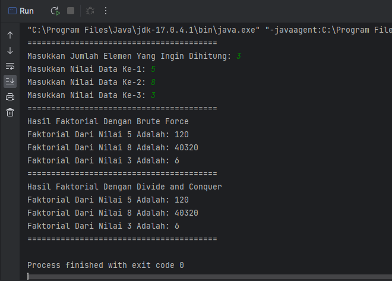
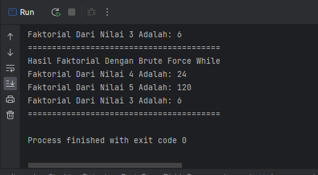
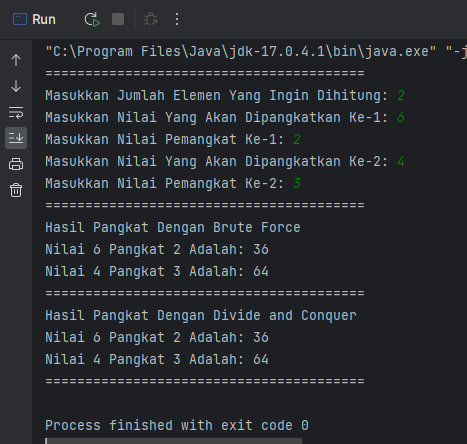
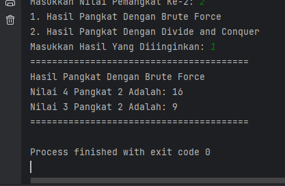
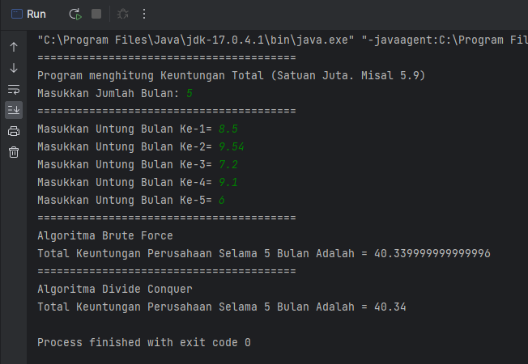
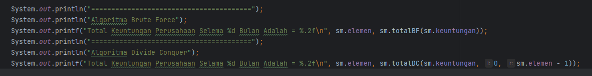
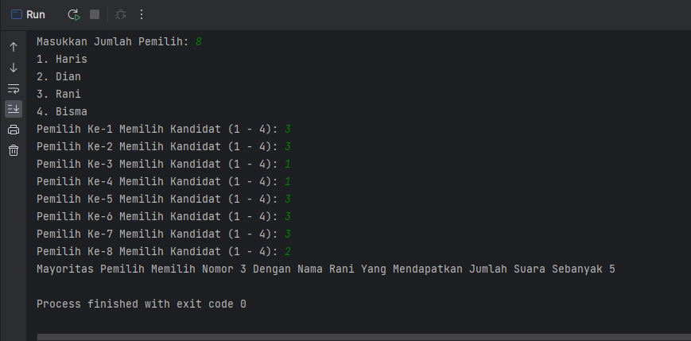

# LAPORAN PRATIKUM 4
NIM   : 2241720030

Nama  : Muhammad Fakhruddin Arif

Kelas : TI-1D

## Latihan
### 4.2 Menghitung Nilai Faktorial dengan Algoritma Brute Force dan Divide and Conquer
Kode Program:

Faktorial
``` java
package minggu5;

public class Faktorial {
    public int nilai;

    public int faktorialBF(int n) {
        int faktor = 1;
        for (int i = 1; i <= n; i++) {
            faktor = faktor * i;
        }
        return faktor;
    }

    public int faktorialDC(int n) {
        if (n == 1) {
            return 1;
        }
        else {
            int faktor = n * faktorialDC(n - 1);
            return faktor;
        }
    }
}
```
MainFaktorial
``` java
package minggu5;

import java.util.Scanner;
public class MainFaktorial {
    public static void main(String[] args) {
        Scanner sc = new Scanner(System.in);
        System.out.println("========================================");
        System.out.print("Masukkan Jumlah Elemen Yang Ingin Dihitung: ");
        int elemen = sc.nextInt();

        Faktorial fk[] = new Faktorial[elemen];
        for (int i = 0; i < elemen; i++) {
            fk[i] = new Faktorial();
            System.out.print("Masukkan Nilai Data Ke-" + (i + 1) + ": ");
            fk[i].nilai = sc.nextInt();
        }

        System.out.println("========================================");
        System.out.println("Hasil Faktorial Dengan Brute Force");
        for (int i = 0; i < elemen; i++) {
            System.out.println("Faktorial Dari Nilai " + fk[i].nilai + " Adalah: " + fk[i].faktorialBF(fk[i].nilai));
        }

        System.out.println("========================================");
        System.out.println("Hasil Faktorial Dengan Divide and Conquer");
        for (int i = 0; i < elemen; i++) {
            System.out.println("Faktorial Dari Nilai " + fk[i].nilai + " Adalah: " + fk[i].faktorialDC(fk[i].nilai));
        }

        System.out.println("========================================");
    }
}
```



Pertanyaan:
1. Jelaskan mengenai base line Algoritma Divide Conquer untuk melakukan pencarian nilai faktorial!
    - Teknik pemecahan masalah yang memecah masalah besar menjadi sub-masalah yang lebih kecil, kemudian menyelesaikan sub masalah secara rekursif lalu menggabungkan solusi sub-masalah untuk memecahkan masalah awal
2. Pada implementasi Algoritma Divide and Conquer Faktorial apakah lengkap terdiri dari 3 tahapan divide, conquer, combine? Jelaskan masing-masing bagiannya pada kode program!
    - Divide:
   
      
      
    - Conquer:
      
      
   
    - Combine:

      

3. Apakah memungkinkan perulangan pada method faktorialBF() dirubah selain menggunakan for? Buktikan!

Class:
``` java
public int faktorialBFWhile(int n) {
        int faktor = 1;
        int i = 1;
        while (i <= n) {
            faktor = faktor * i;
            i++;
        }
        return faktor;
        }
```
Main:
``` java
System.out.println("========================================");
System.out.println("Hasil Faktorial Dengan Brute Force While");
for (int i = 0; i < elemen; i++) {
    System.out.println("Faktorial Dari Nilai " + fk[i].nilai + " Adalah: " + fk[i].faktorialBFWhile(fk[i].nilai));
}
```



4. Tambahkan pengecekan waktu eksekusi kedua jenis method tersebut!
   - Brute Force = 1 + n
   - Divide Conquer = n * 2
5. Buktikan dengan inputan elemen yang diatas 20 angka, apakah ada perbedaan waktu ekseskusi?
   ``` text
   Brute Force = 1 + n
               = 1 + 24
               = 25
   Divide Conquer = n * 2
                  = 24 * 2
                  = 48
   ```

### 4.3 Menghitung Hasil Pangkat dengan Algoritma Brute Force dan Divide and Conquer
Kode Program:

Pangkat
``` java
package minggu5;

public class Pangkat {
    public int nilai, pangkat;

    public int pangkatBF(int a, int n) {
        int hasil = 1;
        for (int i = 0; i < n; i++) {
            hasil = hasil * a;
        }
        return hasil;
    }
    public int pangkatDC(int a, int n) {
        if (n == 0) {
            return 1;
        }
        else {
            if (n % 2 == 1) {
                return (pangkatDC(a, n / 2) * pangkatDC(a, n / 2) * a);
            }
            else {
                return (pangkatDC(a, n / 2) * pangkatDC(a, n / 2));
            }
        }
    }
}
```
MainPangkat
``` java
package minggu5;

import java.util.Scanner;

public class MainPangkat {
    public static void main(String[] args) {
        Scanner sc = new Scanner(System.in);
        System.out.println("========================================");
        System.out.print("Masukkan Jumlah Elemen Yang Ingin Dihitung: ");
        int elemen = sc.nextInt();

        Pangkat[] png = new Pangkat[elemen];

        for (int i = 0; i < elemen; i++) {
            png[i] = new Pangkat();
            System.out.print("Masukkan Nilai Yang Akan Dipangkatkan Ke-" + (i + 1) + ": ");
            png[i].nilai = sc.nextInt();;
            System.out.print("Masukkan Nilai Pemangkat Ke-" + (i  + 1) + ": ");
            png[i].pangkat = sc.nextInt();
        }

        System.out.println("========================================");
        System.out.println("Hasil Pangkat Dengan Brute Force");
        for (int i = 0; i < elemen; i++) {
            System.out.println("Nilai " + png[i].nilai + " Pangkat " + png[i].pangkat + " Adalah: " + png[i].pangkatBF(png[i].nilai, png[i].pangkat));
        }

        System.out.println("========================================");
        System.out.println("Hasil Pangkat Dengan Divide and Conquer");
        for (int i = 0; i < elemen; i++) {
            System.out.println("Nilai " + png[i].nilai + " Pangkat " + png[i].pangkat + " Adalah: " + png[i].pangkatDC(png[i].nilai, png[i].pangkat));
        }

        System.out.println("========================================");
    }
}
```

Output:



Pertanyaan
1. Jelaskan mengenai 2 method yang dibuat yaitu PangkatBF() dan PangkatDC()!
   - pangkatBF() menggunakan pendekatan secara brute force dengan melakukan perpangkatan sebanyak n kali menggunakan loop for. Metode ini cocok digunakan untuk masukan yang kecil atau untuk kasus di mana waktu eksekusi tidak menjadi masalah.
     pangkatDC() menggunakan pendekatan Divide and Conquer. Metode ini memecah permasalahan pangkat a^n menjadi dua sub-permasalahan, yaitu pangkat a^(n/2) dan pangkat a^(n/2). Metode ini memiliki kompleksitas waktu yang lebih cepat dibandingkan dengan pangkatBF.
2. Pada method PangkatDC() terdapat potongan program sebagai berikut:
   - Dilakukan pengecekan apakah nilai n merupakan bilangan ganjil atau genap. Jika hasil n modulo 2 menghasilkan 1 maka bilangan tersebut merupakan bilangan ganjil, maka dilakukan pemangkatan bilangan a dengan n/2 secara rekursif dan hasilnya dikalikan dengan bilangan a. Jika jika dimodulo tidak menghasilkan 1 maka termasuk bilangan genap, maka dilakukan pemangkatan bilangan a dengan n/2 secara rekursif saja.
3. Apakah tahap combine sudah termasuk dalam kode tersebut? Tunjukan!
   - Tidak ada proses combine pada kode tersebut. Karena tidak ada proses penggabungan hasil dari sub masalah yang sudah dipecah (divide) pada kode tersebut
4. Modifikasi kode program tersebut, anggap proses pengisian atribut dilakukan dengan konstruktor
   Kode program
   Pangkat
   ``` java 
   Pangkat(int nilai, int pangkat) {
        this.nilai = nilai;
        this.pangkat = pangkat;
    }
   ```
   MainPangkat
   ``` java
   for (int i = 0; i < elemen; i++) {
            System.out.print("Masukkan Nilai Yang Akan Dipangkatkan Ke-" + (i + 1) + ": ");
            int nilai = sc.nextInt();;
            System.out.print("Masukkan Nilai Pemangkat Ke-" + (i  + 1) + ": ");
            int pangkat = sc.nextInt();
            png[i] = new Pangkat(nilai, pangkat);
        }
   ```
5. Tambahkan menu agar salah satu method yang terpilih saja yang akan dijalankan!
   ``` java
            System.out.println("1. Hasil Pangkat Dengan Brute Force");
            System.out.println("2. Hasil Pangkat Dengan Divide and Conquer");
            System.out.print("Masukkan Hasil Yang Diiinginkan: ");
            int select = sc.nextInt();;

            if(select == 1) {
                System.out.println("========================================");
                System.out.println("Hasil Pangkat Dengan Brute Force");
                for (int i = 0; i < elemen; i++) {
                    System.out.println("Nilai " + png[i].nilai + " Pangkat " + png[i].pangkat + " Adalah: " + png[i].pangkatBF(png[i].nilai, png[i].pangkat));
                }
            }

            else if (select == 2) {
                System.out.println("========================================");
                System.out.println("Hasil Pangkat Dengan Divide and Conquer");
                for (int i = 0; i < elemen; i++) {
                    System.out.println("Nilai " + png[i].nilai + " Pangkat " + png[i].pangkat + " Adalah: " + png[i].pangkatDC(png[i].nilai, png[i].pangkat));
                }
            }
   ```
   Output:



### 4.4 Menghitung Sum Array dengan Algoritma Brute Force dan Divide and Conquer
Kode Program:

Sum
``` java
package minggu5;

public class Sum {
    public int elemen;
    public double keuntungan[];
    public double total;

    Sum(int elemen) {
        this.elemen = elemen;
        this.keuntungan = new double[elemen];
        this.total = 0;
    }
    double totalBF(double arr[]) {
        for (int i = 0; i < elemen; i++) {
            total = total + arr[i];
        }
        return total;
    }

    double totalDC(double arr[], int l, int r) {
        if (l == r) {
            return arr[l];
        }
        else if (l < r) {
            int mid = (l + r) / 2;
            double lsum = totalDC(arr, l, mid - 1);
            double rsum = totalDC(arr, mid + 1, r);
            return lsum + rsum + arr[mid];
        }
        return 0;
    }
}
```
MainSum
``` java
package minggu5;

import java.util.Scanner;

public class MainSum {
    public static void main(String[] args) {
        Scanner sc = new Scanner(System.in);
        System.out.println("========================================");
        System.out.println("Program menghitung Keuntungan Total (Satuan Juta. Misal 5.9)");
        System.out.print("Masukkan Jumlah Bulan: ");
        int elm = sc.nextInt();

        Sum sm = new Sum(elm);
        System.out.println("========================================");
        for (int i = 0; i < sm.elemen; i++) {
            System.out.print("Masukkan Untung Bulan Ke-" + (i + 1) + "= ");
            sm.keuntungan[i] = sc.nextDouble();
        }

        System.out.println("========================================");
        System.out.println("Algoritma Brute Force");
        System.out.println("Total Keuntungan Perusahaan Selama " + sm.elemen + " Bulan Adalah = " + sm.totalBF(sm.keuntungan));
        System.out.println("========================================");
        System.out.println("Algoritma Divide Conquer");
        System.out.println("Total Keuntungan Perusahaan Selama " + sm.elemen + " Bulan Adalah = " + sm.totalDC(sm.keuntungan, 0, sm.elemen - 1));
    }
}
```
Output:



Pertanyaan:
1. Berikan ilustrasi perbedaan perhitungan keuntungan dengan method TotalBF() ataupun Total DC()
   - Method TotalBF() menghitung keuntungan dengan cara menjumlahkan semua elemen pada array keuntungan secara berurutan, sedangkan method TotalDC() menggunakan pendekatan divide and conquer yang membagi array keuntungan menjadi dua bagian hingga hanya tersisa satu elemen pada setiap pembagian dan kemudian menjumlahkan kembali sambil menggabungkan hasil penjumlahan dari setiap pembagian.
2. Perhatikan output dari kedua jenis algoritma tersebut bisa jadi memeiliki hasil berbeda di belakang koma. Bagaimana membatasi output dibelakang koma agar menjadi standar untuk kedua jenis algoritma tersebut.



3. Mengapa terdapat formulasi return value berikut? Jelaskan!
   - Karena kode tersebut digunakan untuk mengembalikan total keuntungan dari seluruh elemen pada array keuntungan
4. Kenapa dibutuhkan variabel mid pada method TotalDC()?
   - Untuk menentukan index tengah pada array keuntungan
5. Program perhitungan keuntungan suatu perusahaan ini hanya untuk salah satu perusahaan saja. Bagaimana cara menghitung sekaligus keuntungan bebearapa bulan untuk beberapa perusahaan.(Setiap perusahaan bisa saja memiliki jumlah bulan berbeda-beda)? Buktikan dengan progrma!


### Latihan Pratikum
Suatu Perguruan Tinggi di kota Malang sedang mengadakan pemilihan suara untuk memilih ketua BEM tahun 2022. Jika jumlah suara yang terkumpul diumpamakan selalu genap. Maka dengan inputan kandidat terpilih, carilah mayoritas jumlah suara untuk masing-masing kandidat. (Jumlah elemen array dan hasil pemilhan suara merupakan inputan user).

Code:

Majority
``` java
package minggu5;

public class Majority {
    int findMajority(int arr[], int n) {
        if (n == 1) {
            return arr[0];
        }
        int mid = n / 2;
        int leftArr[] = copy(arr, 0, mid);
        int rightArr[] = copy(arr, mid, n);
        int left = findMajority(leftArr, mid);
        int right = findMajority(rightArr, n - mid);
        if (left == right) {
            return left;
        }
        int leftCount = count(arr, n, left);
        int rightCount = count(arr, n, right);
        if (leftCount > rightCount) {
            return left;
        }
        else {
            return right;
        }
    }

    int[] copy(int arr[], int from, int to) {
        int array[] = new int[to - from];
        for (int i = from; i < to; i++) {
            array[i - from] = arr[i];
        }
        return array;
    }

    int count(int arr[], int n, int x) {
        int count = 0;
        for (int i = 0; i < n; i++) {
            if (arr[i] == x) {
                count++;
            }
        }
        return count;
    }
}
```
MainMajority
``` java
package minggu5;

import java.util.Scanner;

public class MainMajority {
    public static void main(String[] args) {
        Scanner sc = new Scanner(System.in);
        Majority mj = new Majority();
        String candidate[] = {"Haris", "Dian", "Rani", "Bisma"};

        System.out.print("Masukkan Jumlah Pemilih: ");
        int input = sc.nextInt();
        int arr[] = new int[input];

        for (int i = 0; i < candidate.length; i++) {
            System.out.printf("%d. %s\n", (i + 1), candidate[i]);
        }

        for (int i = 0; i < input; i++) {
            System.out.printf("Pemilih Ke-%d Memilih Kandidat (1 - 4): ", (i + 1));
            arr[i] = sc.nextInt();
        }

        int majority = mj.findMajority(arr, input);
        int countMajority = mj.count(arr, input, majority);
        int minMajority = input / 2 + 1;

        if (countMajority >= minMajority) {
            System.out.printf("Mayoritas Pemilih Memilih Nomor %d Dengan Nama %s Yang Mendapatkan Jumlah Suara Sebanyak %d\n", majority, candidate[majority - 1], countMajority);
        }
        else {
            System.out.println("Tidak Ada Kandidat Yang Memenuhi Syarat Mayoritas Suara");
        }
    }
}
```
Output

