# LAPORAN JOBSHEET Collection
NIM   : 2241720030

Nama  : Muhammad Fakhruddin Arif

Kelas : TI-1D

## Latihan
### Percobaan 1
Code:
``` java
import java.util.ArrayList;
import java.util.LinkedList;
import java.util.List;

public class ContohList {
    public static void main(String[] args) {
        List l = new ArrayList();
        l.add(1);
        l.add(2);
        l.add(3);
        l.add("Cireng");
        System.out.printf("Elemen 0: %d total elemen: %d elemen terakhir: %s\n",
                l.get(0), l.size(), l.get(l.size() - 1));

        l.add(4);
        l.remove(0);
        System.out.printf("Elemen 0: %d total elemen: %d elemen terakhir: %s\n",
                l.get(0), l.size(), l.get(l.size() - 1));

        List<String> names = new LinkedList<>();
        names.add("Noureen");
        names.add("Akhleema");
        names.add("Shannum");
        names.add("Uwais");
        names.add("Al-Qarni");

        System.out.printf("Elemen 0: %s total elemen: %s elemen terakhir: %s\n",
                names.get(0), names.size(), names.get(names.size() - 1));
        names.set(0, "My Kid");
        System.out.printf("Elemen 0: %s total elemen: %s elemen terakhir: %s\n",
                names.get(0), names.size(), names.get(names.size() - 1));
        System.out.println("Names: " + names.toString());
    }
}
```
Output:

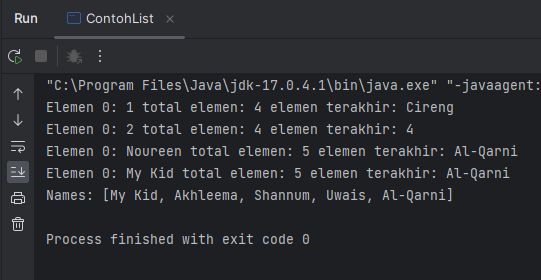

Pertanyaan
1. Perhatikan baris kode 25-36, mengapa semua jenis data bisa ditampung ke dalam sebuah Arraylist?
- Karena ArrayList menggunakan konsep generik, dan pada kode program line 25 tidak dideklarasikan tipe data khusus yang mengakibatkan dapat menerima semua data
2. Modifikasi baris kode 25-36 seingga data yang ditampung hanya satu jenis atau spesifik tipe tertentu!
``` java
import java.util.ArrayList;
import java.util.LinkedList;
import java.util.List;

public class ContohList {
    public static void main(String[] args) {
        List<Integer> l = new ArrayList();
        l.add(1);
        l.add(2);
        l.add(3);
//        l.add("Cireng");
        System.out.printf("Elemen 0: %d total elemen: %d elemen terakhir: %s\n",
                l.get(0), l.size(), l.get(l.size() - 1));

        l.add(4);
        l.remove(0);
        System.out.printf("Elemen 0: %d total elemen: %d elemen terakhir: %s\n",
                l.get(0), l.size(), l.get(l.size() - 1));

        List<String> names = new LinkedList<>();
        names.add("Noureen");
        names.add("Akhleema");
        names.add("Shannum");
        names.add("Uwais");
        names.add("Al-Qarni");

        System.out.printf("Elemen 0: %s total elemen: %s elemen terakhir: %s\n",
                names.get(0), names.size(), names.get(names.size() - 1));
        names.set(0, "My Kid");
        System.out.printf("Elemen 0: %s total elemen: %s elemen terakhir: %s\n",
                names.get(0), names.size(), names.get(names.size() - 1));
        System.out.println("Names: " + names.toString());
    }
}
```
Output

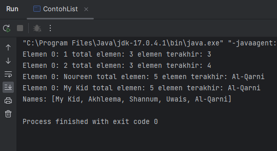

3. Ubah kode pada baris kode 38 menjadi seperti ini
``` java
LinkedList<String> names = new LinkedList<>();
```
4. Tambahkan juga baris berikut ini, untuk memberikan perbedaan dari tampilan yang sebelumnya
``` java
names.push("Mei-mei");
System.out.printf ("Elemen 0: %s total elemen: %s elemen terakhir: %s\n",
        names.getFirst(), names.size(), names.getLast());
```
5. Dari penambahan kode tersebut, silakan dijalankan dan apakah yang dapat Anda jelaskan!

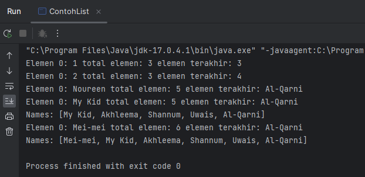

- Karena method push() pada interface LinkedList yaitu memasukkan elemen dibagian depan pada sekumpulan data atau biasa disebut disebut dengan metode addFirst

### Percobaan 2
Code
``` java
import java.util.Iterator;
import java.util.Stack;

public class LoopCollection {
    public static void main(String[] args) {
        Stack<String> fruits = new Stack<>();
        fruits.push("Banana");
        fruits.add("Orange");
        fruits.add("Watermelon");
        fruits.add("Leci");
        fruits.push("Salak");

        for (String fruit : fruits) {
            System.out.printf("%s ", fruit);
        }
        System.out.println("\n" + fruits.toString());

        while (!fruits.empty()) {
            System.out.printf("%s ", fruits.pop());
        }

        fruits.push("Melon");
        fruits.push("Durian");
        System.out.println();
        for (Iterator<String> it = fruits.iterator(); it.hasNext();) {
            String fruit = it.next();
            System.out.printf("%s ", fruit);
        }
        System.out.println();
        fruits.stream().forEach(e -> {
            System.out.printf("%s ", e);
        });
        System.out.println();
        for (int i = 0; i < fruits.size(); i++) {
            System.out.printf("%s ", fruits.get(i));
        }
    }
}
```
Output

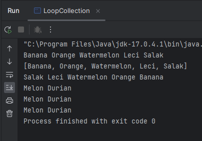

Pertanyaan
1. Apakah perbedaan fungsi push() dan add() pada objek fruits?
- Fungsi push() untuk menambahkan data ke bagian atas pada tumpukan, Sedangkan add() mendapatkan elemen yang ditentukan diakhir vektor
2. Silakan hilangkan baris 43 dan 44, apakah yang akan terjadi? Mengapa bisa demikian?
- Yang terjadi yaitu kode program akan berjalan hanya sampai line 40 karena pada line 38 - 40 data dikeluarkan semua dari stack sehingga stack tidak mempunyai data atau kosong.Dan pada line 43 - 44 karena dicommand maka tidak ada data lagi yang dibaca
3. Jelaskan fungsi dari baris 46-49?
- Fungsinya yaitu untuk mengulang elemen-elemen yang ada pada ArrayList 'fruits' yang berisi objek-objek String
4. Silakan ganti baris kode 25, Stack<String> menjadi List<String> dan apakah yang terjadi? Mengapa bisa demikian?

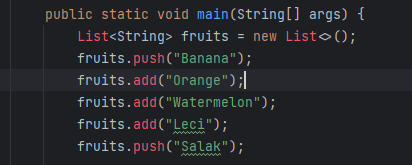

- Akan terjadi error karena method pop, add, dan push merupakan fungsi dari Stack bukan dari List
5. Ganti elemen terakhir dari dari objek fruits menjadi “Strawberry”!
``` java 
fruits.set(4, "Strawberry");
```

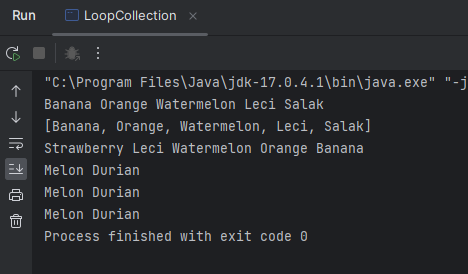

6. Tambahkan 3 buah seperti “Mango”,”guava”, dan “avocado” kemudian dilakukan sorting!
``` java
fruits.push("Mango");
fruits.push("Guava");
fruits.push("Avocado");
fruits.sort(null);
```


### Percobaan 3
Code:

Mahasiswa
``` java
public class Mahasiswa {
    String nim;
    String nama;
    String noTelp;

    Mahasiswa() {

    }
    Mahasiswa(String nim, String nama, String noTelp) {
        this.nim = nim;
        this.nama = nama;
        this.noTelp = noTelp;
    }
    @Override
    public String toString() {
        return "Mahasiswa{" + "nim = " + nim + ", nama = " + nama + ", noTelp = " + noTelp + "}";
    }
}
```
ListMahasiswa
``` java
import java.util.ArrayList;
import java.util.Arrays;
import java.util.List;

public class ListMahasiswa {
    List<Mahasiswa> mahasiswas = new ArrayList<>();

    void tambah(Mahasiswa... mahasiswa) {
        mahasiswas.addAll(Arrays.asList(mahasiswa));
    }
    void hapus(int index) {
        mahasiswas.remove(index);
    }
    void update(int index, Mahasiswa mhs) {
        mahasiswas.set(index, mhs);
    }
    void tampil() {
        mahasiswas.stream().forEach(mhs -> {
            System.out.println("" + mhs.toString());
        });
    }

    int linearSearch(String nim) {
        for (int i = 0; i < mahasiswas.size(); i++) {
            if (nim.equals(mahasiswas.get(i).nim)) {
                return i;
            }
        }
        return -1;
    }

    public static void main(String[] args) {
        ListMahasiswa lm = new ListMahasiswa();
        Mahasiswa m0 = new Mahasiswa("201234", "Noureen", "021xx1");
        Mahasiswa m1 = new Mahasiswa("201235", "Akhleema", "021xx2");
        Mahasiswa m2 = new Mahasiswa("201236", "Shannum", "021xx3");

        lm.tambah(m0, m1, m2);
        lm.tampil();
        lm.update(lm.linearSearch("201235"), new Mahasiswa("201235", "Akhleema Lela", "021xx2"));
        System.out.println();
        lm.tampil();
    }
}
```
Output

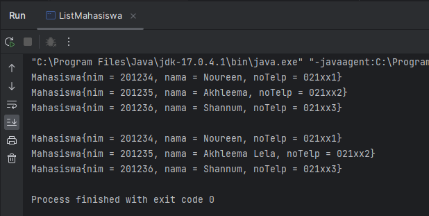

Pertanyaan
1. Pada fungsi tambah() yang menggunakan unlimited argument itu menggunakan konsep apa? Dan kelebihannya apa?
- Itu menggunakan konsep varargs yang kelebihannya digunakan untuk menginputkan data pada method yang belum diketahui banyak datanya
2. Pada fungsi linearSearch() di atas, silakan diganti dengan fungsi binarySearch() dari collection!
``` java
    int binarySearch(String nim) {
        List<String> nimList = new ArrayList<>();
        for (Mahasiswa mhs : mahasiswas) {
            nimList.add(mhs.nim);
        }
        return Collections.binarySearch(nimList, nim);
    }
```
Output

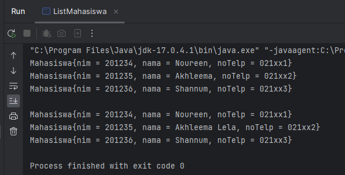

3. Tambahkan fungsi sorting baik secara ascending ataupun descending pada class tersebut!

## Tugas
Code

Film
``` java
package TugasFilm;

public class Film {
    int id;
    String judul;
    int tahun;
    String director;

    Film() {

    }
    Film(int id, String judul, int tahun, String director) {
        this.id = id;
        this.judul = judul;
        this.tahun = tahun;
        this.director = director;
    }

    @Override
    public String toString() {
        return "Film{ID Film = " + id + ", Judul Film = " + judul + ", Tahun Tayang = " + tahun + ", Director = " + director + "}";
    }
}
```
MainFilm
``` java
package TugasFilm;

import java.util.Scanner;
import java.util.Stack;

public class MainFilm {
    public static void main(String[] args) {
        Scanner scd = new Scanner(System.in);
        Scanner scs = new Scanner(System.in);

        Stack<Film> films = new Stack<>();
        films.push(new Film(1, "Spider-Man: No Way home", 2021, "Joh Watts"));
        films.push(new Film(2, "Dr.Strange: The Madness of Multiverse", 2022, "Sam Raimi"));
        films.push(new Film(3, "Skyfall", 2012, "Sam Mendes"));
        films.push(new Film(4, "Aquaman", 2018, "James Wan"));
        films.push(new Film(5, "Dark Knight Rises", 2012, "Christopher Nolan"));

        boolean run = true;
        while (run) {
            System.out.println("====================================");
            System.out.println("Data Film Layar Lebar Sepanjang Masa");
            System.out.println("====================================");
            System.out.println("1. Input Judul Film");
            System.out.println("2. Hapus Data Film Teratas");
            System.out.println("3. Cek Judul Film Teratas");
            System.out.println("4. Info Semua Judul Film");
            System.out.println("5. keluar");
            System.out.println("====================================");
            System.out.print("Pilih: ");
            int selectMenu = scd.nextInt();
            switch (selectMenu) {
                case 1:
                    System.out.print("ID Film\t: ");
                    int id = scd.nextInt();
                    System.out.print("Judul Film\t: ");
                    String judul = scs.nextLine();
                    System.out.print("Tahun Tayang\t: ");
                    int tahun = scd.nextInt();
                    System.out.print("Director\t: ");
                    String director = scs.nextLine();
                    films.push(new Film(id, judul, tahun, director));
                    break;
                case 2:
                    System.out.println(films.pop());
                    break;
                case 3:
                    System.out.println(films.peek());
                    break;
                case 4:
                    for (Film film : films) {
                        System.out.println(film.toString());
                    }
                    break;
                case 5:
                    System.out.print("Apakah yakin ingin keluar(y/t)? ");
                    String logout = scs.nextLine();
                    if (logout.toLowerCase().charAt(0) == 'y') run = false;
                    break;
                default:
                    System.out.println("Input Yang Anda Masukkan Tidak Tersedia");
            }
            System.out.println();
        }
    }
}
```

Output

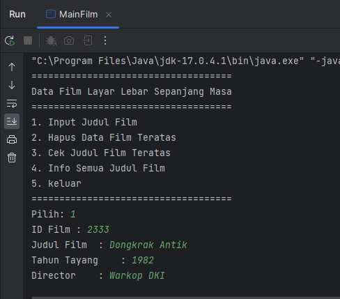

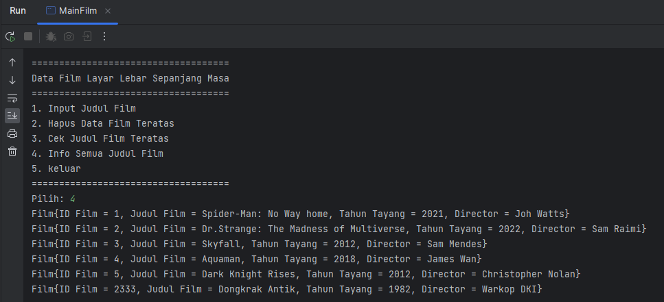

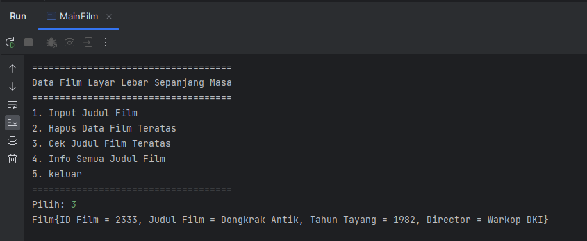

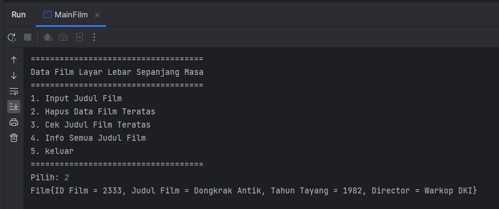

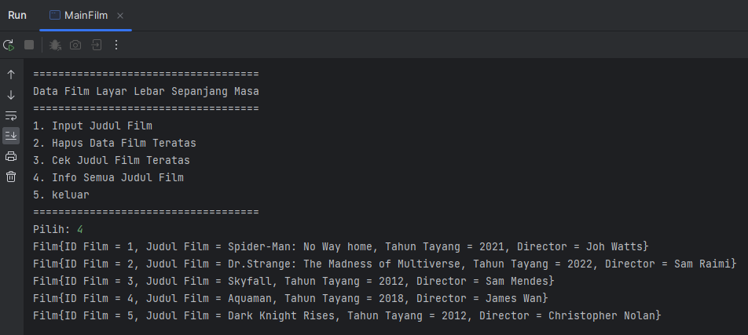

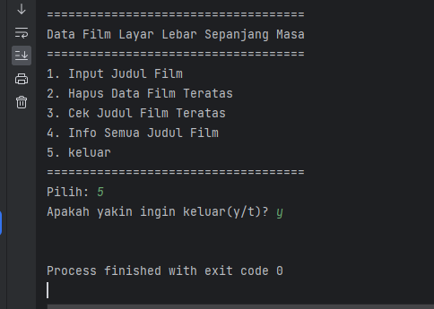
