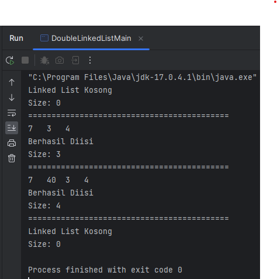
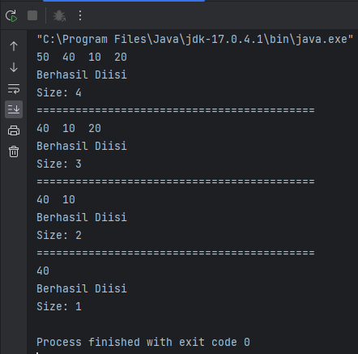
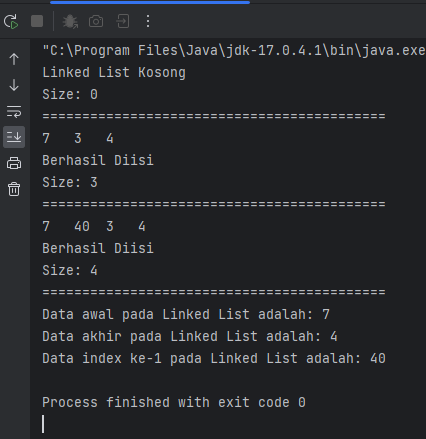
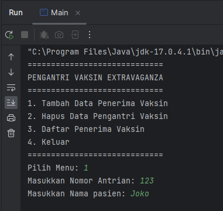
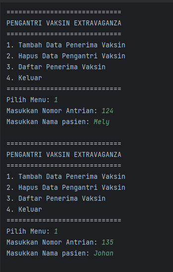
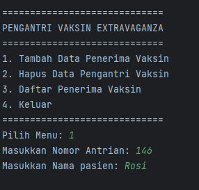
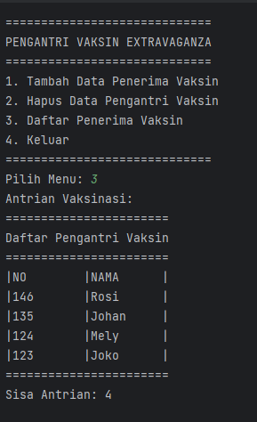
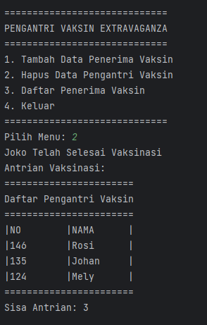

# LAPORAN PRATIKUM 10
NIM   : 2241720030

Nama  : Muhammad Fakhruddin Arif

Kelas : TI-1D

## Latihan
### Praktikum 1
Code:

Node
``` java
package DoubleLinkedList;

public class Node {
    int data;
    Node prev, next;

    Node(Node prev, int data, Node next) {
        this.prev = prev;
        this.data = data;
        this.next = next;
    }
}
```
DoubleLinkedList
``` java
package DoubleLinkedList;

public class DoubleLinkedList {
    Node head;
    int size;

    DoubleLinkedList() {
        head = null;
        size = 0;
    }

    boolean IsEmpty() {
        return head == null;
    }
    void addFirst(int item) {
        if (IsEmpty()) {
            head = new Node(null, item, head);
        }
        else {
            Node newNode = new Node(null, item, head);
            head.prev = newNode;
            head = newNode;
        }
        size++;
    }
    void addLast(int item) {
        if (IsEmpty()) {
            addFirst(item);
        }
        else {
            Node current = head;
            while (current.next != null) {
                current = current.next;
            }
            Node newNode = new Node(current, item, null);
            current.next = newNode;
            size++;
        }
    }
    void add(int item, int index) throws ExceptionInInitializerError {
        if (IsEmpty()) {
            addFirst(item);
        }
        else if (index < 0 || index > size) {
            throw new ExceptionInInitializerError("Nilai Index Diluar Batas");
        }
        else {
            Node current = head;
            int i = 0;
            while (i  < index) {
                current = current.next;
                i++;
            }
            if (current.prev == null) {
                Node newNode = new Node(null, item, current);
                current.prev = newNode;
                head = newNode;
            }
            else {
                Node newNode = new Node(current.prev, item, current);
                newNode.prev = current.prev;
                newNode.next = current;
                current.prev.next = newNode;
                current.prev = newNode;
            }
        }
        size++;
    }
    int size() {
        return size;
    }
    void clear() {
        head = null;
        size = 0;
    }
    void print() {
        if (!IsEmpty()) {
            Node tmp = head;
            while (tmp != null) {
                System.out.print(tmp.data + "\t");
                tmp = tmp.next;
            }
            System.out.println("\nBerhasil Diisi");
        }
        else  {
            System.out.println("Linked List Kosong");
        }
    }
}
```
DoubleLinkedListMain
``` java
package DoubleLinkedList;

public class DoubleLinkedListMain {
    public static void main(String[] args) {
        DoubleLinkedList dll = new DoubleLinkedList();
        dll.print();
        System.out.println("Size: " + dll.size());
        System.out.println("===========================================");
        dll.addFirst(3);
        dll.addLast(4);
        dll.addFirst(7);
        dll.print();
        System.out.println("Size: " + dll.size());
        System.out.println("===========================================");
        dll.add(40, 1);
        dll.print();
        System.out.println("Size: " + dll.size());
        System.out.println("===========================================");
        dll.clear();
        dll.print();
        System.out.println("Size: " + dll.size());
    }
}
```
Output



Pertanyaan
1. Jelaskan perbedaan antara single linked list dengan double linked lists!
- Single linked list hanya memiliki satu pointer untuk menyimpan alamat node berikutnya, sedangkan double linked list memiliki dua pointer yang dapat menyimpan alamat node sebelumnya dan berikutnya.
2. Perhatikan class Node, di dalamnya terdapat atribut next dan prev. Untuk apakah atribut tersebut?
- Dapat merujuk ke node sebelum atau sesudah
3. Perhatikan konstruktor pada class DoubleLinkedLists. Apa kegunaan inisialisasi atribut head dan size?
-  Jika list kosong, tidak ada data, jadi head = nol dan size 0
4. Pada method addFirst(), kenapa dalam pembuatan object dari konstruktor class Node prev dianggap sama dengan null?
-  Node ditempatkan paling awal (addFirst). Jadi karena node berada di awal, tidak ada node sebelumnya, jadi node.prev = null
5. Perhatikan pada method addFirst(). Apakah arti statement head.prev = newNode ?
-  Jika Anda menambahkan node ke bagian atas list, node tersebut akan berada sebelum head saat ini
6. Perhatikan isi method addLast(), apa arti dari pembuatan object Node dengan mengisikan parameter prev dengan current, dan next dengan null?
-  Saat Anda menambahkan data di akhir, current berhenti di node terakhir, yang merupakan node baru sebelumnya yang ditambahkan, jadi newNode.prev = current dan karena newNode adalah yang terakhir, tidak ada data setelah newNode.next . = nol
7. Pada method add(),jelaskan maksud dari bagian tersebut.
- Jika list tidak berisi data, node ditambahkan sebagai data pertama atau head

### Praktikum 2
Code:

DoubleLinkedList
``` java
package DoubleLinkedList;

public class DoubleLinkedList {
    Node head;
    int size;

    DoubleLinkedList() {
        head = null;
        size = 0;
    }

    boolean IsEmpty() {
        return head == null;
    }
    void addFirst(int item) {
        if (IsEmpty()) {
            head = new Node(null, item, head);
        }
        else {
            Node newNode = new Node(null, item, head);
            head.prev = newNode;
            head = newNode;
        }
        size++;
    }
    void addLast(int item) {
        if (IsEmpty()) {
            addFirst(item);
        }
        else {
            Node current = head;
            while (current.next != null) {
                current = current.next;
            }
            Node newNode = new Node(current, item, null);
            current.next = newNode;
            size++;
        }
    }
    void add(int item, int index) throws ExceptionInInitializerError {
        if (IsEmpty()) {
            addFirst(item);
        }
        else if (index < 0 || index > size) {
            throw new ExceptionInInitializerError("Nilai Index Diluar Batas");
        }
        else {
            Node current = head;
            int i = 0;
            while (i  < index) {
                current = current.next;
                i++;
            }
            if (current.prev == null) {
                Node newNode = new Node(null, item, current);
                current.prev = newNode;
                head = newNode;
            }
            else {
                Node newNode = new Node(current.prev, item, current);
                newNode.prev = current.prev;
                newNode.next = current;
                current.prev.next = newNode;
                current.prev = newNode;
            }
        }
        size++;
    }
    int size() {
        return size;
    }
    void clear() {
        head = null;
        size = 0;
    }
    void print() {
        if (!IsEmpty()) {
            Node tmp = head;
            while (tmp != null) {
                System.out.print(tmp.data + "\t");
                tmp = tmp.next;
            }
            System.out.println("\nBerhasil Diisi");
        }
        else  {
            System.out.println("Linked List Kosong");
        }
    }

    void removeFirst() throws ExceptionInInitializerError {
        if (IsEmpty()) {
            throw new ExceptionInInitializerError("Linked List Masih Kosong, Tidak Dapat Dihapus");
        }
        else if (size == 1) {
            removeLast();
        }
        else {
            head = head.next;
            head.prev = null;
            size--;
        }
    }
    void removeLast() throws ExceptionInInitializerError {
        if (IsEmpty()) {
            throw new ExceptionInInitializerError("Linked List Masih Kosong, Tidak Dapat Dihapus");
        }
        else if (head.next == null) {
            head = null;
            size--;
            return;
        }
        Node current = head;
        while (current.next.next != null) {
            current = current.next;
        }
        current.next = null;
        size--;
    }
    void remove(int index) throws ExceptionInInitializerError {
        if (IsEmpty() || index >= size) {
            throw new ExceptionInInitializerError("Nilai Index Di Luar Batas");
        }
        else if (index == 0) {
            removeFirst();
        }
        else {
            Node current = head;
            int i = 0;
            while (i < index) {
                current = current.next;
                i++;
            }
            if (current.next == null) {
                current.prev.next = null;
            }
            else if (current.prev == null) {
                current = current.next;
                current.prev = null;
                head = current;
            }
            else {
                current.prev.next = current.next;
                current.next.prev = current.prev;
            }
            size--;
        }
    }
}
```
DoubleLinkedListMain
``` java
package DoubleLinkedList;

public class DoubleLinkedListMain {
    public static void main(String[] args) {
        DoubleLinkedList dll = new DoubleLinkedList();
        dll.addLast(50);
        dll.addLast(40);
        dll.addLast(10);
        dll.addLast(20);
        dll.print();
        System.out.println("Size: " + dll.size());
        System.out.println("===========================================");
        dll.removeFirst();
        dll.print();
        System.out.println("Size: " + dll.size());
        System.out.println("===========================================");
        dll.removeLast();
        dll.print();
        System.out.println("Size: " + dll.size());
        System.out.println("===========================================");
        dll.remove(1);
        dll.print();
        System.out.println("Size: " + dll.size());
    }
}
```
Output:



Pertanyaan
1. Apakah maksud statement berikut pada method removeFirst()?
- "head = head.next;" berarti mengubah referensi menjadi node berikutnya dan "head.prev = null;" mengatur referensi prev dari node yang baru menjadi null
2. Bagaimana cara mendeteksi posisi data ada pada bagian akhir pada method removeLast()?
- Periksa jika head null maka data tersebut pada bagian posisi akhir
3. Jelaskan alasan potongan kode program di bawah ini tidak cocok untuk perintah remove!
- Mengabaikan pengecekan keberadan elemen yang dihapus, tidak membebaskan memori elemen yang dihapus, dan potensi kesalahan jika elemen yang dihapus adalah elemen terakhir
4. Jelaskan fungsi kode program berikut ini pada fungsi remove!
- "current.prev.next = current.next;" menghubungkan node setelahnya dengan node sebelum node yang akan dihapus dan mengabaikan node yang sedang dihapus.

### Praktikum 3
Code:
DoubleLinkedList
``` java
package DoubleLinkedList;

public class DoubleLinkedList {
    Node head;
    int size;

    DoubleLinkedList() {
        head = null;
        size = 0;
    }

    boolean IsEmpty() {
        return head == null;
    }
    void addFirst(int item) {
        if (IsEmpty()) {
            head = new Node(null, item, head);
        }
        else {
            Node newNode = new Node(null, item, head);
            head.prev = newNode;
            head = newNode;
        }
        size++;
    }
    void addLast(int item) {
        if (IsEmpty()) {
            addFirst(item);
        }
        else {
            Node current = head;
            while (current.next != null) {
                current = current.next;
            }
            Node newNode = new Node(current, item, null);
            current.next = newNode;
            size++;
        }
    }
    void add(int item, int index) throws ExceptionInInitializerError {
        if (IsEmpty()) {
            addFirst(item);
        }
        else if (index < 0 || index > size) {
            throw new ExceptionInInitializerError("Nilai Index Diluar Batas");
        }
        else {
            Node current = head;
            int i = 0;
            while (i  < index) {
                current = current.next;
                i++;
            }
            if (current.prev == null) {
                Node newNode = new Node(null, item, current);
                current.prev = newNode;
                head = newNode;
            }
            else {
                Node newNode = new Node(current.prev, item, current);
                newNode.prev = current.prev;
                newNode.next = current;
                current.prev.next = newNode;
                current.prev = newNode;
            }
        }
        size++;
    }
    int size() {
        return size;
    }
    void clear() {
        head = null;
        size = 0;
    }
    void print() {
        if (!IsEmpty()) {
            Node tmp = head;
            while (tmp != null) {
                System.out.print(tmp.data + "\t");
                tmp = tmp.next;
            }
            System.out.println("\nBerhasil Diisi");
        }
        else  {
            System.out.println("Linked List Kosong");
        }
    }

    void removeFirst() throws ExceptionInInitializerError {
        if (IsEmpty()) {
            throw new ExceptionInInitializerError("Linked List Masih Kosong, Tidak Dapat Dihapus");
        }
        else if (size == 1) {
            removeLast();
        }
        else {
            head = head.next;
            head.prev = null;
            size--;
        }
    }
    void removeLast() throws ExceptionInInitializerError {
        if (IsEmpty()) {
            throw new ExceptionInInitializerError("Linked List Masih Kosong, Tidak Dapat Dihapus");
        }
        else if (head.next == null) {
            head = null;
            size--;
            return;
        }
        Node current = head;
        while (current.next.next != null) {
            current = current.next;
        }
        current.next = null;
        size--;
    }
    void remove(int index) throws ExceptionInInitializerError {
        if (IsEmpty() || index >= size) {
            throw new ExceptionInInitializerError("Nilai Index Di Luar Batas");
        }
        else if (index == 0) {
            removeFirst();
        }
        else {
            Node current = head;
            int i = 0;
            while (i < index) {
                current = current.next;
                i++;
            }
            if (current.next == null) {
                current.prev.next = null;
            }
            else if (current.prev == null) {
                current = current.next;
                current.prev = null;
                head = current;
            }
            else {
                current.prev.next = current.next;
                current.next.prev = current.prev;
            }
            size--;
        }
    }

    int getFirst() throws ExceptionInInitializerError {
        if (IsEmpty()) {
            throw new ExceptionInInitializerError("Linked List Kosong");
        }
        return head.data;
    }
    int getLast() throws ExceptionInInitializerError {
        if (IsEmpty()) {
            throw new ExceptionInInitializerError("Linked List Kosong");
        }
        Node tmp = head;
        while (tmp.next != null) {
            tmp = tmp.next;
        }
        return tmp.data;
    }
    int get(int index) throws ExceptionInInitializerError {
        if (IsEmpty() || index >= size) {
            throw new ExceptionInInitializerError("Nilai Index Diluar Batas");
        }
        Node tmp = head;
        for (int i = 0; i < index; i++) {
            tmp = tmp.next;
        }
        return tmp.data;
    }
}
```
DoubleLinkedListMain
``` java
package DoubleLinkedList;

public class DoubleLinkedListMain {
    public static void main(String[] args) {
        DoubleLinkedList dll = new DoubleLinkedList();
        dll.print();
        System.out.println("Size: " + dll.size());
        System.out.println("===========================================");
        dll.addFirst(3);
        dll.addLast(4);
        dll.addFirst(7);
        dll.print();
        System.out.println("Size: " + dll.size());
        System.out.println("===========================================");
        dll.add(40, 1);
        dll.print();
        System.out.println("Size: " + dll.size());
        System.out.println("===========================================");
        System.out.println("Data awal pada Linked List adalah: " + dll.getFirst());
        System.out.println("Data akhir pada Linked List adalah: " + dll.getLast());
        System.out.println("Data index ke-1 pada Linked List adalah: " + dll.get(1));
    }
}
```
Output:



Pertanyaan
1. Jelaskan method size() pada class DoubleLinkedLists!
- Method size() digunakan untuk mereturn jumlah data/node yang ada di list saat ini
2. Jelaskan cara mengatur indeks pada double linked lists supaya dapat dimulai dari indeks ke- 1!
- Dengan cara mengubah perulangan pada method add() dan remove() menjadi i = 1;
3. Jelaskan perbedaan karakteristik fungsi Add pada Double Linked Lists dan Single Linked Lists!
- Saat add ke doublelinkedlist, harus menentukan pointer prev dan next, sedangkan SingleLinkedList hanya menentukan pointer next
4. Jelaskan perbedaan logika dari kedua kode program
- a. Gunakan size sebagai syarat, jika size list = 0 maka dianggap belum list masih kosong
- b. Guanakan head sebagai titik, jika head = null maka dianggap belum ada data di list

## Tugas
1. Buat program antrian vaksinasi menggunakan queue berbasis double linked list
Code: 
Pasien
```java
package Tugas1;

public class Pasien {
    int nomor;
    String nama;

    Pasien(int nomor, String nama) {
        this.nomor = nomor;
        this.nama = nama;
    }
}
```
Node
``` java
package Tugas1;

public class Node {
    Pasien data;
    Node prev, next;

    Node(Node prev, Pasien data, Node next) {
        this.prev = prev;
        this.data = data;
        this.next = next;
    }
}
```
Queue
``` java
package Tugas1;

public class Queue {
    Node front, rear;

    Queue() {
        this.front = null;
        this.rear = null;
    }

    boolean isEmpty() {
        return front == null;
    }
    void enqueue(Pasien pasien) {
        Node newNode = new Node(null, pasien, null);

        if (rear == null) {
            front = newNode;
            rear = newNode;
        }
        else {
            newNode.next = rear;
            rear.prev = newNode;
            rear = newNode;
        }
    }
    Node dequeue() {
        if (isEmpty()) {
            System.out.println("Antrian Kosong");
            return null;
        }
        else {
            Node tmp = front;
            front = front.prev;
            if (front == null) {
                rear = null;
            }
            else {
                front.next = null;
            }
            return tmp;
        }
    }

    void print() {
        if (isEmpty()) {
            System.out.println("Antrian Kosong");
        }
        else {
            Node current = rear;
            System.out.println("=======================");
            System.out.println("Daftar Pengantri Vaksin");
            System.out.println("=======================");
            System.out.printf("|%-10s|%-10s|\n", "NO", "NAMA");
            while (current != null) {
                System.out.printf("|%-10d", current.data.nomor);
                System.out.printf("|%-10s|\n", current.data.nama);
                current = current.next;
            }
            System.out.println("=======================");
        }
    }
    int get() {
        if (isEmpty()) {
            return 0;
        }
        else {
            int count = 0;
            Node current = front;
            while (current != null) {
                count++;
                current = current.prev;
            }
            return count;
        }
    }
}
```
Main
``` java
package Tugas1;

import java.util.Scanner;

public class Main {
    public static void main(String[] args) {
        Scanner scd = new Scanner(System.in);
        Scanner scs = new Scanner(System.in);

        Queue queue = new Queue();
        boolean run = true;
        while (run) {
            menu();
            System.out.print("Pilih Menu: ");
            int menu = scd.nextInt();
            switch (menu) {
                case 1:
                    System.out.print("Masukkan Nomor Antrian: ");
                    int nomor = scd.nextInt();
                    System.out.print("Masukkan Nama pasien: ");
                    String nama = scs.nextLine();
                    Pasien pasien = new Pasien(nomor, nama);
                    queue.enqueue(pasien);
                    System.out.println();
                    break;
                case 2:
                    Node user = queue.dequeue();
                    if (user != null) {
                        System.out.println(user.data.nama + " Telah Selesai Vaksinasi");
                    }
                    print(queue);
                    break;
                case 3:
                    print(queue);
                    break;
                case 4:
                    System.out.print("Apakah Anda Yakin Ingin Keluar? (y/n): ");
                    String logout = scs.nextLine();
                    if (logout.toLowerCase().charAt(0) == 'y') run = false;
                    break;
                default:
                    System.out.println("Menu Yang Anda Masukkan Tidak Tersedia");
                    System.out.println();
                    break;
            }
        }
    }
    static void menu() {
        System.out.println("=============================");
        System.out.println("PENGANTRI VAKSIN EXTRAVAGANZA");
        System.out.println("=============================");
        System.out.println("1. Tambah Data Penerima Vaksin");
        System.out.println("2. Hapus Data Pengantri Vaksin");
        System.out.println("3. Daftar Penerima Vaksin");
        System.out.println("4. Keluar");
        System.out.println("=============================");
    }
    static void print(Queue queue) {
        System.out.println("Antrian Vaksinasi:");
        queue.print();
        System.out.println("Sisa Antrian: " + queue.get());
        System.out.println();
    }
}
```
Output











2. Buatlah program daftar film yang terdiri dari id, judul dan rating menggunakan double linked lists, bentuk program memiliki fitur pencarian melalui ID Film dan pengurutan Rating secara descending. Class Film wajib diimplementasikan


