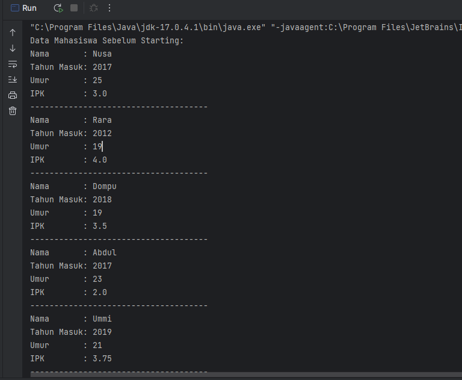
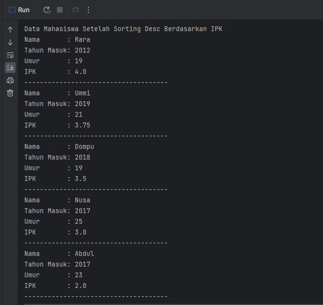
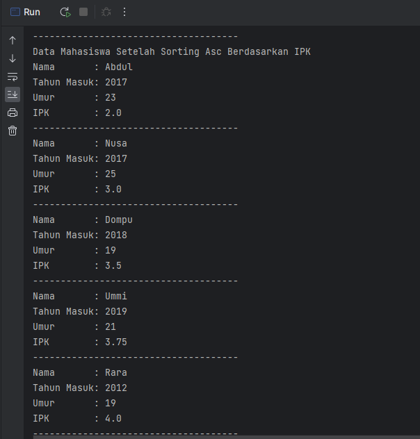
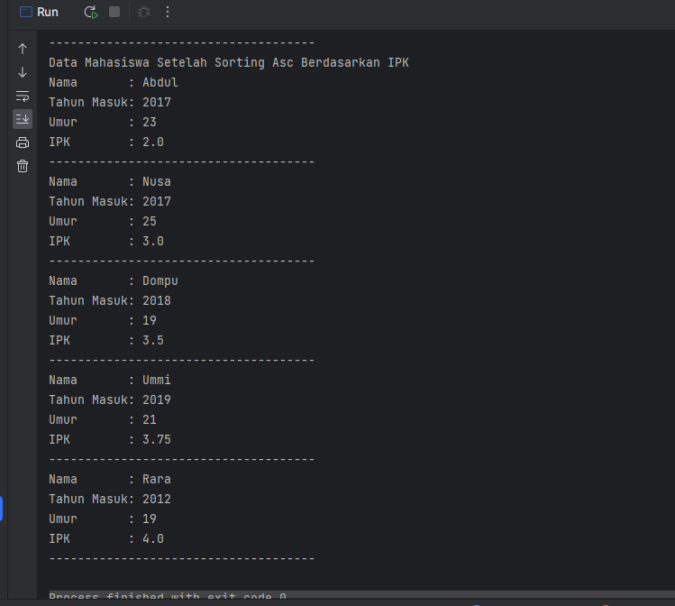
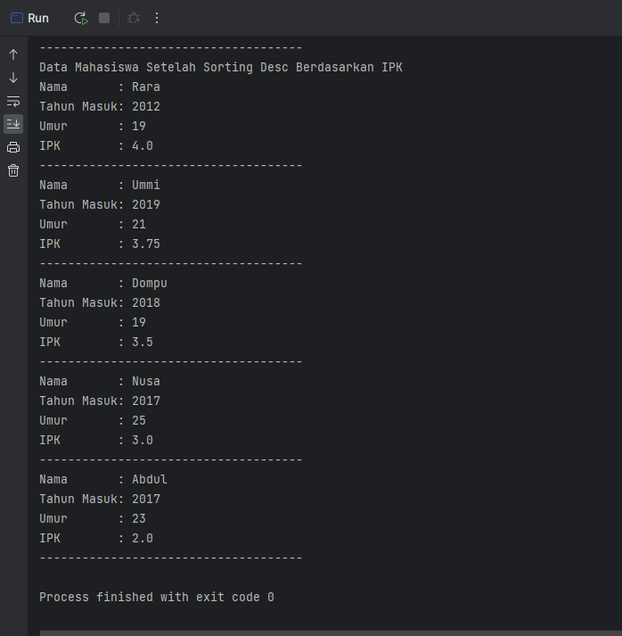

# LAPORAN PRATIKUM 5
NIM   : 2241720030

Nama  : Muhammad Fakhruddin Arif

Kelas : TI-1D

## Latihan
### 5.2 Mengurutkan Data Mahasiswa Berdasarkan IPK Menggunakan Bubble Sort

Code:

Mahasiswa
``` java
package minggu6;

public class Mahasiswa {
    String nama;
    int tahunMasuk, umur;
    double ipk;

    Mahasiswa(String nama, int tahunMasuk, int umur, double ipk) {
        this.nama = nama;
        this.tahunMasuk = tahunMasuk;
        this.umur = umur;
        this.ipk = ipk;
    }

    void tampil() {
        System.out.println("Nama       : " + nama);
        System.out.println("Tahun Masuk: " + tahunMasuk);
        System.out.println("Umur       : " + umur);
        System.out.println("IPK        : " + ipk);
    }
}
```
DaftarMahasiswaBerprestasi
``` java
package minggu6;

public class DaftarMahasiswaBerprestasi {
    Mahasiswa listMhs[] = new Mahasiswa[5];
    int idx;

    void tambah(Mahasiswa mhs) {
        if (idx < listMhs.length) {
            listMhs[idx] = mhs;
            idx++;
        }
        else {
            System.out.println("Data Sudah Penuh");
        }
    }

    void tampil() {
        for (Mahasiswa mhs : listMhs) {
            mhs.tampil();
            System.out.println("-------------------------------------");
        }
    }

    void bubbleSort() {
        for (int i = 0; i < listMhs.length - 1; i++) {
            for (int j = 1; j < listMhs.length - i; j++) {
                if (listMhs[j].ipk > listMhs[j - 1].ipk) {
                    Mahasiswa temp = listMhs[j];
                    listMhs[j] = listMhs[j - 1];
                    listMhs[j - 1] = temp;
                }
            }
        }
    }
}
```
MainMahasiswa
``` java
package minggu6;

public class MainMahasiswa {
    public static void main(String[] args) {
        DaftarMahasiswaBerprestasi list = new DaftarMahasiswaBerprestasi();
        Mahasiswa mhs1 = new Mahasiswa("Nusa", 2017, 25, 3);
        Mahasiswa mhs2 = new Mahasiswa("Rara", 2012, 19, 4);
        Mahasiswa mhs3 = new Mahasiswa("Dompu", 2018, 19, 3.5);
        Mahasiswa mhs4 = new Mahasiswa("Abdul", 2017, 23, 2);
        Mahasiswa mhs5 = new Mahasiswa("Ummi", 2019, 21, 3.75);

        list.tambah(mhs1);
        list.tambah(mhs2);
        list.tambah(mhs3);
        list.tambah(mhs4);
        list.tambah(mhs5);

        System.out.println("Data Mahasiswa Sebelum Starting: ");
        list.tampil();

        System.out.println("Data Mahasiswa Setelah Sorting Desc Berdasarkan IPK");
        list.bubbleSort();
        list.tampil();
    }
}
```
Output





Pertanyaan

1. Terdapat di method apakah proses bubble sort?
   - Terdapat di method bubbleSort()
2. Di dalam method bubbleSort(), terdapat baris program seperti di bawah ini:
   Untuk apakah proses tersebut?
   - Untuk melakukan compare dan swap
3. Perhatikan perulangan di dalam bubbleSort() di bawah ini:
   
    a. Apakah perbedaan antara kegunaan perulangan i dan perulangan j?
   
    b. Mengapa syarat dari perulangan i adalah i<listMhs.length-1 ?
   
    c. Mengapa syarat dari perulangan j adalah j<listMhs.length-i ?
   
    d. Jika banyak data di dalam listMhs adalah 50, maka berapakali perulangan i akan berlangsung? Dan ada berapa Tahap bubble sort yang ditempuh?
   - A. Perulangan i untuk tahap yang dilakukan dan perulangan j untuk langkah yang dilakukan
   - B. Karena array index dimulai dari 0, maka listMhs.length - 1 digunakan untuk memastikan bahwa elemen terakhir pada array tidak dihitung dalam pengurutan.Oleh karena itu, kondisi perulangan i adalah i < listMhs.length - 1
   - C. Karena digunakan untuk mengurangi setiap langkah dari setiap tahapan yang dilakukan
   - D. Perulangan ada 49 pada perulangan i dan ada 1225 langkah bubbleSort

### 5.3 Mengurutkan Data Mahasiswa Berdasarkan IPK Menggunakan Selection Sort

Code:

DaftarMahasiswaBerprestasi
``` java
void selectionSort() {
   for (int i = 0; i < listMhs.length - 1; i++) {
       int idxMin = i;
       for (int j = i + 1; j < listMhs.length; j++) {
          if (listMhs[j].ipk < listMhs[idxMin].ipk) {
            idxMin = j;
          }
      }
      Mahasiswa temp = listMhs[idxMin];
      listMhs[idxMin] = listMhs[i];
      listMhs[i] = temp;
   }
}
```

MainMahasiswa
``` java
System.out.println("Data Mahasiswa Setelah Sorting Asc Berdasarkan IPK");
list.selectionSort();
list.tampil();
```

Output



Pertanyaan
1. Di dalam method selection sort, terdapat baris program seperti di bawah ini:
   Untuk apakah proses tersebut, jelaskan!
   - Untuk proses pencarian nilai minimal didalam Array Of Objects

### 5.4 Mengurutkan Data Mahasiswa Berdasarkan IPK Menggunakan Insertion Sort

Code:

DaftarMahasiswaBerprestasi
``` java
void insertionSort() {
    for (int i = 1; i < listMhs.length; i++) {
        Mahasiswa temp = listMhs[i];
        int j = i;
        while (j > 0 && listMhs[j - 1].ipk > temp.ipk) {
            listMhs[j] = listMhs[j - 1];
            j--;
        }
        listMhs[j] = temp;
    }
}
```
MainMahasiswa
``` java
System.out.println("Data Mahasiswa Setelah Sorting Asc Berdasarkan IPK");
list.insertionSort();
list.tampil();
```

Output:



Pertanyaan
1. Ubahlah fungsi pada InsertionSort sehingga fungsi ini dapat melaksanakan proses sorting dengan cara descending.

Code
``` java
void insertionSort() {
    for (int i = 1; i < listMhs.length; i++) {
        Mahasiswa temp = listMhs[i];
        int j = i;
        while (j > 0 && listMhs[j - 1].ipk < temp.ipk) {
            listMhs[j] = listMhs[j - 1];
            j--;
        }
        listMhs[j] = temp;
    }
}
```

Output



### 5.5 Latihan Pratikum

Sebuah platform travel yang menyediakan layanan pemesanan kebutuhan travelling sedang mengembangkan backend untuk sistem pemesanan/reservasi akomodasi (penginapan), salah satu fiturnya adalah menampilkan daftar penginapan yang tersedia berdasarkan pilihan filter yang diinginkan user. Daftar penginapan ini harus dapat disorting berdasarkan
1. Harga dimulai dari harga termurah ke harga tertinggi.
2. Rating bintang penginapan dari bintang tertinggi (5) ke terendah (1)

Buatlah proses sorting data untuk kedua filter tersebut dengan menggunakan algoritma bubble sort dan selection sort.

Code:

Hotel
``` java
package minggu6;

public class Hotel {
    String nama, kota;
    int harga;
    byte bintang;

    Hotel(String n, String k, int h, byte b) {
        nama = n;
        kota = k;
        harga = h;
        bintang = b;
    }
}
```
HotelService
``` java
package minggu6;

public class HotelService {
    Hotel rooms[] = new Hotel[5];
    int index;

    void tambah(Hotel h) {
        if (index < rooms.length) {
            rooms[index] = h;
            index++;
        }
        else {
            System.out.println("Data Sudah Penuh");
        }
    }

    void tampilAll() {
        for (Hotel hotel : rooms) {
            System.out.println("==============================================");
            System.out.println("Nama Hotel   : " + hotel.nama);
            System.out.println("Kota Hotel   : " + hotel.kota);
            System.out.println("Harga Hotel  : " + hotel.harga);
            System.out.println("Rating Hotel : " + hotel.bintang);
        }
    }

    void bubbleSort() {
        for (int i = 0; i < rooms.length - 1; i++) {
            for (int j = 1; j < rooms.length - i; j++) {
                if (rooms[j].harga < rooms[j - 1].harga) {
                    Hotel temp = rooms[j];
                    rooms[j] = rooms[j - 1];
                    rooms[j - 1] = temp;
                }
            }
        }
    }

    void selectionSort() {
        for (int i = 0; i < rooms.length - 1; i++) {
            int indexMax = i;
            for (int j = i + 1; j < rooms.length; j++) {
                if (rooms[j].bintang > rooms[indexMax].bintang) {
                    indexMax = j;
                }
            }
            Hotel temp = rooms[indexMax];
            rooms[indexMax] = rooms[i];
            rooms[i] = temp;
        }
    }
}
```
MainHotel
``` java
package minggu6;

import java.util.Scanner;

public class MainHotel {
    public static void main(String[] args) {
        Scanner sc = new Scanner(System.in);
        HotelService hs = new HotelService();
        Hotel hotel1 = new Hotel("Ascent Premiere Hotel and Convention", "Malang", 500000, (byte)5);
        Hotel hotel2 = new Hotel("The Alana Surabaya", "Surabaya", 450000, (byte)3);
        Hotel hotel3 = new Hotel("OYO", "Malang", 100000, (byte)2);
        Hotel hotel4 = new Hotel("Reddoorz", "Lumajang", 200000, (byte)1);
        Hotel hotel5 = new Hotel("Everyday", "Malang", 350000, (byte)4);

        hs.tambah(hotel1);
        hs.tambah(hotel2);
        hs.tambah(hotel3);
        hs.tambah(hotel4);
        hs.tambah(hotel5);

        System.out.println("Data Hotel Sekitar Jawa Timur");
        hs.tampilAll();

        System.out.println();
        System.out.println("Urutkan Berdasarkan: ");
        System.out.println("1. Harga");
        System.out.println("2. Rating");
        System.out.print("Pilih Metode Pengurutan: ");
        int input = sc.nextInt();
        if (input == 1) {
            System.out.println("Diurutkan Berdasarkan Harga");
            hs.bubbleSort();
            hs.tampilAll();
        }
        else if (input == 2) {
            System.out.println("Diurutkan Berdasarkan Rating");
            hs.selectionSort();
            hs.tampilAll();
        }
        else {
            System.out.println("Inputan Yang Anda Masukkan Tidak Sesuai");
        }
    }
}
```
Output

